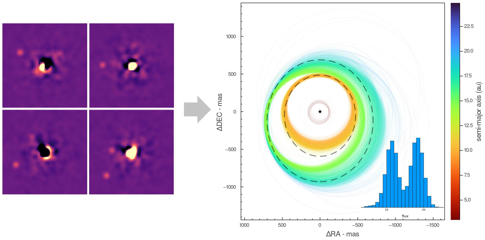
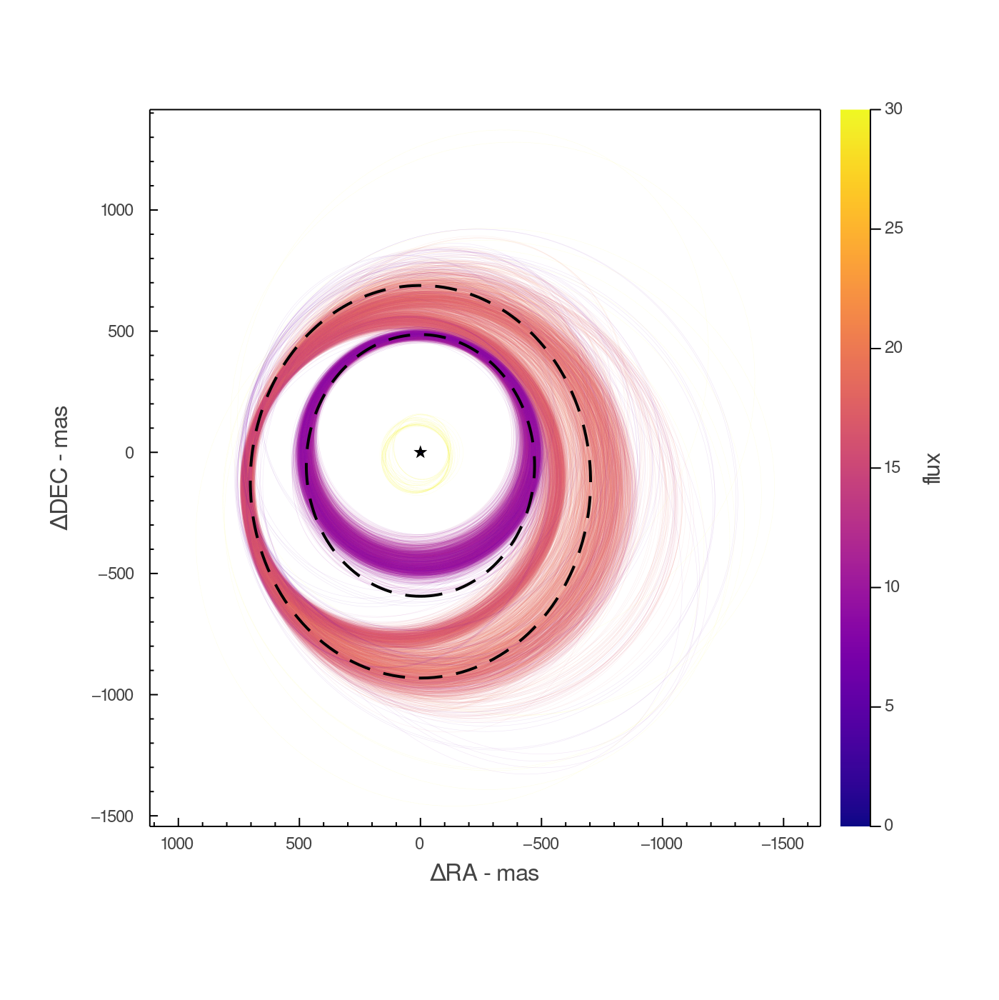
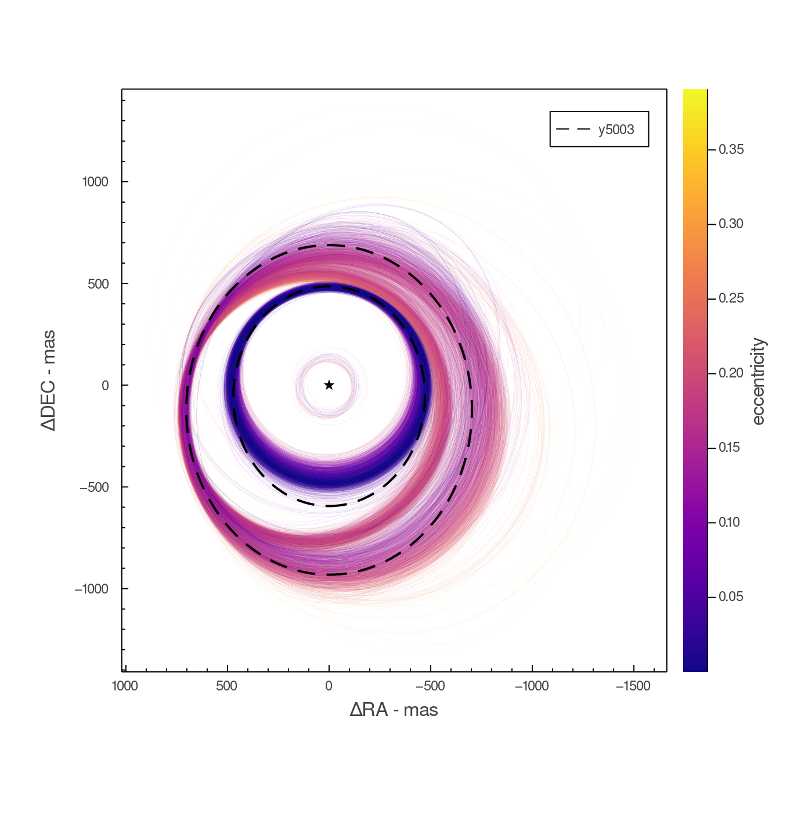
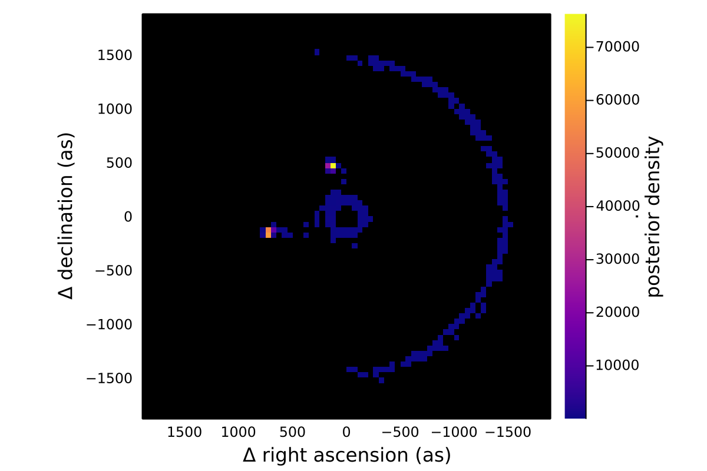
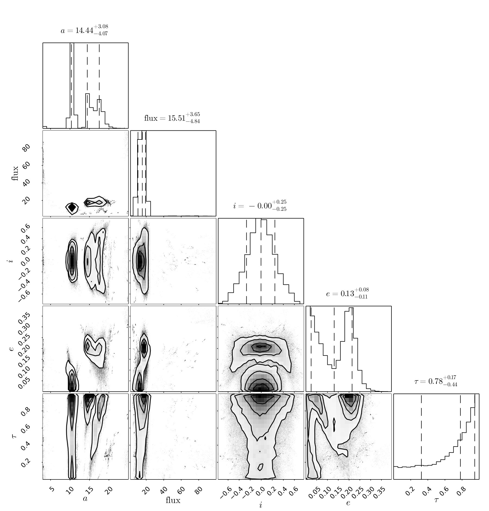

# DirectDetections.jl


This in development package uses hierarchical Bayesian modelling to detect exoplanets and other sub-stellar companions by jointly modelling their orbit and atmosphere. Orbit modelling is handled using DirectOrbits.jl and atmospheres via grids of Sonora models.

Simply specify your priors on physical and orbital parameters, provide any direct images of the system from any bands in the Sonora grids, as well as any RV or astrometry measurements. This package will then generate a posterior distribution which can be used to assess a detection and/or constrain these parameters.




## Usage

Starting from a set of convolved images in units of mJy at 10pc, the steps are 
as follows:

1. Load and centre the images
2. Calculate contrast curves for each image
3. List the observations by filter with their platescales, epochs (MJD) and contrast. 
4. Specify priors for orbital and physical parameters. Multiple planets can be provided.
5. Run the MCMC sampler (KissMCMC.jl)
```julia
using DirectImages
using DirectDetections
using ComponentArrays

# Step 1
images = centered.(readfits.(fnames))

# Step 2
contrasts = contrast_interp.(images)

# Step 3
input = (;
    # List any direct imaging observations
    phot = (;
        # List the observations by filter (see below for options).
        # You can easily build this list from the headers of your FITS files.
        # The order is not important.
        MKO_J = [
            (image=images[1], platescale=10.0, epoch=12354.0, contrast=contrasts[1]),
            (image=images[2], platescale=10.0, epoch=12410.0, contrast=contrasts[2]),
            (image=images[3], platescale=10.0, epoch=11235.0, contrast=contrasts[3]),
        ],
        MKO_H = [ 
            (image=images[4], platescale=10.0, epoch=11235.0, contrast=contrasts[4]),
            (image=images[5], platescale=10.0, epoch=53423.0, contrast=contrasts[5]),
        ]
    ),
    # List any astrometric points
    astrom = [],
)

# Step 4
priors = ComponentVector(
    planets = [(
        a = Uniform(8, 25),
        e = TruncatedNormal(0.0, 0.4, 0.0, 0.9999),
        τ = Uniform(0,1),
        ω = Normal(0.0, 0.3),
        i = Normal(0.5, 0.3),
        Ω = Normal(0.0, 0.3),
        μ = Normal(1.0, 0.01),
        plx = Normal(45., 0.0001),
        phot = (;
            MKO_J = Uniform(0., 100.),
            MKO_H = Uniform(0., 100.),
        ),
    )]
)

# Step 5
@time chains = DirectDetections.mcmc(
    priors, input;
    numwalkers=1600,
    burnin=62_000,
    numsamples_perwalker=70_000,
    thinning=250,
    squash = false
);
```

The resulting chains object has the same shape as the priors, only each element has a matrix of samples from the posterior with columns corresponding to the different chains. If `squash=true`, then each element is just a vector of samples.

## Analysis
Once you have run the MCMC sampler, there are many interesting things you can learn from the posterior.

### Assessing convergence
There are several useful tools for summarizing the posterior and assessing convergence in the `MCMCChains.jl` package. 
You can convert the chains returned from this package (a ComponentArray) to an MCMCChains.Chains object like so:
```julia
using MCMCChains: Chains
chains_2 = Chains(ComponentArrays.getdata(chains), ComponentArrays.labels(chains))
```
Displaying this object will print a summary with several convergence metrics.

### Visualizing the posterior
You can draw samples from the posterior using the `sampleorbits` function
with a particular planet from the posterior. The samples are automatically
converted into `KeplerianElements` from DirectOrbits.jl. That package defines
a plot recipe, so you can plot samples from the chain directly:
```julia
# Sample 300 orbits randomly from the posterior.
sampled_orbits = DirectDetections.sampleorbits(chains.planets[1], 300)

plot(sampled_orbits)
```

It can be useful to overplot sampled orbits on one of the input images. This is easy
using the `imshow` function from the DirectImages package in conjunction with `sample_chain`.
```julia
imshow(images[1], skyconvention=true) # Flip the x-axis ticks to match RA coordinates from this package
plot(sampled_orbits)
```

There is also a plotting function for colouring the orbits based on any parameter from the posterior:
```julia
# Shown at top of README!
DirectDetections.plotposterior(chains.planets[1], :a, 5000)


DirectDetections.plotposterior(chains.planets[1], (:phot, :Keck_L′), 5000, colorbartitle="flux", cmap=:plasma, rev=false, clims=(0,30))

DirectDetections.plotposterior(chains.planets[1], :e, 5000, colorbartitle="eccentricity", cmap=:plasma, rev=false,)
```



## Available filters
This package uses a precomputed Sonora model grid. You can specify direct imaging observations in any of the following filters:

`:MKO_Y, :MKO_Z, :MKO_J, :MKO_H, :MKO_K, :MKO_L′, :MKO_M′, :TwoMASS_J, :TwoMASS_H, :TwoMASS_Ks, :Keck_Ks, :Keck_L′, :Keck_Ms, :SDSS_g′, :SDSS_r′, :SDSS_i′, :SDSS_z′, :IRAC_36, :IRAC_45, :IRAC_57, :IRAC_79, :WISE_W1, :WISE_W2, :WISE_W3, :WISE_W4`

## Suggestions
- I recommend you use counter-rotated images containing no planets for the contrast calculations. This prevents any planets from biasing the contrast lower.


## Position Plots
Once you have the posterior, you can plot the most likely position of the planet(s) at a given epoch.

```julia
# Pick a time in MJD to see where the planets were/would be
t = mean(times)
ra, dec = projectpositions(chains.planets[1], t)

# Plot a histogram. This gives the posterior density.
histogram2d(
    ra,dec,
    aspectratio=1,
    xflip=true,
)
```


## Corner Plots
You can use the registered PairPlots.jl package to display the posterior in a pair plot (aka corner plot):

```julia
table = (;
    a=chains.planets[1].a,
    L=chains.planets[1].phot.Keck_L′,
    i=chains.planets[1].i,
    e=chains.planets[1].e,
)
corner(table, plotscatter=false)
```


