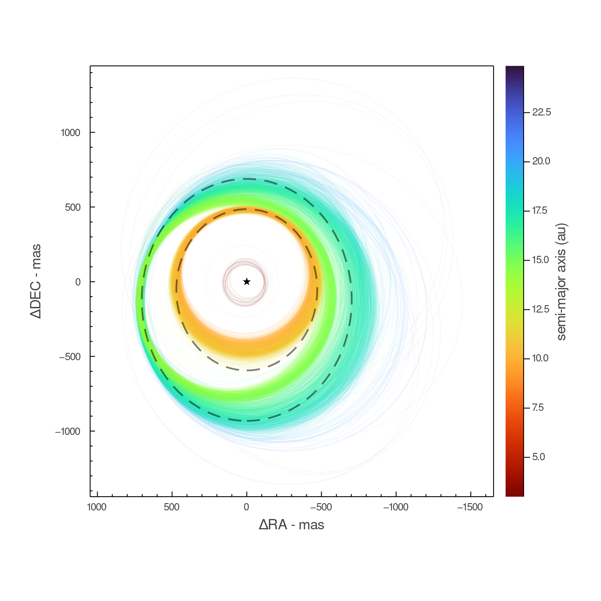
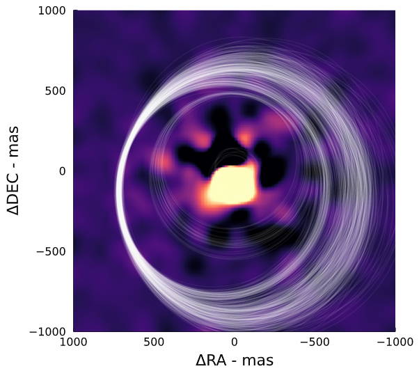
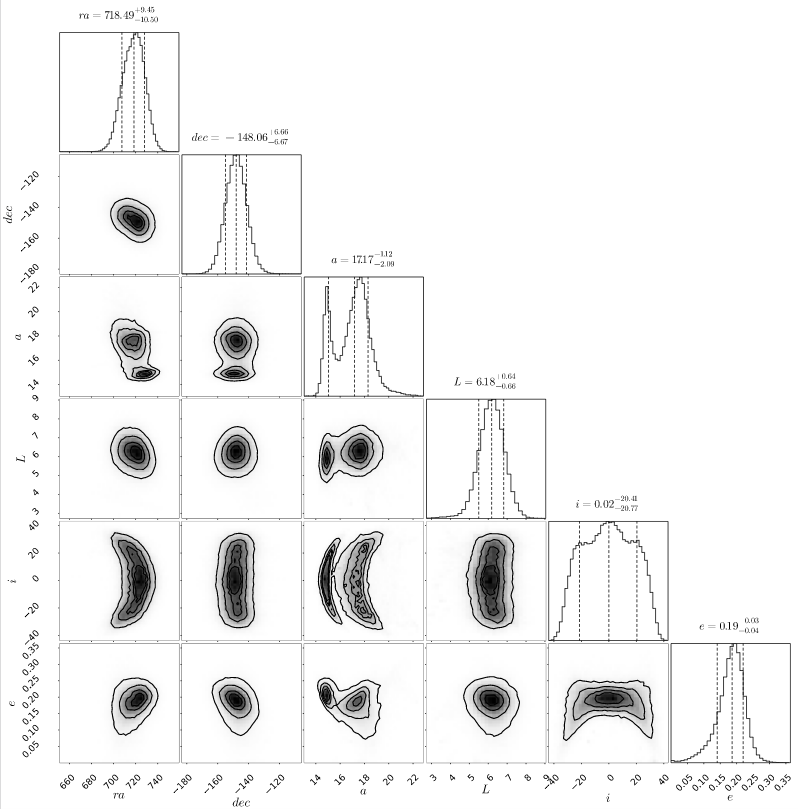

# DirectDetections.jl


This in-development package allows you to jointly model a system of exoplanets using any combinations of supported input data. In particular, it's able to model the flux and orbital motion of planets using a sequence of image(s) without any obvious detections. Using this tool, the SNR of a planet can grow with roughly the square root of the number of images.

The code currently supports:
- direct images (multiple bands / instruments)
- planet astrometry
- astrometric acceleration
- multiple planets
- priors from any univariate distribution from Distributions.jl

And in the near future:
- radial velocity curves
- planetary radial velocity measurements

Simply build up a model of your system using pluggable components and any data you might have. The resulting model then automatically builds an efficient and differentiable hierarchical Bayesian model, from which you can sample the posterior.
You can then analyse the posterior to constrain these parameters, and/or asses a detection.

Sampling can be performed by MCMC (KissMCMC.jl) or HMC with the No U-Turn sampler (NUTS, AdvancedHMC.jl). Finally, the performance of the package is quite good even on personal laptops. Using a cluster, it would be reasonable to model many hundreds of systems.

This code draws inspiration and shares conventions with [Orbitize!](https://orbitize.readthedocs.io/en/latest/), a fantastic Python package for fitting astrometry & RV curves by Blunt et al. Unlike DirectDetections.jl, that package is mature and well documented.


## Example 1: Fitting Astrometry
This example shows how to fit orbits to astrometric measurements of the planet 51 Eri b, taken from the Gemini Planet Image [De Rosa et al, 2019](https://arxiv.org/abs/1910.10169).

<details>
  <summary>Click to expand!</summary>

**Step 1: specify model & data**
```julia

# Data from De Rosa et al, 2019. See above arXiv link.
planet_b_astrometry = Astrometry(
    (epoch=57009.13,  ra=454.24sind(171.22), dec=454.24cosd(171.22), σ_ra=2., σ_dec=2.),
    (epoch=57052.06,  ra=451.81sind(170.01), dec=451.81cosd(170.01), σ_ra=2., σ_dec=2.),
    (epoch=57053.06,  ra=456.80sind(170.19), dec=456.80cosd(170.19), σ_ra=2.5, σ_dec=2.5),
    (epoch=57266.41,  ra=455.10sind(167.30), dec=455.10cosd(167.30), σ_ra=2., σ_dec=2.),
    (epoch=57332.23,  ra=452.88sind(167.30), dec=452.88cosd(167.30), σ_ra=5.4, σ_dec=5.4),
    (epoch=57374.19,  ra=455.91sind(165.66), dec=455.91cosd(165.66), σ_ra=6.3, σ_dec=6.3),
    (epoch=57376.17,  ra=455.01sind(165.69), dec=455.01cosd(165.69), σ_ra=3., σ_dec=3.),
    (epoch=57415.05,  ra=454.46sind(165.94), dec=454.46cosd(165.94), σ_ra=6., σ_dec=6.),
    (epoch=57649.39,  ra=454.81sind(161.80), dec=454.81cosd(161.80), σ_ra=2., σ_dec=2.),
    (epoch=57652.38,  ra=451.43sind(161.73), dec=451.43cosd(161.73), σ_ra=2.7, σ_dec=2.7),
    (epoch=57739.13,  ra=449.39sind(160.06), dec=449.39cosd(160.06), σ_ra=2.5, σ_dec=2.5),
    (epoch=58068.26,  ra=447.54sind(155.23), dec=447.54cosd(155.23), σ_ra=3., σ_dec=3.),
    (epoch=58442.21,  ra=434.22sind(149.64), dec=434.22cosd(149.64), σ_ra=2., σ_dec=2.),
)

planet_b_priors = Priors(
    a = Uniform(0, 20),
    e = Uniform(0, 0.8),
    τ = Uniform(0, 1),
    ω = Uniform(-π, π),
    i = Uniform(-π, π),
    Ω = Uniform(-π, π),
)
planet_b = DirectDetections.Planet(planet_b_priors, planet_b_astrometry)

system_priors = Priors(
    μ = TruncatedNormal(1.75, 0.01, 0., Inf),
    plx =TruncatedNormal(33.439034, 0.07770842, 0., Inf), # From GAIA EDR3
    # priors on i, Ω, and their expected variance between planets can also be specified for multi-planet models.
)

system = System(system_priors, system_pma, planet_b, )
```

**Step 2: sample from the model**

In this example, we sample from the model using NUTS (AdvancedHMC.jl). 
```julia
chains, _ = DirectDetections.hmc(
    system;
    burnin=2_000,
    numwalkers=1,
    numsamples_perwalker=15_000,
);
chains = chains[1];
```

```
Sampling 35%|███████████                    |  ETA: 0:00:16
  iterations:                    5287
  n_steps:                       6
  is_accept:                     true
  acceptance_rate:               0.8333333331647736
  log_density:                   -19446.616930344586
  hamiltonian_energy:            19460.79112295783
  hamiltonian_energy_error:      1.673470251262188e-10
  max_hamiltonian_energy_error:  Inf
  tree_depth:                    2
  numerical_error:               true
  step_size:                     3.991526096499091e-5
  nom_step_size:                 3.991526096499091e-5
  is_adapt:                      false
  mass_matrix:                   DiagEuclideanMetric([4.526572319817907e-6, 4.53 ...])
```

**Step 3+: visualize the results**
```julia
using Plots
clims=(8,20)

sampled_priors = sample_priors(system,1000)
p_priors = plotposterior(sampled_priors, 1, sampled_priors.planets[1].a, 500,  lw=1, alpha=0.25, colorbartitle="semi-major axis (au)", cmap=:plasma, rev=false, colorbar=nothing, clims=clims)
title!("priors")

p_post = plotposterior(chains, 1, chains.planets[1].a, 500,  lw=1, alpha=0.25, colorbartitle="semi-major axis (au)", cmap=:plasma, rev=false, clims=clims)
scatter!(planet_b.astrometry,marker=(:black,:circle,3),label="")
title!("posterior")

plot(p_priors, p_post, size=(1200,400))
xlims!(-700,700)
ylims!(-700,700)
```
</details>


## Example 2: Fitting Images
This example shows how to fit orbits / photometry from a sequence of images with two planets undergoing orbital motion, and no previously extracted astrometry. The inputs are simulated images. The planets are quite obvious here, but in general, this works with planets as faint as SNR 2-2.5 per image.
<details>
  <summary>Click to expand!</summary>

Starting from a set of convolved images in units of mJy at 10pc, the steps are 
as follows:

1. Load and centre the images
2. Calculate contrast curves for each image
3. List the observations by filter with their platescales, epochs (MJD) and contrast. 
4. Specify priors for orbital and physical parameters. Multiple planets can be provided.
5. Run the MCMC sampler (KissMCMC.jl)
```julia
using DirectImages
using DirectDetections
using ComponentArrays

# Step 1
images = centered.(readfits.(fnames))

# Step 2
contrasts = contrast_interp.(images)

# Step 3
planet_priors = Priors(
    a = Uniform(7, 16),
    e = TruncatedNormal(0.1, 0.1, 0.0, 0.4),
    τ = Uniform(0,1),
    ω = Uniform(-π,π),
    i = Uniform(-π,π),
    Ω = Uniform(-π,π),
    J = Uniform(0,20)
)
  
planet = DirectDetections.Planet(planet_priors)
  
system_images = DirectDetections.Images(
    # You can specify a contrast curve yourself from a backwards-rotated ADI sequence, or they will be calculated for you. 
    # The difference should be negligible for faint planets near the level of the noise, but could underestimate the
    # likelihood of very strongly detected planets.
    (band=:J, image=images[1], platescale=10.0, epoch=times[1]),#, contrast=contrasts[1]),
    (band=:J, image=images[2], platescale=10.0, epoch=times[2]),#, contrast=contrasts[2]),
    (band=:J, image=images[3], platescale=10.0, epoch=times[3]),#, contrast=contrasts[3]),
    (band=:J, image=images[4], platescale=10.0, epoch=times[4]),#, contrast=contrasts[4]),
)

# Step 4
system_priors = Priors(
    μ = TruncatedNormal(1.0, 0.01, 0, 10),
    plx = TruncatedNormal(45., 0.0001, 0, 100),
)

system = System(system_priors, system_pma, system_images, planet)
  
# Step 5
# MCMC with many walkers is recomended over NUTS when sampling from images
@time chains = DirectDetections.mcmc(
    priors, input;
    numwalkers=1600,
    burnin=62_000,
    numsamples_perwalker=70_000,
    thinning=250,
    squash = false
);
```

The resulting chains object has the same shape as the priors, only each element has a matrix of samples from the posterior with columns corresponding to the different chains. If `squash=true`, then each element is just a vector of samples.
E.g.: `chains.planets[1].a` is a vector sampled semi-major axes.

## Analysis
Once you have run the MCMC sampler, there are many interesting things you can learn from the posterior.

### Assessing convergence
There are several useful tools for summarizing the posterior and assessing convergence in the `MCMCChains.jl` package. 
You can convert the chains returned from this package (a ComponentArray) to an MCMCChains.Chains object like so:
```julia
using MCMCChains: Chains
chains_2 = Chains(ComponentArrays.getdata(chains), ComponentArrays.labels(chains))
```
Displaying this object will print a summary with several convergence metrics.

### Visualizing the posterior
You can draw samples from the posterior using the `sampleorbits` function
with a particular planet from the posterior. The samples are automatically
converted into `KeplerianElements` from DirectOrbits.jl. That package defines
a plot recipe, so you can plot samples from the chain directly:
```julia
using DirectOrbits
using Plots
# Sample 300 orbits randomly from the posterior.
sampled_orbits = DirectDetections.sampleorbits(chains.planets[1], 300)

plot(sampled_orbits)
```



There a plotting function for colouring the orbits based on any parameter from the posterior:
```julia
# Shown at top of README!
DirectDetections.plotposterior(chains.planets[1], :a, 5000)


DirectDetections.plotposterior(chains.planets[1], (:phot, :Keck_L′), 5000, colorbartitle="flux", cmap=:plasma, rev=false, clims=(0,30))

DirectDetections.plotposterior(chains.planets[1], :e, 5000, colorbartitle="eccentricity", cmap=:plasma, rev=false,)
```

    
It can be useful to overplot sampled orbits on one of the input images. This is easy
using the `imshow` function from the DirectImages package in conjunction with `sample_chain`.
```julia
i = DirectImage(image)
i.PLATESCALE = 10.
imshow(i, skyconvention=true)
plot!(sampled_orbits,color=:white,label="")
```
</details>



## Available filters
This package uses a precomputed Sonora model grid. You can specify direct imaging observations in any of the following filters:

`:MKO_Y, :MKO_Z, :MKO_J, :MKO_H, :MKO_K, :MKO_L′, :MKO_M′, :TwoMASS_J, :TwoMASS_H, :TwoMASS_Ks, :Keck_Ks, :Keck_L′, :Keck_Ms, :SDSS_g′, :SDSS_r′, :SDSS_i′, :SDSS_z′, :IRAC_36, :IRAC_45, :IRAC_57, :IRAC_79, :WISE_W1, :WISE_W2, :WISE_W3, :WISE_W4`


## Position Plots
Once you have the posterior, you can plot the most likely position of the planet(s) at a given epoch.
<details>
  <summary>Click to expand!</summary>

```julia
# Pick a time in MJD to see where the planets were/would be
t = mean(times)
ra, dec = projectpositions(chains.planets[1], t)

# Plot a histogram. This gives the posterior density.
histogram2d(
    ra,dec,
    aspectratio=1,
    xflip=true,
)
```
</details>


## Corner Plots
You can use the registered PairPlots.jl package to display the posterior in a pair plot (aka corner plot):
<details>
  <summary>Click to expand!</summary>

```julia
using PairPlots
table = (;
    a=chains.planets[1].a,
    L=chains.planets[1].phot.Keck_L′,
    i=chains.planets[1].i,
    e=chains.planets[1].e,
)
corner(table, plotscatter=false)
```


Or, isolating only a single planet from the posterior:
</details>




## Suggestions
- I recommend you use counter-rotated images containing no planets for the contrast calculations. This prevents any planets from biasing the contrast lower.
- Running the samplers with multiple threads, e.g. `julia -t 4` or `julia -t auto`. The runtime scales with close to linearly with the number of epochs.
