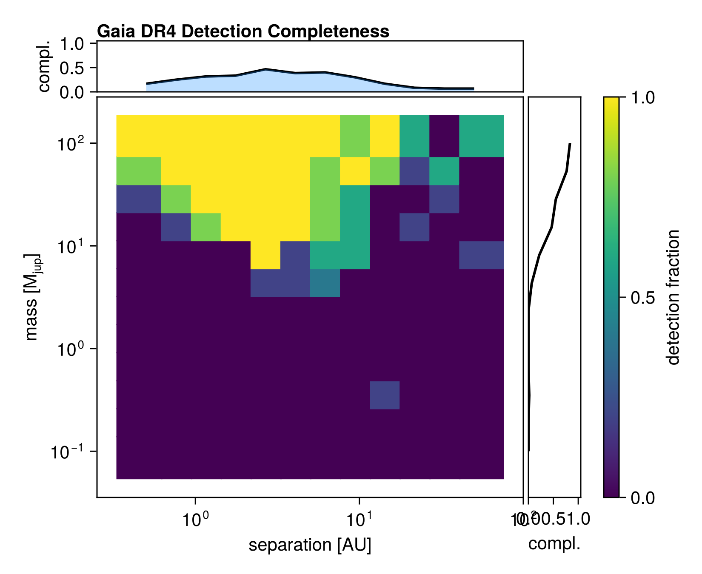

# [Detection Completeness Mapping](@id completeness)

Octofitter includes a framework for computing detection completeness maps via
injection-recovery. Given a model template and a grid of companion masses and
separations, it systematically injects synthetic companions, simulates
observations, fits the data, and tests whether the companion is recovered.

Each trial stores the full posterior chain and the true injected parameters. You choose
and apply your detection criterion after sampling, so you can iterate on
thresholds without re-running the sampler.

The framework supports both local execution and cluster-scale parallelism via
a three-phase workflow:

| Phase | Function | What it does |
|-------|----------|-------------|
| 1 | [`completeness_jobs`](@ref) | Generate lightweight job descriptions |
| 2 | [`run_completeness_trial`](@ref) | Inject, simulate, and sample (one trial) |
| 3 | [`assemble_completeness`](@ref) | Apply detection criterion and build map |

For convenience, [`completeness_map`](@ref) runs all three phases locally.

!!! note "Initialization shortcut"
    For efficiency, each trial initializes the sampler at the true injected
    parameters rather than running blind initialization. This dramatically
    reduces sampling cost but means the completeness estimate is optimistic
    about convergence. The results reflect the *statistical* detectability
    of a signal, not the ability to blindly discover it.

## Quick example (local)

```julia
using Octofitter, Distributions

# ... (define your system with observation templates) ...

# Run completeness map
cmap, results = completeness_map(
    sys,
    model -> octofit(model, iterations=5000, verbosity=0),   # your sampler
    (chain, θ) -> quantile(vec(chain["b_mass"]), 0.05) > 0.1; # your detection criterion
    inject = (mass, sep) -> (; planets=(; b=(; mass=mass, a=sep))),
    masses = 10 .^ range(-1, 2, length=12),       # 0.1 to 100 Mjup
    separations = 10 .^ range(-0.3, 1.7, length=12), # 0.5 to 50 AU
    n_trials = 5, # trials per mass/separation combination
)

# Plot
using CairoMakie
completenessplot(cmap)
```

## Choosing a sampler

The `sampler` argument is any function that takes a `LogDensityModel` and
returns an MCMCChains `Chains` object. You control the sampler, its settings,
and the number of iterations. Some options:

```julia
# HMC (fast, good for unimodal posteriors)
sampler = model -> octofit(model, iterations=5000, verbosity=0)

# Pigeons (slower, better for multimodal posteriors)
sampler = model -> begin
    chain, pt = octofit_pigeons(model, n_rounds=8)
    chain
end
```

## Choosing a detection criterion

The `detection_criterion` is a function `(chain, θ_true) -> Bool` that you
provide to [`assemble_completeness`](@ref). Because it is only applied in the
assembly phase, you can experiment with different criteria on the same set of
results.

Here are some example criteria:

**Mass recovery** — recovered mass within a factor of 3 of the true value:
```julia
detection = (chain, θ) -> begin
    med = median(vec(chain["b_mass"]))
    true_mass = θ.planets.b.mass
    return med > true_mass / 3 && med < true_mass * 3
end
```

**Credible interval excludes zero** — 95% lower bound on mass exceeds a threshold:
```julia
detection = (chain, θ) -> quantile(vec(chain["b_mass"]), 0.05) > 0.1
```

**Spike-and-slab Bayes factor** — if your model includes a `planet_present ~ Bernoulli(0.5)` indicator variable:
```julia
detection = (chain, θ) -> begin
    p = mean(vec(chain["b_planet_present"]))
    BF = p / (1 - p)
    return BF > 3
end
```

### Iterating on thresholds

Since the full chain is stored in each result, you can re-apply different
criteria without re-running the sampler:

```julia
# Original assembly with BF > 3
cmap_bf3 = assemble_completeness(results,
    (chain, θ) -> let p = mean(vec(chain["b_planet_present"])); p/(1-p) > 3 end;
    masses=masses, separations=seps,
)

# Stricter: BF > 10
cmap_bf10 = assemble_completeness(results,
    (chain, θ) -> let p = mean(vec(chain["b_planet_present"])); p/(1-p) > 10 end;
    masses=masses, separations=seps,
)

# Compare
completenessplot(cmap_bf3, "completeness_bf3.png")
completenessplot(cmap_bf10, "completeness_bf10.png")
```

## The `inject` function

The `inject` argument maps grid values to parameter overrides. It must return
a nested `NamedTuple` that sets *free* (prior) parameters only — not derived
parameters.

```julia
# Simple case: mass and semi-major axis are free parameters
inject = (mass, sep) -> (; planets=(; b=(; mass=mass, a=sep)))

# Spike-and-slab case: also force planet_present=1 during injection
inject = (mass, sep) -> (; planets=(; b=(; planet_present=1.0, mass_prime=mass, a=sep)))
```

## Gaia DR4 example

Below is a pre-computed completeness map for Gaia DR4 epoch astrometry of a
representative target (Gaia DR3 source 5064625130502952704, G=11.5 mag).
The grid spans 0.1–100 M_Jup in mass and 0.5–50 AU in separation, with 5
trials per cell (720 total), run as a SLURM array job.



Key features:
- **Peak sensitivity at 1–5 AU** for massive companions, where the astrometric
  signal is strongest relative to the DR4 time baseline (~5.5 years)
- **Sensitivity drops beyond ~10 AU** — orbital periods exceed the DR4 baseline,
  so only partial orbits are observed
- **Detection threshold ~5–10 M_Jup** at optimal separations for this noise level
  (σ_true ≈ 0.069 mas per scan)

## Cluster-scale workflow

For large grids or many trials, use the three-phase API with SLURM array jobs.

### Phase 1: Generate jobs (head node)

```julia
jobs = completeness_jobs(
    masses = 10 .^ range(-1, 2, length=15),
    separations = 10 .^ range(-0.3, 1.7, length=15),
    n_trials = 10,
)
# 15 × 15 × 10 = 2250 independent jobs
```

### Phase 2: Trial script (one per array task)

```julia
# completeness_trial.jl — called by SLURM with SLURM_ARRAY_TASK_ID
using Octofitter, Distributions, Serialization

# ... (define your system template) ...

jobs = completeness_jobs(masses=MASSES, separations=SEPARATIONS, n_trials=N_TRIALS)
job = jobs[parse(Int, ENV["SLURM_ARRAY_TASK_ID"])]

result = run_completeness_trial(
    job, sys,
    model -> octofit(model, iterations=5000, verbosity=0);
    inject = (mass, sep) -> (; planets=(; b=(; mass=mass, a=sep))),
)

serialize("results/trial_\$(lpad(ENV["SLURM_ARRAY_TASK_ID"], 4, '0')).jls", result)
```

### SLURM submission script

```bash
#!/bin/bash
#SBATCH --array=1-2250
#SBATCH --time=01:00:00
#SBATCH --mem=8G
#SBATCH --cpus-per-task=4

module load julia
julia --project=. --threads=4 completeness_trial.jl
```

### Phase 3: Assemble results (head node)

```julia
using Octofitter, Serialization, CairoMakie

results = [deserialize(f) for f in readdir("results", join=true) if endswith(f, ".jls")]

# Apply detection criterion — try different thresholds!
cmap = assemble_completeness(results,
    (chain, θ) -> quantile(vec(chain["b_mass"]), 0.05) > 0.1;
    masses=MASSES, separations=SEPARATIONS,
)

completenessplot(cmap, "completeness_map.png")
```

!!! tip "Timeout handling"
    Some trials may time out on the cluster, particularly at very low masses
    where NUTS explores large, flat parameter spaces. Missing trials are simply
    absent from the results — `assemble_completeness` handles incomplete grids
    gracefully.

## Visualization

```julia
using CairoMakie

# Basic plot
completenessplot(cmap, "map.png")

# With detection counts overlaid
completenessplot(cmap, "map_counts.png"; show_counts=true)

# Customized
fig = Figure(size=(700, 500))
completenessplot!(fig.layout, cmap;
    title="My Target — Gaia DR4 Sensitivity",
    colormap=Makie.cgrad(:inferno),
)
Makie.save("map_custom.png", fig, px_per_unit=3)
```
