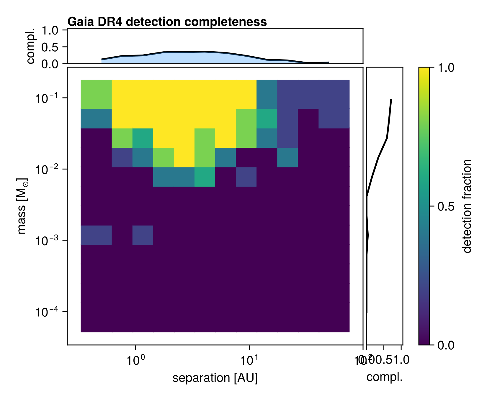

# [Detection Completeness Mapping](@id completeness)

Octofitter includes a framework for computing detection completeness maps via
injection-recovery. Given a model template and a grid of companion masses and
separations, it systematically injects synthetic companions, simulates
observations, fits the data, and tests whether the companion is recovered.

Each trial stores the full posterior chain and the true injected parameters. You choose
and apply your detection criterion after sampling, so you can iterate on
thresholds without re-running the sampler.

The framework supports both local execution and cluster-scale parallelism via
a three-phase workflow:

| Phase | Function | What it does |
|-------|----------|-------------|
| 1 | [`completeness_jobs`](@ref) | Generate lightweight job descriptions |
| 2 | [`run_completeness_trial`](@ref) | Inject, simulate, and sample (one trial) |
| 3 | [`assemble_completeness`](@ref) | Apply detection criterion and build map |

For convenience, [`completeness_map`](@ref) runs all three phases locally.


For efficiency, each trial initializes the sampler at the true injected
parameters rather than running blind initialization. This 
reduces sampling cost for this tutorial but means the completeness estimate is optimistic
about convergence. Consider letting them initialize without that hint.

## A runnable miniature

Before the cluster-scale recipe, here is the whole workflow at a size that finishes
in about a minute: a two-body model with stellar reflex radial velocity, a 2 × 2 grid,
and one trial per cell.

```@example 1
using Octofitter
using Distributions
using Statistics
using CairoMakie

# The template model. Its data are placeholders -- `run_completeness_trial`
# replaces them with a simulation from the injected parameters, so only the
# epochs and the uncertainties matter here.
epochs = range(56000.0, 58000.0, length=30)

A = Body(name="A", variables=@variables begin
    mass ~ truncated(Normal(1.0, 0.05), lower=0.1)      # M⊙
end)

b = Body(name="b", about=A, variables=@variables begin
    mass ~ LogUniform(0.1mjup, 30mjup)                  # M⊙
    a ~ LogUniform(0.5, 30.0)                           # AU
    e ~ Uniform(0.0, 0.5)
    i ~ Sine()
    ω ~ Uniform(0, 2pi)
    Ω ~ Uniform(0, 2pi)
    tp ~ Uniform(55000, 59000)
end)

rvs = RadialVelocityObs(
    Table(
        epoch = collect(epochs),
        rv    = zeros(length(epochs)),
        σ_rv  = fill(10.0, length(epochs)),   # m/s
    );
    target = A, ref = Barycentre, name = "HARPS",
    variables=@variables begin
        offset ~ Normal(0, 100)          # m/s -- declare it; nothing is auto-injected
        jitter ~ LogUniform(0.1, 30.0)   # m/s
    end)

template = System(name="completeness-demo", bodies=[A, b], observations=[rvs],
    variables=@variables begin
        plx = 25.0
    end)
nothing # hide
```

```@example 1
masses = [0.3mjup, 10mjup]    # M⊙
seps   = [1.0, 20.0]          # AU

@time cmap, results = completeness_map(
    template,
    model -> octofit(model, iterations=500, adaptation=1000, verbosity=0),
    (chain, θ) -> quantile(vec(chain["b_mass"]), 0.05) > 1mjup;
    inject = (mass, sep) -> (; bodies=(; b=(; mass=mass, a=sep))),
    masses = masses,
    separations = seps,
    n_trials = 1,
    verbosity = 0,
)
cmap.completeness
```

Only the massive, close companion is recovered — a 0.3 M_Jup companion produces a
few m/s of reflex motion against a 10 m/s noise floor, and a 20 AU orbit is four
times longer than the 2000-day baseline.

```@example 1
completenessplot(cmap, nothing; show_counts=true)
```

Two things to know about `inject`:

* Overrides nest under **`bodies=`**, matching the shape of the model.
* The values are in the model's own units, so a mass override is in **M⊙**.

## Quick example (local)

```julia
using Octofitter, Distributions

# ... (define your system with observation templates) ...

# Run completeness map
cmap, results = completeness_map(
    sys,
    model -> octofit(model, iterations=5000, verbosity=0),   # your sampler
    (chain, θ) -> quantile(vec(chain["b_mass"]), 0.05) > 1mjup; # your detection criterion
    inject = (mass, sep) -> (; bodies=(; b=(; mass=mass, a=sep))),
    masses = 10 .^ range(-1, 2, length=12) .* mjup,  # 0.1 to 100 Mjup, expressed in M⊙
    separations = 10 .^ range(-0.3, 1.7, length=12), # 0.5 to 50 AU
    n_trials = 5, # trials per mass/separation combination
)

# Plot
using CairoMakie
completenessplot(cmap)
```

`completeness_map` returns **both** the assembled map and the full results vector, so you can re-apply a different detection criterion without re-sampling.

## Choosing a sampler

The `sampler` argument is any function that takes a `LogDensityModel` and
returns an MCMCChains `Chains` object. You control the sampler, its settings,
and the number of iterations. Some options:

```julia
# HMC (fast, good for unimodal posteriors)
sampler = model -> octofit(model, iterations=5000, verbosity=0)

# Lower target acceptance, for bumpier posteriors (e.g. image data)
sampler = model -> octofit(model, 0.6, iterations=5000, adaptation=2000, verbosity=0)

# Pigeons (slower, better for multimodal posteriors)
using Pigeons
sampler = model -> begin
    chain, pt = octofit_pigeons(model, n_rounds=8)
    chain
end
```

Note the `.chain` unwrap above: `octofit_pigeons` returns `(;chain, pt)`,
while `run_completeness_trial` wants a bare `Chains`.


## Choosing a detection criterion

The `detection_criterion` is a function `(chain, θ_true) -> Bool` that you
provide to [`assemble_completeness`](@ref). Because it is only applied in the
assembly phase, you can experiment with different criteria on the same set of
results.

The `θ_true` argument is the model's own nested parameter structure, so a body's
variables live under `θ.bodies.<name>`.

Here are some example criteria:

**Mass recovery** — recovered mass within a factor of 3 of the true value:
```julia
detection = (chain, θ) -> begin
    med = median(vec(chain["b_mass"]))
    true_mass = θ.bodies.b.mass
    return med > true_mass / 3 && med < true_mass * 3
end
```

**Credible interval excludes zero** — 95% lower bound on mass exceeds a threshold:
```julia
detection = (chain, θ) -> quantile(vec(chain["b_mass"]), 0.05) > 1mjup
```

**Spike-and-slab Bayes factor** — if your model includes a `planet_present ~ Bernoulli(0.5)` indicator variable:
```julia
detection = (chain, θ) -> begin
    p = mean(vec(chain["b_planet_present"]))
    BF = p / (1 - p)
    return BF > 3
end
```

### Iterating on thresholds

Since the full chain is stored in each result, you can re-apply different
criteria without re-running the sampler:

```julia
# Original assembly with BF > 3
cmap_bf3 = assemble_completeness(results,
    (chain, θ) -> let p = mean(vec(chain["b_planet_present"])); p/(1-p) > 3 end;
    masses=masses, separations=seps,
)

# Stricter: BF > 10
cmap_bf10 = assemble_completeness(results,
    (chain, θ) -> let p = mean(vec(chain["b_planet_present"])); p/(1-p) > 10 end;
    masses=masses, separations=seps,
)

# Compare
completenessplot(cmap_bf3, "completeness_bf3.png")
completenessplot(cmap_bf10, "completeness_bf10.png")
```

## The `inject` function

The `inject` argument maps grid values to parameter overrides. It must return
a nested `NamedTuple` that sets *free* (prior) parameters only — not derived
parameters. Overriding a derived variable is an error listing the model's free
variables.

```julia
# Simple case: mass and semi-major axis are free parameters
inject = (mass, sep) -> (; bodies=(; b=(; mass=mass, a=sep)))

# Spike-and-slab case: also force planet_present=1 during injection
inject = (mass, sep) -> (; bodies=(; b=(; planet_present=1.0, mass_prime=mass, a=sep)))

# System-level variables sit at the top level; observation variables under `observations`
inject = (mass, sep) -> (; bodies=(; b=(; mass=mass, a=sep)),
                           observations=(; GPI=(; jitter=1.0)))
```

Overrides are located by exact slot lookup in the flat parameter vector rather than by
searching for a matching value, so two parameters that happen to draw the same number,
or one element of a vector-valued prior, are addressed correctly.

## Gaia DR4 example

Below is a pre-computed completeness map for Gaia DR4 epoch astrometry of a
representative target (Gaia DR3 source 5064625130502952704, G=11.5 mag).
The grid spans 0.1–100 M_Jup in mass and 0.5–50 AU in separation, with 5
trials per cell (720 total), run as a SLURM array job.



Key features:
- **Peak sensitivity at 1–5 AU** for massive companions, where the astrometric
  signal is strongest relative to the DR4 time baseline (~5.5 years)
- **Sensitivity drops beyond ~10 AU** — orbital periods exceed the DR4 baseline,
  so only partial orbits are observed
- **Detection threshold ~5–10 M_Jup** at optimal separations for this noise level
  (σ_true ≈ 0.069 mas per scan)

## Cluster-scale workflow

For large grids or many trials, use the three-phase API with SLURM array jobs.

### Phase 1: Generate jobs (head node)

```julia
jobs = completeness_jobs(
    masses = 10 .^ range(-1, 2, length=15) .* mjup,   # M⊙
    separations = 10 .^ range(-0.3, 1.7, length=15),
    n_trials = 10,
)
# 15 × 15 × 10 = 2250 independent jobs
```

### Phase 2: Trial script (one per array task)

```julia
# completeness_trial.jl — called by SLURM with SLURM_ARRAY_TASK_ID
using Octofitter, Distributions, Serialization

# ... (define your system template) ...

jobs = completeness_jobs(masses=MASSES, separations=SEPARATIONS, n_trials=N_TRIALS)
job = jobs[parse(Int, ENV["SLURM_ARRAY_TASK_ID"])]

result = run_completeness_trial(
    job, sys,
    model -> octofit(model, iterations=5000, verbosity=0);
    inject = (mass, sep) -> (; bodies=(; b=(; mass=mass, a=sep))),
)

serialize("results/trial_\$(lpad(ENV["SLURM_ARRAY_TASK_ID"], 4, '0')).jls", result)
```

### SLURM submission script

```bash
#!/bin/bash
#SBATCH --array=1-2250
#SBATCH --time=01:00:00
#SBATCH --mem=8G
#SBATCH --cpus-per-task=4

module load julia
julia --project=. --threads=4 completeness_trial.jl
```

### Phase 3: Assemble results (head node)

```julia
using Octofitter, Serialization, CairoMakie

results = [deserialize(f) for f in readdir("results", join=true) if endswith(f, ".jls")]

# Apply detection criterion — try different thresholds!
cmap = assemble_completeness(results,
    (chain, θ) -> quantile(vec(chain["b_mass"]), 0.05) > 1mjup;
    masses=MASSES, separations=SEPARATIONS,
)

completenessplot(cmap, "completeness_map.png")
```
 Missing (e.g. timed out) trials are simply absent from the results — `assemble_completeness` handles incomplete grids
gracefully, but beware these trials may not be missing at random.

`assemble_completeness` reports `completeness = 0.0` for cells with zero trials,
which is indistinguishable from a cell where nothing was recovered. `n_total`
carries the distinction; mask on `n_total == 0` rather than trusting the
completeness value there.

## Visualization

```julia
using CairoMakie

# Basic plot
completenessplot(cmap, "map.png")

# With detection counts overlaid
completenessplot(cmap, "map_counts.png"; show_counts=true)

# Pass `nothing` as the filename to skip saving and just return the figure
fig = completenessplot(cmap, nothing)

# Customized
fig = Figure(size=(700, 500))
completenessplot!(fig.layout, cmap;
    title="My Target — Gaia DR4 Sensitivity",
    colormap=Makie.cgrad(:inferno),
)
Makie.save("map_custom.png", fig, px_per_unit=3)
```

The default y-axis label is `mass [M⊙]`, matching the single mass unit used throughout.
