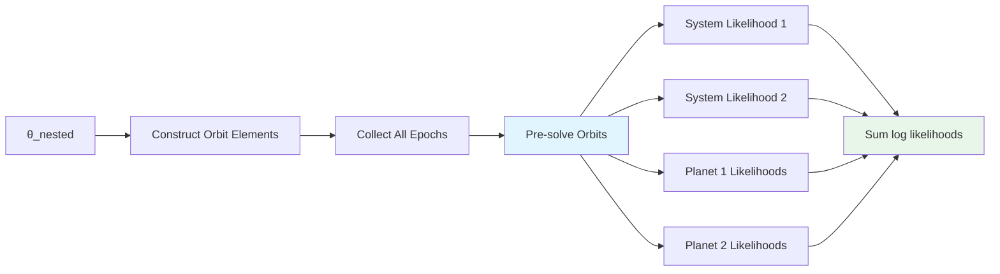
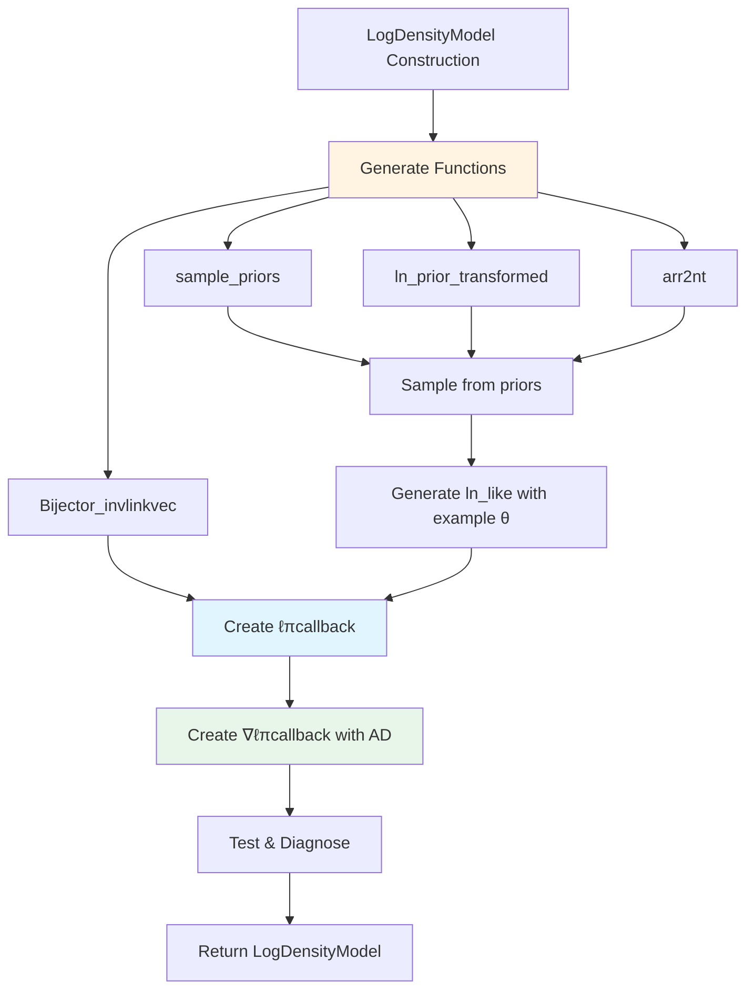

# Architecture Overview

This document provides an overview of Octofitter's internal architecture, focusing on how user model specifications are transformed into efficient log prior and log likelihood functions for Bayesian inference.

## High-Level Flow

```mermaid
flowchart TD
    A[User Model Specification] --> B[@variables macro]
    B --> C[Priors, Derived, UserLikelihoods]
    C --> D[Planet & System Objects]
    D --> E[LogDensityModel Construction]

    E --> F[Generated Functions]
    F --> F1[sample_priors]
    F --> F2[arr2nt]
    F --> F3[ln_prior_transformed]
    F --> F4[ln_like_generated]
    F --> F5[Bijector_invlinkvec/linkvec]

    F1 & F2 & F3 & F4 & F5 --> G[ℓπcallback & ∇ℓπcallback]
    G --> H[Sampler: HMC, NUTS, etc.]

    H --> I[θ_transformed]
    I --> J[Bijector_invlinkvec]
    J --> K[θ_natural]
    K --> L[arr2nt]
    L --> M[θ_nested: NamedTuple]
    M --> N[log_prior + log_likelihood]
    N --> O[log_posterior]

    style E fill:#e1f5ff
    style F fill:#fff4e1
    style G fill:#e8f5e9
    style M fill:#fce4ec
```

## 1. Model Definition Layer

### The `@variables` Macro

**Location**: [`src/macros.jl`](../../src/macros.jl), [`src/variables.jl`](../../src/variables.jl)

The `@variables` macro is Octofitter's PPL interface. It parses variable definitions into prior distributions and derived variables:

```julia
@variables begin
    a ~ Uniform(0, 10)      # Prior distribution
    e ~ Beta(1, 2)          # Prior distribution
    mass = a^2 * e          # Derived variable
    Normal(0,1) ~ a + e     # User likelihood constraint
end
```

**Output**: A tuple `(Priors, Derived, [UserLikelihood...])` where:
- `Priors`: Contains an `OrderedDict{Symbol,Distribution}` of random variables
- `Derived`: Contains expressions for computed variables plus captured constants (via `$variable` interpolation)
- `UserLikelihood`: Optional distribution constraints on expressions

### Special Parameterizations

Certain parameterizations expand into multiple variables. For example, `UniformCircular()` for angles:

```julia
Ω ~ UniformCircular()
```

Expands to:
```julia
Ωx ~ Normal(0, 1)        # Priors
Ωy ~ Normal(0, 1)        # Priors
Ω = atan(Ωy, Ωx)         # Derived variable
# Plus a UnitLengthPrior likelihood to prevent pinching at origin
```

This ensures uniform sampling on the circle while avoiding the pinching problem at the origin that would occur with direct uniform angle sampling.

### Model Hierarchy

```julia
System(
    name=:HD82134,
    variables=@variables begin
        M ~ Normal(1.0, 0.1)
        plx ~ Normal(50.0, 0.02)
    end,
    companions=[planet_b, planet_c],
    likelihoods=[hgca_likelihood, gaia_likelihood]
)
```

**Structure**:
- `System`: System-level priors, derived variables, observations, and companion objects
- `Planet`: Planet-level priors, derived variables, and observations
- Each can have attached `AbstractLikelihood` objects representing observational data

## 2. The `arr2nt` Transformation

**Location**: [`src/variables.jl:600-902`](../../src/variables.jl)

### Purpose

The `make_arr2nt` function generates a specialized function that transforms flat parameter vectors (used by samplers) into nested named tuples (used for model evaluation):

```julia
arr2nt = make_arr2nt(system)

θ_flat = [1.2, 50.0, 5.0, 0.1, ...]  # From sampler
θ_nested = arr2nt(θ_flat)

# Returns structured data:
# (M=1.2, plx=50.0,
#  planets=(
#    b=(a=5.0, e=0.1, tp=..., mass=...),
#    c=(a=10.0, e=0.05, ...)
#  ))
```

### Implementation Strategy

The function uses **compile-time code generation** via `RuntimeGeneratedFunctions.jl` to create a fully type-stable, unrolled transformation:

1. **Direct indexing**: All array accesses are unrolled to `arr[1]`, `arr[2]`, etc.
2. **Dependency ordering**: Variables are processed in dependency order:
   - System priors → System derived → Planet priors → Planet derived → Observation priors → Observation derived
3. **Scope management**: Uses nested `let` blocks to provide proper scoping for derived variables

### Generated Code Pattern

For a simple two-planet system, the generated function looks like:

```julia
function (arr)
    # System priors (direct indexing)
    M = arr[1]
    plx = arr[2]
    sys0 = (M=M, plx=plx)

    # System derived variables (can reference priors)
    sys1 = let _prev=sys0
        (; _prev..., distance = 1000/_prev.plx)
    end
    sys = sys1

    # Planet B variables
    planet_b = begin
        # Planet priors
        planet0 = (a=arr[3], e=arr[4], i=arr[5], ...)

        # Planet derived (can reference system AND planet priors)
        planet1 = let system=sys, _prev=planet0
            (; _prev...,
               tp = θ_at_epoch_to_tperi(_prev.θ, 50000;
                                        M=system.M,
                                        e=_prev.e,
                                        a=_prev.a, ...))
        end
        planet1
    end

    # Planet C variables (similar structure)
    planet_c = begin
        planet0 = (a=arr[10], e=arr[11], ...)
        planet1 = let system=sys, _prev=planet0
            # ... derived variables
        end
        planet1
    end

    # Merge into final nested structure
    return (;sys..., planets=(b=planet_b, c=planet_c))
end
```

### Key Design Decisions

- **Type stability**: By unrolling everything, Julia can infer concrete types
- **Zero runtime overhead**: All indexing and structure construction is known at compile time
- **Named access in likelihoods**: Derived variable expressions can use descriptive names (e.g., `θ_system.distance`) rather than array indices

## 3. Bijection Mechanisms

**Location**: [`src/logdensitymodel.jl:61-84`](../../src/logdensitymodel.jl), [`src/variables.jl:1289-1335`](../../src/variables.jl)

### Purpose

Most samplers (especially HMC/NUTS) work best in unconstrained space. Bijectors transform between constrained (natural parameter space) and unconstrained (sampling space) representations.

### Transformation Functions

#### 1. `Bijector_linkvec`: Constrained → Unconstrained

Used for initialization and diagnostics:

```julia
θ_constrained = [0.5, 100.0]  # e ∈ [0,1], plx > 0
θ_unconstrained = Bijector_linkvec(θ_constrained)
# e.g., [-0.69, 4.61] (logit and log transforms)
```

#### 2. `make_Bijector_invlinkvec`: Unconstrained → Constrained

Generated function used during sampling for **maximum performance**:

```julia
Bijector_invlinkvec = make_Bijector_invlinkvec(_list_priors(system))

# Generated code applies appropriate inverse transforms:
function (arr)
    tuple(
        Bijectors.invlink(Uniform(0,1), arr[1]),      # Logit⁻¹
        Bijectors.invlink(Normal(50,0.1), arr[2]),    # Identity
        Bijectors.invlink(LogNormal(0,1), arr[3]),    # Exp
        ...
    )
end
```

### Common Transformations

| Distribution | Transform | Unconstrained Range |
|--------------|-----------|---------------------|
| `Uniform(a,b)` | Logit (scaled) | ℝ |
| `Normal(μ,σ)` | Identity | ℝ |
| `LogNormal(μ,σ)` | Log | ℝ |
| `Beta(α,β)` | Logit | ℝ |
| `Truncated(...)` | Custom bijector | ℝ |

### Jacobian Corrections

When sampling in transformed space, we must account for the change of variables in the probability density. This is handled automatically in `logpdf_with_trans`.

## 4. Log Prior Generation

**Location**: [`src/variables.jl:1047-1211`](../../src/variables.jl)

### Purpose

The `make_ln_prior_transformed` function generates an unrolled function to efficiently evaluate the log prior density across all parameters:

```julia
ln_prior_transformed = make_ln_prior_transformed(system)
lp = ln_prior_transformed(θ_natural, sampled=true)
```

### Generated Code Pattern

```julia
function (arr, sampled)
    lp = zero(first(arr))  # Type-stable zero

    # System priors
    lp += logpdf_with_trans(Uniform(0,10), arr[1], sampled)
    lp += logpdf_with_trans(Beta(1,2), arr[2], sampled)

    # Planet priors
    lp += logpdf_with_trans(Normal(0,1), arr[3], sampled)
    lp += logpdf_with_trans(LogNormal(0,1), arr[4], sampled)
    # ... continues for all priors

    # User-defined likelihood constraints (from @variables)
    lp += logpdf(Normal(0,1), arr[1] + arr[2])

    return lp
end
```

### The `sampled` Parameter

- `sampled=true`: Includes Jacobian correction for transformed sampling (used during MCMC)
- `sampled=false`: Raw log probability (used for prior predictive checks)

### Performance Characteristics

- **Fully unrolled**: No loops or dynamic dispatch
- **Type stable**: Return type is known at compile time
- **SIMD friendly**: Sequential memory access pattern
- **Automatic differentiation ready**: Clean, differentiable code

## 5. Log Likelihood Generation

**Location**: [`src/likelihoods/system.jl`](../../src/likelihoods/system.jl)

### Purpose

The `make_ln_like` function is the most complex generated function. It orchestrates:

1. **Orbit element construction** from parameter values
2. **Epoch collection** from all observations
3. **Orbit solving** (Kepler's equation) at all epochs
4. **Likelihood evaluation** for each observation

### High-Level Structure



### Generated Code Pattern

```julia
function (system::System, θ_system)
    T = _system_number_type(θ_system)
    ll0 = zero(T)

    # Construct orbit element objects for each planet
    planet_1 = VisualOrbit(;merge(θ_system, θ_system.planets[1])...)
    planet_2 = ThieleInnesOrbit(;merge(θ_system, θ_system.planets[2])...)

    ll_out = @no_escape begin  # Bumper.jl: stack allocation scope
        elems = tuple(planet_1, planet_2)

        # Collect all unique epochs from all observations
        epochs = [50000.0, 50100.0, 50200.0, ...]

        # Pre-solve orbits at all epochs (Kepler equation solving)
        sols_planet_1 = [orbitsolve(planet_1, epoch) for epoch in epochs]
        sols_planet_2 = [orbitsolve(planet_2, epoch) for epoch in epochs]

        # Evaluate planet observation likelihoods
        ll1 = ll0 + ln_like(
            system.planets[1].observations[1],  # e.g., PlanetRelAstromLikelihood
            θ_system,                            # System parameters
            θ_system.planets[1],                 # Planet parameters
            θ_obs,                               # Observation parameters
            elems,                               # All orbit elements
            (sols_planet_1, sols_planet_2),      # Pre-computed orbit solutions
            1,                                   # Planet index
            0                                    # Epoch start index
        )

        # Evaluate system observation likelihoods
        ll2 = ll1 + ln_like(
            system.observations[1],              # e.g., HGCALikelihood
            θ_system,
            θ_obs,
            elems,
            (sols_planet_1, sols_planet_2),
            0                                    # System level (no specific planet)
        )

        ll2
    end

    return ll_out
end
```

### Why Pre-solve Orbits?

Solving Kepler's equation is expensive (iterative Newton-Raphson). Many observations may occur at the same epoch:

- Relative astrometry: RA and Dec at same epoch → solve once, use twice
- Multi-instrument: Different instruments observing simultaneously → solve once, use many times

By pre-solving all orbits at all unique epochs, we minimize redundant computation.

### Likelihood Interface

Each likelihood type implements a common interface:

```julia
function ln_like(
    likeobj::AbstractLikelihood,    # The observation data
    θ_system::NamedTuple,            # System parameters (M, plx, etc.)
    θ_planet::NamedTuple,            # Planet parameters (a, e, i, etc.)
    θ_obs::NamedTuple,               # Observation-specific parameters
    elems::Tuple,                    # All orbit element objects
    orbit_solutions::Tuple,          # Pre-computed orbit solutions
    planet_index::Int,               # Which planet (0 for system-level)
    epoch_start_index::Int           # Index into orbit_solutions
)
    # Calculate residuals: model predictions vs observations
    # Return sum of log likelihoods
end
```

### Allocation Management

The `@no_escape` macro (from Bumper.jl) creates a stack-allocated memory arena:

- **Fast allocation**: Stack bump allocation instead of heap
- **Automatic cleanup**: Memory freed when block exits
- **Thread safe**: Each thread has its own buffer

This is crucial for performance since likelihood evaluation happens millions of times during sampling.

## 6. The `LogDensityModel` Orchestrator

**Location**: [`src/logdensitymodel.jl`](../../src/logdensitymodel.jl)

### Purpose

`LogDensityModel` ties everything together into an object that samplers can use:

```julia
model = LogDensityModel(system)
```

### Construction Process



#### Step 1: Generate Core Functions

```julia
sample_priors = make_prior_sampler(system)
ln_prior_transformed = make_ln_prior_transformed(system)
arr2nt = make_arr2nt(system)
Bijector_invlinkvec = make_Bijector_invlinkvec(_list_priors(system))
```

#### Step 2: Generate Likelihood with Example

To create the likelihood function, we need an example parameter vector to determine types and structure:

```julia
θ_example = arr2nt(sample_priors(rng))
ln_like_generated = make_ln_like(system, θ_example)
```

#### Step 3: Create `ℓπcallback` (Log Posterior)

The callback orchestrates the complete evaluation pipeline:

```julia
function ℓπcallback(θ_transformed)
    # Transform from unconstrained to natural space
    θ_natural = Bijector_invlinkvec(θ_transformed)

    # Convert flat vector to nested named tuple
    θ_structured = arr2nt(θ_natural)

    # Evaluate log prior (with Jacobian correction)
    lpost = ln_prior_transformed(θ_natural, sampled=true)

    # Only evaluate likelihood if prior is finite
    if isfinite(lpost)
        lpost += ln_like_generated(system, θ_structured)
    end

    return lpost
end
```

#### Step 4: Create `∇ℓπcallback` (Gradient)

Using DifferentiationInterface.jl with ForwardDiff backend:

```julia
∇ℓπcallback = DI.prepare_gradient(ℓπcallback, AutoForwardDiff(), θ_example)
```

This enables efficient Hamiltonian Monte Carlo sampling.

#### Step 5: Test and Diagnose

The constructor runs test evaluations:

- Checks type stability
- Verifies gradient correctness (if AD is available)
- Reports parameter count and compilation time

### The Complete Model Object

```julia
struct LogDensityModel
    ℓπcallback::Function              # Log posterior evaluation
    ∇ℓπcallback::Function             # Log posterior + gradient
    arr2nt::Function                  # Flat → Nested transformation
    sample_priors::Function           # Prior sampling
    link::Function                    # Constrained → Unconstrained
    invlink::Function                 # Unconstrained → Constrained
    # ... metadata fields
end
```

### Usage in Sampling

```julia
# Initialize
θ_init = model.link(model.sample_priors(rng))

# Evaluate (called millions of times)
lp = model.ℓπcallback(θ_current)
lp, ∇lp = model.∇ℓπcallback(θ_current)

# Post-process results
θ_natural = model.invlink(θ_chain[i])
θ_named = model.arr2nt(θ_natural)
# Access: θ_named.planets.b.a
```

## 7. Design Principles

### 1. Type Stability

All generated functions are fully type-stable. Julia can infer concrete types for all intermediate values, enabling:

- LLVM optimization
- Efficient memory layout
- Elimination of dynamic dispatch

### 2. Zero Runtime Overhead

Code generation moves work from runtime to compile time:

- No loops over variable names
- No dictionary lookups
- No type checking at runtime

### 3. Separation of Concerns

Clean separation between:

- **Model specification** (`@variables`, `Planet`, `System`): User-facing, flexible
- **Code generation** (`make_*` functions): Implementation detail, optimized
- **Evaluation** (`ℓπcallback`, etc.): Simple, fast, differentiation-ready

### 4. Composability

Likelihoods implement a common interface and compose freely:

```julia
System(
    likelihoods=[
        HGCALikelihood(...),
        GaiaDR4Likelihood(...),
        CustomLikelihood(...)
    ]
)
```

Each likelihood is independent and receives all information it needs via the standardized interface.

### 5. Allocation Efficiency

Strategic use of allocation management:

- `RuntimeGeneratedFunctions`: Generate functions once, reuse forever
- `@no_escape`: Stack allocation for temporary arrays
- Pre-allocation: Orbit solutions computed once per likelihood evaluation

## 8. Example: Complete Flow

Here's a concrete example showing the complete transformation pipeline:

```julia
# ========================================
# 1. Model Definition
# ========================================

astrom_data = PlanetRelAstromLikelihood(
    (epoch=50000.0, ra=100.0, dec=50.0, σ_ra=1.0, σ_dec=1.0),
    (epoch=50100.0, ra=98.0, dec=52.0, σ_ra=1.0, σ_dec=1.0)
)

planet_vars = @variables begin
    # Priors
    a ~ truncated(Normal(10, 4), lower=0.1)
    e ~ Uniform(0.0, 0.5)
    i ~ Sine()
    ω ~ UniformCircular()  # Expands to ωx, ωy priors + ω derived
    Ω ~ UniformCircular()  # Expands to Ωx, Ωy priors + Ω derived
    θ ~ UniformCircular()  # Expands to θx, θy priors + θ derived

    # Derived variable
    tp = θ_at_epoch_to_tperi(θ, 50000; M=system.M, e, a, i, ω, Ω)
end

b = Planet(
    name="b",
    basis=Visual{KepOrbit},
    variables=planet_vars,
    observations=[astrom_data]
)

system_vars = @variables begin
    M ~ truncated(Normal(1.2, 0.1), lower=0.1)
    plx ~ truncated(Normal(50.0, 0.02), lower=0.1)
end

system = System(
    name="HD82134",
    variables=system_vars,
    companions=[b]
)

# ========================================
# 2. Create Log Density Model
# ========================================

model = LogDensityModel(system)

# This generates:
# - sample_priors:  () -> [random draws from all priors]
# - arr2nt:         [θ₁, θ₂, ...] -> (M=θ₁, plx=θ₂, planets=(b=(a=θ₃, ...)))
# - ln_prior:       [θ₁, θ₂, ...] -> Σ log p(θᵢ)
# - ln_like:        nested_θ -> Σ log p(data | θ)
# - ℓπcallback:     θ_unconstrained -> log p(θ, data)
# - ∇ℓπcallback:    θ_unconstrained -> (log p(θ, data), ∇ log p(θ, data))

# ========================================
# 3. Sampling
# ========================================

# Initialize in unconstrained space
θ_init = model.link(model.sample_priors(rng))  # e.g., [-0.5, 4.6, 2.3, ...]

# Sample (simplified pseudocode)
for iteration in 1:10000
    # Evaluate log posterior and gradient (HMC/NUTS)
    lp, ∇lp = model.∇ℓπcallback(θ_current)

    # The above call executes:
    # θ_current (unconstrained)
    #   → Bijector_invlinkvec → θ_natural (constrained)
    #   → arr2nt → θ_structured (nested named tuple)
    #   → ln_prior_transformed(θ_natural) → log prior
    #   → ln_like_generated(system, θ_structured) → log likelihood
    #   → return log prior + log likelihood

    # HMC/NUTS update step
    θ_current = nuts_step(θ_current, lp, ∇lp)
end

# ========================================
# 4. Post-Processing
# ========================================

# Convert chain to named tuples for analysis
chain_named = map(model.arr2nt ∘ model.invlink, eachrow(chain_array))

# Access structured results
for θ in chain_named
    println("Planet b semi-major axis: ", θ.planets.b.a)
    println("Planet b periastron time: ", θ.planets.b.tp)  # Derived variable!
end
```

## Summary

Octofitter's architecture achieves high performance through aggressive compile-time specialization:

1. **User writes**: Declarative model specification (`@variables`, `Planet`, `System`)
2. **Octofitter generates**: Specialized, type-stable functions for this specific model
3. **Sampler uses**: Fast, allocation-efficient evaluation of log posterior and gradients
4. **User receives**: Structured results with named parameters and derived quantities

The key insight is that while each user's model is different, the *structure* of the transformation pipeline is the same. By generating custom code for each model, we combine the flexibility of a high-level PPL with the performance of hand-written, specialized code.

---

## See Also

- [Custom Likelihoods](../custom-likelihood.md) - How to implement new likelihood types
- [Derived Variables](../derived.md) - User guide for derived variables
- [Priors](../priors.md) - Available prior distributions and parameterizations
- [Samplers](../samplers.md) - Available sampling algorithms
