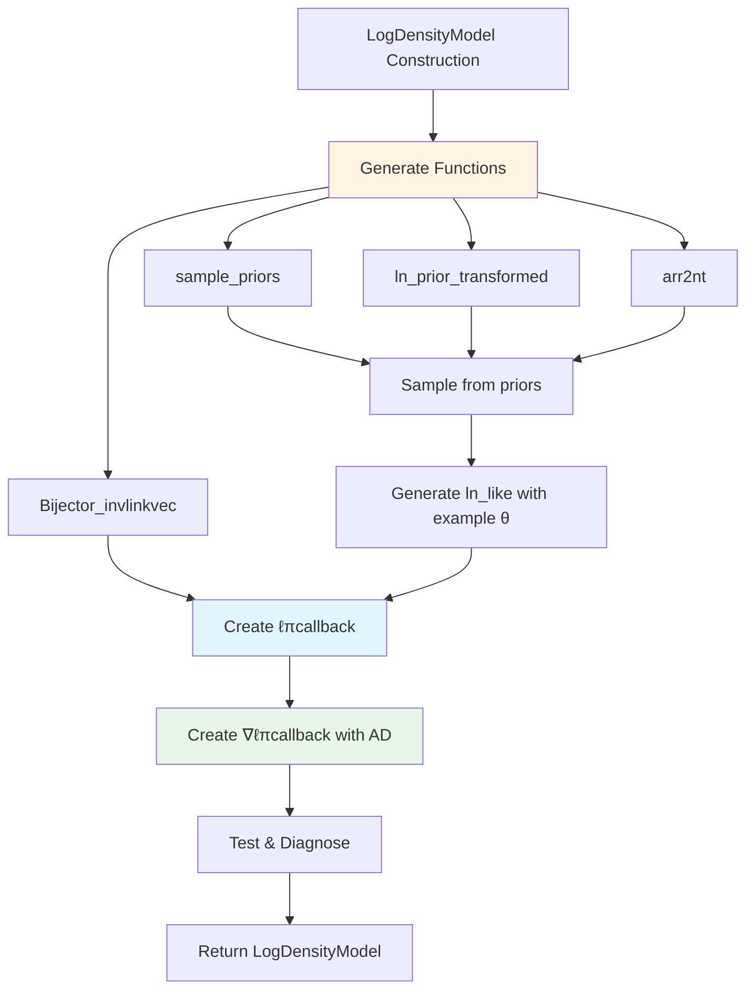

# Architecture Overview

This document provides an overview of Octofitter's internal architecture, focusing on how user model specifications are transformed into efficient log prior and log likelihood functions for Bayesian inference.

It describes the **v2** internals. The v1 architecture — `Planet` objects owning their
own observations, `basis=` orbit types, and a per-likelihood epicyclic superposition loop
— is gone; see [Migrating to Octofitter v2](@ref v2-migration) for the user-facing map.

## High-Level Flow

```mermaid
flowchart TD
    A[User Model Specification] --> B[@variables macro]
    B --> C[Priors, Derived, prior-shaped terms]
    C --> D[Body / Orbit / System nodes]
    D --> E[LogDensityModel Construction]

    E --> F[Generated Functions]
    F --> F1[sample_priors]
    F --> F2[arr2nt]
    F --> F3[ln_prior_transformed]
    F --> F4[GeneratedLnLike: build + evaluate]
    F --> F5[Bijector_invlinkvec/linkvec]

    F1 & F2 & F3 & F4 & F5 --> G[ℓπcallback & ∇ℓπcallback]
    G --> H[Sampler: HMC, NUTS, etc.]

    H --> I[θ_transformed]
    I --> J[Bijector_invlinkvec]
    J --> K[θ_natural]
    K --> L[arr2nt]
    L --> M[θ_nested: NamedTuple]
    M --> N1[build: PlanetOrbits.System]
    N1 --> N2[orbitsolve! once, over the epoch union]
    N2 --> N3[ln_like per observation]
    N3 --> O[log_posterior]

    style E fill:#e1f5ff
    style F fill:#fff4e1
    style G fill:#e8f5e9
    style M fill:#fce4ec
```

## 1. Model Definition Layer

### The `@variables` Macro

**Location**: `src/macros.jl`, `src/model/variables.jl`

The `@variables` macro is Octofitter's PPL interface. It parses variable definitions into prior distributions, derived variables, and prior-shaped terms:

```julia
@variables begin
    a ~ Uniform(0, 10)      # Prior distribution
    e ~ Beta(1, 2)          # Prior distribution
    mass = a^2 * e          # Derived variable
    Normal(0,1) ~ a + e     # Prior-shaped term on an expression
end
```

**Output**: A tuple `(Priors, Derived, terms...)` where:
- `Priors`: an `OrderedDict{Symbol,Distribution}` of random variables
- `Derived`: the stored (unevaluated) expressions for computed variables, plus any constants captured with `$` interpolation
- the trailing terms are `AbstractObs` values with `_isprior(t) == true` — `UserLikelihood` for a `~` on an expression, and the `UnitLengthPrior` behind each `UniformCircular`

Keeping the derived expressions *unevaluated* is what lets `System` decide, by a static
walk, which system lines mention a body and therefore have to be deferred (§1.3).

### Special Parameterizations

Certain parameterizations expand into multiple variables. For example, `UniformCircular()` for angles:

```julia
Ω ~ UniformCircular()
```

Expands to:
```julia
Ωx ~ Normal(0, 1)        # Priors
Ωy ~ Normal(0, 1)        # Priors
Ω = atan(Ωy, Ωx)         # Derived variable
# Plus a UnitLengthPrior term to prevent pinching at the origin
```

This ensures uniform sampling on the circle while avoiding the pinching problem at the origin that would occur with direct uniform angle sampling.

### Model Nodes

**Location**: `src/model/nodes.jl`

```julia
A = Body(name="A", variables=@variables begin mass ~ Normal(1.0, 0.1) end)
b = Body(name="b", about=A, variables=@variables begin … end)

System(
    name="HD82134",
    bodies=[A, b],
    observations=[astrom, rvs],
    variables=@variables begin plx ~ Normal(50.0, 0.02) end
)
```

The correspondence with PlanetOrbits is the teaching device, and it is 1:1:

| Octofitter node | PlanetOrbits object |
|---|---|
| `Body` | one `PlanetOrbits.Body`, plus one `PlanetOrbits.Orbit` if `about=` is given |
| `Orbit` (a hierarchy row whose exterior is not a single body) | one `PlanetOrbits.Orbit` |
| `System` | one `PlanetOrbits.System`, rebuilt every sample |

`System`'s constructor is where the model's *structure* is resolved, once, at build time:

- **`bodynames`** — the PlanetOrbits body order.
- **`rows`** — `(owning node, exterior names, interior names)` for every hierarchy row.
  A body is *placed* by whichever row has it on the exterior side, which is not the same
  as "has an `about=`" (in a 2+2 quadruple a body can be placed by a set exterior). Exactly
  one body must be unplaced, and there must be exactly `nbodies - 1` rows.
- **`deferred`** — the system variables whose stored expression mentions a node by name
  (`b.i`). These are evaluated *after* every body block. Deferral is transitive, computed
  to a fixed point, because a system line reading a deferred variable must itself wait.
- **`framevars`** — which of `plx, ra, dec, pmra, pmdec, rv, ref_epoch` the system block
  defines. This, and nothing else, chooses the reference frame. A partial absolute frame
  is an error.
- **`priorterms`** — the prior-shaped terms the `@variables` blocks emitted, each paired
  with the namespace it reads from (`:system`, or a node's name).

Observations do not belong to a node. Each one names its own `target` and `ref` through
the reference grammar in `src/model/refs.jl` (`BodyRefSpec`, `BarycentreSpec`,
`PhotocentreSpec`), which is validated against `bodynames` here.

## 2. The `arr2nt` Transformation

**Location**: `src/model/codegen.jl`

### Purpose

`make_arr2nt` generates a specialized function that transforms flat parameter vectors (used by samplers) into nested named tuples (used for model evaluation):

```julia
arr2nt = make_arr2nt(system)

θ_flat = [50.0, 1.2, 5.0, 0.1, ...]  # From sampler
θ_nested = arr2nt(θ_flat)

# Returns structured data:
# (plx = 50.0,
#  bodies = (
#    A = (mass = 1.2,),
#    b = (a = 5.0, e = 0.1, tp = …, mass = …),
#  ),
#  observations = (
#    GPI = (jitter = 1.3,),
#  ))
```

Note the three top-level groups: system variables at the top level, then `bodies`, then
`observations`. This is also the shape `initialize!` and `startingpoints!` accept for
partial starting guesses.

### Implementation Strategy

The function uses **compile-time code generation** via `RuntimeGeneratedFunctions.jl` to create a fully type-stable, unrolled transformation. It emits exactly four stages, in the model's resolution order:

1. **System block, non-deferred lines.** Priors are read by direct index (`arr[1]`, …),
   derived lines are chained through nested `let` blocks.
2. **Every node's block, in declaration order**, each with `system` bound to the result of
   stage 1. A node sees `system.*` and its own earlier lines; it does not see its siblings.
3. **System block, deferred lines**, with every node's namespace bound by name so that
   `b.i - c.i` resolves. No priors are consumed here — they were all taken in stage 1.
4. **Observation blocks**, each with `system` bound to the *full* system namespace,
   including the deferred variables.

### Key Design Decisions

- **Type stability**: By unrolling everything, Julia can infer concrete types
- **Zero runtime overhead**: All indexing and structure construction is known at compile time
- **Named access in likelihoods**: Derived variable expressions can use descriptive names (e.g. `system.age`) rather than array indices

## 3. Bijection Mechanisms

**Location**: `src/logdensitymodel.jl`

### Purpose

Most samplers (especially HMC/NUTS) work best in unconstrained space. Bijectors transform between constrained (natural parameter space) and unconstrained (sampling space) representations.

### Transformation Functions

#### 1. `Bijector_linkvec`: Constrained → Unconstrained

Used for initialization and diagnostics:

```julia
θ_constrained = [0.5, 100.0]  # e ∈ [0,1], plx > 0
θ_unconstrained = Bijector_linkvec(θ_constrained)
# e.g., [-0.69, 4.61] (logit and log transforms)
```

#### 2. `make_Bijector_invlinkvec`: Unconstrained → Constrained

Generated function used during sampling for **maximum performance**:

```julia
Bijector_invlinkvec = make_Bijector_invlinkvec(_list_priors(system))

# Generated code applies appropriate inverse transforms:
function (arr)
    tuple(
        Bijectors.invlink(Uniform(0,1), arr[1]),      # Logit⁻¹
        Bijectors.invlink(Normal(50,0.1), arr[2]),    # Identity
        Bijectors.invlink(LogNormal(0,1), arr[3]),    # Exp
        ...
    )
end
```

### Common Transformations

| Distribution | Transform | Unconstrained Range |
|--------------|-----------|---------------------|
| `Uniform(a,b)` | Logit (scaled) | ℝ |
| `Normal(μ,σ)` | Identity | ℝ |
| `LogNormal(μ,σ)` | Log | ℝ |
| `Beta(α,β)` | Logit | ℝ |
| `Truncated(...)` | Custom bijector | ℝ |

### Jacobian Corrections

When sampling in transformed space, we must account for the change of variables in the probability density. This is handled automatically in `logpdf_with_trans`.

## 4. Log Prior Generation

**Location**: `src/model/codegen.jl`

`make_ln_prior_transformed` generates an unrolled function evaluating the log prior density across all parameters:

```julia
ln_prior_transformed = make_ln_prior_transformed(system)
lp = ln_prior_transformed(θ_natural, sampled=true)
```

### Generated Code Pattern

```julia
function (arr, sampled)
    lp = zero(first(arr))  # Type-stable zero

    lp += logpdf_with_trans(Uniform(0,10), arr[1], sampled)
    lp += logpdf_with_trans(Beta(1,2), arr[2], sampled)
    # ... continues for every prior, in arr2nt order

    return lp
end
```

The prior-shaped terms emitted by `@variables` (`lhs ~ dist`, `LL +=`, `UnitLengthPrior`)
are *not* evaluated here — they need the resolved nested namespace, so they are dispatched
as `AbstractObs` values with `_isprior(t) == true` in stage 5 below. That flag is also what
excludes them from `pointwise_like`'s columns and from cross-validation's data counts.

### The `sampled` Parameter

- `sampled=true`: Includes Jacobian correction for transformed sampling (used during MCMC)
- `sampled=false`: Raw log probability (used for prior predictive checks)

## 5. Log Likelihood Generation

**Location**: `src/model/codegen.jl` (`make_ln_like`), `src/model/obs.jl` (`ObsContext`)

This is where the largest v1→v2 change lives. `make_ln_like` returns a `GeneratedLnLike`
with **two** compiled halves:

```julia
struct GeneratedLnLike
    build     # θ_nested -> PlanetOrbits.System
    evaluate  # (system, θ_nested, posys) -> log likelihood
end
```

They are separate for a concrete reason: orbit construction can fail on a proposal the
priors admit but the elements do not (`e == 1` exactly, a non-positive `a` out of a derived
expression), and Bumper's `@no_escape` is not exception-safe — a throw inside the arena
would leak it. Catching around `build` only, outside the block, is also what keeps `posys`
concretely typed.

### `build`

Emits one `PlanetOrbits.Body` per body node (reading its `mass` and any `flux_<band>`
variables), one `PlanetOrbits.Orbit` per hierarchy row (reading that node's element
variables), and one `PlanetOrbits.System` with the frame keywords the system block defined.

### `evaluate`

```julia
function (system, θ, posys)
    T = _system_number_type(θ)
    buf = _scratch_buffer(Val(SLAB))
    return @no_escape buf begin
        traj = PlanetOrbits.Trajectory(BumpAlloc(buf), T, posys, UNIQUE_EPOCHS)
        PlanetOrbits.orbitsolve!(traj, posys; method, observing_geometry, barycentric_lighttime)
        ll0 = zero(T)
        ll1 = ll0 + ln_like(system.observations[1], ObsContext(θ, θ.observations.GPI, posys, traj, MAP1, buf))
        ll2 = ll1 + ln_like(system.observations[2], ObsContext(θ, θ.observations.HARPS, posys, traj, MAP2, buf))
        ll3 = ll2 + ln_like(system.priorterms[1][2], ObsContext(θ, θ.bodies.b, posys, traj, Int[], buf))
        ll3
    end
end
```

`UNIQUE_EPOCHS` is the deduplicated, sorted union of every observation's epochs, computed
at build time by `epoch_plan`. Each observation gets its own `MAP` vector taking a row of
*its* table to a column of the shared trajectory. Solving Kepler's equation is expensive
and many observations share epochs, so the whole model is solved exactly once per sample.

### The likelihood interface

There is one context type — the v1 `PlanetObservationContext`/`SystemObservationContext`
split collapsed when references became explicit:

```julia
function ln_like(obs::MyObs, ctx::ObsContext)
    T = _system_number_type(ctx.θ_system)   # never assert Float64: ForwardDiff
    tgt, rf = resolverefs(ctx, refspecs(obs))   # resolve ONCE, outside the loop
    ll = zero(T)
    for i in eachindex(obs.table)
        sol = solutionat(ctx, i)
        Δα = raoff(sol, tgt, rf)
        ...
    end
    return ll
end
```

`ctx` carries `θ_system` (the whole nested NamedTuple), `θ_obs` (this observation's own
variables), `system` (the sample's `PlanetOrbits.System`), `traj`, the `epoch_index` map,
and `buf`, the scratch arena.

**This is where v1's six duplicated epicyclic-superposition loops went.** v1 rebuilt a
companion's apparent position by summing the reflex motion of every body it decided at
runtime was "inner" (`semimajoraxis(other) < semimajoraxis(this)`) — which had no answer
for crossing orbits, equal semi-major axes, or anything that is not a planet orbiting a
star. `raoff(sol, target, ref)` is exact for any hierarchy under either propagator, and
there is nothing left for a likelihood to reconstruct by hand.

### Allocation management

The `@no_escape` macro (from Bumper.jl) creates a stack-allocated memory arena:

- **Fast allocation**: stack bump allocation instead of heap
- **Automatic cleanup**: memory freed when the block exits
- **Task safe**: the arena is task-local

Its slab is *sized to the model at build time* (`_slab_size`), for the widest single
ForwardDiff chunk the model can ask for — one `Dual` partial per free parameter — because
a slab a hair too small costs the whole extra-slab penalty on every evaluation. A
likelihood needing its own temporaries should `@no_escape ctx.buf` / `@alloc` rather than
reach for `Bumper.default_buffer()`, so that one arena covers the whole evaluation.

## 6. The `LogDensityModel` Orchestrator

**Location**: `src/logdensitymodel.jl`

### Purpose

`LogDensityModel` ties everything together into an object that samplers can use:

```julia
model = Octofitter.LogDensityModel(system)
```

### Construction Process


```mermaid
flowchart TD
    A[LogDensityModel Construction] --> B[Generate Functions]

    B --> C1[sample_priors]
    B --> C2[ln_prior_transformed]
    B --> C3[arr2nt]
    B --> C4[Bijector_invlinkvec]

    C1 & C2 & C3 --> D[Sample from priors]
    D --> E[Generate ln_like with example θ]
    C4 & E --> F[Create ℓπcallback]
    F --> G[Create ∇ℓπcallback with AD]
    G --> H[Test & Diagnose]
    H --> I[Return LogDensityModel]

    style B fill:#fff4e1
    style F fill:#e1f5ff
    style G fill:#e8f5e9
```

#### Step 1: Generate Core Functions

```julia
sample_priors = make_prior_sampler(system)
ln_prior_transformed = make_ln_prior_transformed(system)
arr2nt = make_arr2nt(system)
Bijector_invlinkvec = make_Bijector_invlinkvec(_list_priors(system))
```

#### Step 2: Generate the Likelihood with an Example

`make_ln_like` needs an example parameter vector — not only for types, but to *price* the
trajectory and choose the arena slab size:

```julia
θ_example = arr2nt(sample_priors(rng))
ln_like_generated = make_ln_like(system, θ_example)
```

#### Step 3: Create `ℓπcallback` (Log Posterior)

```julia
function ℓπcallback(θ_transformed)
    θ_natural = Bijector_invlinkvec(θ_transformed)
    θ_structured = arr2nt(θ_natural)
    lpost = ln_prior_transformed(θ_natural, sampled=true)
    if isfinite(lpost)
        lpost += ln_like_generated(system, θ_structured)
    end
    return lpost
end
```

#### Step 4: Create `∇ℓπcallback` (Gradient)

Using DifferentiationInterface.jl with a ForwardDiff backend:

```julia
∇ℓπcallback = DI.prepare_gradient(ℓπcallback, AutoForwardDiff(), θ_example)
```

Everything downstream of `arr2nt` must therefore be `Dual`-clean. In particular, a
likelihood must never assert `Float64` on a value that flows from a parameter — use
`_system_number_type(ctx.θ_system)`.

#### Step 5: Test and Diagnose

The constructor runs test evaluations, reports the parameter count, timings and
allocations, and warns when the log density or its gradient is non-finite at a prior draw.

### Usage in Sampling

```julia
θ_init = model.link(model.sample_priors(rng))

lp = model.ℓπcallback(θ_current)
lp, ∇lp = model.∇ℓπcallback(θ_current)

θ_natural = model.invlink(θ_chain[i])
θ_named = model.arr2nt(θ_natural)
# Access: θ_named.bodies.b.a
```

## 7. Design Principles

### 1. Type Stability

All generated functions are fully type-stable. Julia can infer concrete types for all intermediate values, enabling LLVM optimization, efficient memory layout, and elimination of dynamic dispatch.

### 2. Zero Runtime Overhead

Code generation moves work from runtime to compile time: no loops over variable names, no dictionary lookups, no type checking at runtime. Reference specs carry their content in *type parameters*, so `resolverefs` constant-folds.

### 3. Separation of Concerns

- **Model specification** (`@variables`, `Body`, `System`): user-facing, flexible
- **Code generation** (`make_*`): implementation detail, optimized
- **Orbital physics** (PlanetOrbits): hierarchy solving, propagation, observables
- **Evaluation** (`ℓπcallback`): simple, fast, differentiation-ready

The third line is the one v2 drew that v1 did not. Likelihoods no longer contain any
orbital mechanics — they ask PlanetOrbits a question about a solved system.

### 4. Composability

Observations implement a common interface and compose freely. Every one names its own
references, so adding a data type does not touch the model layer:

```julia
System(
    bodies=[A, b, c],
    observations=[
        RelAstromObs(dat; target=b, ref=A, name="GPI"),
        RadialVelocityObs(rvs; target=A, ref=Barycentre, name="HARPS"),
        G23HObs(; host=A, companions=(b, c)),
        HillStabilityPrior(bodies=(b, c)),
    ],
)
```

### 5. Allocation Efficiency

- `RuntimeGeneratedFunctions`: generate functions once, reuse forever
- `@no_escape` with a model-sized slab: stack allocation for the trajectory and for every
  likelihood's temporaries
- One `orbitsolve!` per sample, over the epoch union, shared by every observation

## 8. Example: Complete Flow

```julia
# ========================================
# 1. Model Definition
# ========================================

astrom_dat = Table(
    epoch = [50000.0, 50100.0],
    ra    = [100.0, 98.0],
    dec   = [50.0, 52.0],
    σ_ra  = [1.0, 1.0],
    σ_dec = [1.0, 1.0],
)

A = Body(name="A", variables=@variables begin
    mass ~ truncated(Normal(1.2, 0.1), lower=0.1)
end)

b = Body(name="b", about=A, variables=@variables begin
    mass = 0.0
    a ~ truncated(Normal(10, 4), lower=0.1)
    e ~ Uniform(0.0, 0.5)
    i ~ Sine()
    ω ~ UniformCircular()   # Expands to ωx, ωy priors + ω derived + UnitLengthPrior
    Ω ~ UniformCircular()
    θ ~ UniformCircular()
    epoch = 50000.0
end)

astrom = RelAstromObs(astrom_dat; target=b, ref=A, name="GPI")

system = System(
    name="HD82134",
    bodies=[A, b],
    observations=[astrom],
    variables=@variables begin
        plx ~ truncated(Normal(50.0, 0.02), lower=0.1)
    end
)

# ========================================
# 2. Create Log Density Model
# ========================================

model = Octofitter.LogDensityModel(system)

# This generates:
# - sample_priors:  rng -> [random draws from all priors]
# - arr2nt:         [θ₁, …] -> (plx=θ₁, bodies=(A=(mass=θ₂,), b=(a=θ₃, …)), observations=(…,))
# - ln_prior:       [θ₁, …] -> Σ log p(θᵢ)
# - ln_like:        (system, θ_nested) -> build a PlanetOrbits.System, solve once, sum ln_like
# - ℓπcallback:     θ_unconstrained -> log p(θ, data)
# - ∇ℓπcallback:    θ_unconstrained -> (log p(θ, data), ∇ log p(θ, data))

# ========================================
# 3. Sampling
# ========================================

θ_init = model.link(model.sample_priors(rng))

for iteration in 1:10000
    lp, ∇lp = model.∇ℓπcallback(θ_current)
    # θ_current (unconstrained)
    #   → Bijector_invlinkvec → θ_natural (constrained)
    #   → arr2nt → θ_structured (nested named tuple)
    #   → ln_prior_transformed(θ_natural) → log prior
    #   → build → PlanetOrbits.System → orbitsolve! → Σ ln_like → log likelihood
    θ_current = nuts_step(θ_current, lp, ∇lp)
end

# ========================================
# 4. Post-Processing
# ========================================

posys = construct_system(model, chain, 1)   # the same `build` the likelihood uses
traj  = orbitsolve(posys, [mjd("2030-01-01")])
raoff(traj[1], :b, :A)
```

## Summary

Octofitter's architecture achieves high performance through aggressive compile-time specialization:

1. **User writes**: a declarative model specification (`@variables`, `Body`, `System`)
2. **Octofitter generates**: specialized, type-stable functions for this specific model
3. **PlanetOrbits solves**: one system, one trajectory over the epoch union, per sample
4. **Sampler uses**: fast, allocation-efficient evaluation of log posterior and gradients
5. **User receives**: structured results with named parameters and derived quantities
