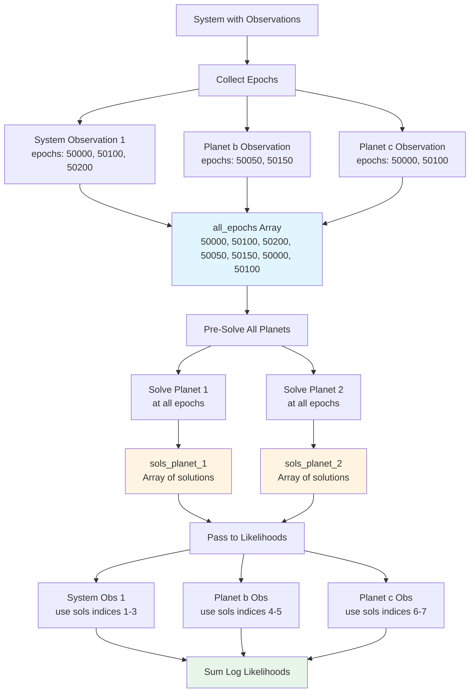

# Observation Epoch Tables and Kepler Pre-Solving

This document explains how Octofitter manages observation epochs and implements efficient Kepler equation solving through pre-computation and caching strategies.

## Overview

Solving Kepler's equation is one of the most expensive operations in orbit fitting. For a system with multiple planets and hundreds of observations, naively solving the orbit at each observation for each planet would result in redundant computation.

Octofitter optimizes this through:

1. **Epoch collection**: Gathering all unique observation epochs upfront
2. **Pre-solving**: Computing orbit solutions for all planets at all epochs once
3. **Index mapping**: Allowing likelihoods to efficiently access their pre-computed solutions
4. **Smart threading**: Parallelizing orbit solving when beneficial

## Observation Epoch Tables

### Table Structure

All observation likelihoods that depend on orbital positions must provide their data as a `TypedTables.Table` with an `:epoch` column:

```julia
using TypedTables

# Relative astrometry example
astrom_table = Table(
    epoch = [50000.0, 50100.0, 50200.0],  # MJD
    ra    = [100.0, 98.0, 95.0],          # mas
    dec   = [50.0, 52.0, 54.0],           # mas
    σ_ra  = [1.0, 1.0, 1.0],              # mas
    σ_dec = [1.0, 1.0, 1.0]               # mas
)

astrom_like = PlanetRelAstromLikelihood(astrom_table)
```

### Why TypedTables?

`TypedTables.jl` provides:

- **Type stability**: Each column has a concrete element type
- **Efficient access**: Fast indexing without type checks
- **Immutability**: Tables can't be accidentally modified during sampling
- **Named columns**: Clear, self-documenting data structure

### Common Epoch Column Patterns

Different likelihood types access epochs differently:

```julia
# Most likelihoods: epoch column in main table
struct PlanetRelAstromLikelihood{TTable<:Table}
    table::TTable  # Must have :epoch column
end

# Some likelihoods: nested tables
struct HGCALikelihood{TTable<:Table}
    table::TTable  # :hip and :gaia sub-tables, each with :epoch
end

# System-level: epochs at observation level
struct GaiaDR4Likelihood{TTable<:Table}
    table::TTable  # :epoch column for entire system
end
```

## Epoch Collection Process

**Location**: [`src/likelihoods/system.jl:6-40`](../../src/likelihoods/system.jl)

### Collection Algorithm

During `make_ln_like` code generation, Octofitter walks through all observations and collects epochs:

```julia
function make_ln_like(system::System, θ_system_sample)
    all_epochs = Float64[]
    epoch_start_index_mapping = Dict{Any,Int}()
    j = 1

    # Step 1: Collect from system-level observations
    for obs in system.observations
        if hasproperty(obs, :table) && hasproperty(obs.table, :epoch)
            # Record starting index for this observation
            epoch_start_index_mapping[obs] = j

            # Append epochs
            n_epochs = length(obs.table.epoch)
            j += n_epochs
            append!(all_epochs, obs.table.epoch)
        end
    end

    # Step 2: Collect from planet-level observations
    for i in 1:length(system.planets)
        planet = system.planets[i]
        for obs in planet.observations
            if hasproperty(obs, :table) && hasproperty(obs.table, :epoch)
                # Record starting index
                epoch_start_index_mapping[obs] = j

                # Append epochs
                n_epochs = length(obs.table.epoch)
                j += n_epochs
                append!(all_epochs, obs.table.epoch)
            end
        end
    end

    # all_epochs now contains concatenated epochs from all observations
    # epoch_start_index_mapping maps each observation → its offset
end
```

### Index Mapping

The `epoch_start_index_mapping` dictionary is crucial for efficiency:

```julia
# Example system:
# - HGCALikelihood (system): epochs [50000, 50100, 50200]  → starts at index 1
# - PlanetRelAstrom (planet b): epochs [50050, 50150]      → starts at index 4
# - PlanetRelAstrom (planet c): epochs [50000, 50100]      → starts at index 6

epoch_start_index_mapping = Dict(
    hgca_like => 1,
    planet_b_astrom => 4,
    planet_c_astrom => 6
)

all_epochs = [50000, 50100, 50200,  # HGCA
              50050, 50150,          # Planet b
              50000, 50100]          # Planet c
```

### Handling Duplicate Epochs

Currently, Octofitter does **not** deduplicate epochs across observations. This is intentional:

**Advantages**:
- Simpler indexing: Each observation has its own contiguous slice
- Easier debugging: One-to-one mapping between table rows and solutions
- Thread safety: No shared indices between observations

**Disadvantage**:
- Some redundant computation if multiple observations share epochs

**Future optimization**: Could deduplicate and use indirect indexing, but profiling shows Kepler solving is fast enough (~32ns per call) that the added complexity isn't worth it for typical use cases.

## Kepler Equation Pre-Solving

### The Kepler Problem

Given orbital elements and a time `t`, find the true anomaly `ν` (position in orbit):

```
M = n(t - tp)              # Mean anomaly (linear in time)
M = E - e sin(E)           # Kepler's equation (must solve for E)
ν = 2 atan(√((1+e)/(1-e)) * tan(E/2))  # True anomaly from E
```

Kepler's equation has no closed-form solution, requiring iterative methods (Newton-Raphson).

### Pre-Solving Strategy

**Location**: [`src/likelihoods/system.jl:111-131`](../../src/likelihoods/system.jl)

Instead of solving during likelihood evaluation, Octofitter pre-solves at the start of each likelihood call:

```julia
# Generated code pattern
function ln_like_generated(system::System, θ_system)
    ll_out = @no_escape begin
        # Construct orbit elements
        planet_1 = Visual{KepOrbit}(;merge(θ_system, θ_system.planets[1])...)
        planet_2 = ThieleInnesOrbit(;merge(θ_system, θ_system.planets[2])...)
        elems = tuple(planet_1, planet_2)

        # Pre-solve ALL orbits at ALL epochs
        epochs = @alloc(Float64, $(length(all_epochs)))
        $(initialize_epochs...)  # Unrolled: epochs[1] = 50000.0, epochs[2] = ...

        # Solve first epoch to determine solution type
        sol0_planet_1 = orbitsolve(planet_1, first(epochs))
        sols_planet_1 = @alloc(typeof(sol0_planet_1), length(epochs))
        sols_planet_1[begin] = sol0_planet_1
        _kepsolve_all!(view(sols_planet_1, 2:length(epochs)),
                       planet_1,
                       view(epochs, 2:length(epochs)))

        # Repeat for planet 2
        sol0_planet_2 = orbitsolve(planet_2, first(epochs))
        sols_planet_2 = @alloc(typeof(sol0_planet_2), length(epochs))
        sols_planet_2[begin] = sol0_planet_2
        _kepsolve_all!(view(sols_planet_2, 2:length(epochs)),
                       planet_2,
                       view(epochs, 2:length(epochs)))

        orbit_solutions = (sols_planet_1, sols_planet_2)

        # Now evaluate likelihoods (can access pre-computed solutions)
        ll = zero(Float64)
        ll += ln_like(system.observations[1], θ_system, θ_obs, elems, orbit_solutions, 0)
        ll += ln_like(planet_1.observations[1], θ_system, θ_planet_1, θ_obs, elems, orbit_solutions, 1, 4)
        # ... more likelihood evaluations

        ll
    end

    return ll_out
end
```

### Why Pre-Solve?

Consider a planet with astrometry measurements:

```julia
# Each observation has RA and Dec at same epoch
observations = [
    (epoch=50000, ra=100, dec=50),
    (epoch=50100, ra=98, dec=52),
    # ... 100 more epochs
]
```

**Without pre-solving**:
```julia
for obs in observations
    sol = orbitsolve(orbit, obs.epoch)  # Solve Kepler
    ra_model = raoff(sol)
    sol = orbitsolve(orbit, obs.epoch)  # SOLVE AGAIN!
    dec_model = decoff(sol)
    # 2N solves for N epochs
end
```

**With pre-solving**:
```julia
# Solve once per epoch
sols = [orbitsolve(orbit, epoch) for epoch in unique_epochs]

# Reuse solutions
for i in eachindex(observations)
    ra_model = raoff(sols[i])
    dec_model = decoff(sols[i])
    # N solves for N epochs
end
```

For systems with multiple instruments observing simultaneously, savings are even larger.

## Solver Implementations

**Location**: [`src/likelihoods/system.jl:201-221`](../../src/likelihoods/system.jl)

### Single-Threaded Solver

```julia
function _kepsolve_all_singlethread!(solutions, orbit, epochs)
    for epoch_i in eachindex(epochs)
        solutions[epoch_i] = orbitsolve(orbit, epochs[epoch_i])
    end
    return solutions
end
```

Simple, predictable, low overhead.

### Multi-Threaded Solver

```julia
function _kepsolve_all_multithread!(solutions, orbit, epochs)
    Threads.@threads for epoch_i in 1:length(epochs)
        solutions[epoch_i] = orbitsolve(orbit, epochs[epoch_i])
    end
    return solutions
end
```

Parallelizes across available threads. Each orbit solve is independent.

### Dynamic Dispatch

```julia
const _kepsolve_use_threads = Ref(false)

function _kepsolve_all!(solutions, orbit, epochs)
    if _kepsolve_use_threads[]
        return _kepsolve_all_multithread!(solutions, orbit, epochs)
    else
        return _kepsolve_all_singlethread!(solutions, orbit, epochs)
    end
end
```

Threading decision is made once at the start of sampling, not per-call.

## Threading Decision

**Location**: [`src/sampling.jl:264-269`](../../src/sampling.jl)

### Heuristic

```julia
threads_avail = Threads.nthreads()
n_epochs = _count_epochs(model.system)

# Enable threading if:
# 1. Multiple threads available
# 2. Enough epochs to justify overhead
Octofitter._kepsolve_use_threads[] = threads_avail > 1 && n_epochs > 15
```

### Benchmark-Based Threshold

The threshold of **15 epochs** is based on micro-benchmarks:

```julia
# Typical performance on modern CPU:
thread_spawn_overhead ≈ 450 ns
orbitsolve_time ≈ 32 ns per call

# Threading beneficial when:
# N × orbitsolve_time > thread_spawn_overhead
# N × 32ns > 450ns
# N > 14

# Conservative threshold: 15 epochs
```

For fewer epochs, single-threaded is faster due to spawn overhead.

### Counting Epochs

```julia
function _count_epochs(system::System)
    n = 0
    # System-level observations
    for obs in system.observations
        if hasproperty(obs, :table) && hasproperty(obs.table, :epoch)
            n += length(obs.table.epoch)
        end
    end
    # Planet-level observations
    for planet in system.planets
        for obs in planet.observations
            if hasproperty(obs, :table) && hasproperty(obs.table, :epoch)
                n += length(obs.table.epoch)
            end
        end
    end
    return n
end
```

## Likelihood Interface

### Standard Signature

Likelihoods receive pre-solved orbits via this interface:

```julia
function ln_like(
    like::AbstractLikelihood,
    θ_system::NamedTuple,            # System parameters
    θ_planet::NamedTuple,            # Planet parameters (if planet-level)
    θ_obs::NamedTuple,               # Observation parameters
    orbits::Tuple,                   # All orbit element objects
    orbit_solutions::Tuple,          # Pre-computed solutions for all planets
    planet_index::Int,               # Which planet (0 for system-level)
    orbit_solutions_start_index::Int # Offset into solutions array
)
end
```

### Accessing Pre-Solved Orbits

Example from [`src/likelihoods/relative-astrometry.jl`](../../src/likelihoods/relative-astrometry.jl):

```julia
function ln_like(
    like::PlanetRelAstromLikelihood,
    θ_system,
    θ_planet,
    θ_obs,
    orbits,
    orbit_solutions,
    planet_index,
    orbit_solutions_start_index
)
    ll = zero(eltype(θ_planet.a))

    # Get this planet's solutions
    sols = orbit_solutions[planet_index]

    # Loop through observations
    for i_epoch in eachindex(like.table.epoch)
        # Access pre-computed solution
        sol_i = i_epoch + orbit_solutions_start_index
        sol = sols[sol_i]

        # Extract observables (no solving needed!)
        ra_model = raoff(sol) * θ_obs.platescale
        dec_model = decoff(sol) * θ_obs.platescale

        # Compute residuals
        Δra = like.table.ra[i_epoch] - ra_model
        Δdec = like.table.dec[i_epoch] - dec_model

        # Likelihood contribution
        ll += logpdf(Normal(0, like.table.σ_ra[i_epoch]), Δra)
        ll += logpdf(Normal(0, like.table.σ_dec[i_epoch]), Δdec)
    end

    return ll
end
```

### Key Points

1. **No `orbitsolve` calls**: Solutions already computed
2. **Indexing**: Use `orbit_solutions_start_index` to offset into global solution array
3. **Planet selection**: `planet_index` selects the correct planet's solutions
4. **Type stability**: `sols` has concrete type from pre-solving

## Memory Management

### Stack Allocation with Bumper.jl

All temporary arrays use stack allocation:

```julia
ll_out = @no_escape begin
    # Create bump allocator scope

    epochs = @alloc(Float64, n_epochs)
    sols_planet_1 = @alloc(OrbitSolution, n_epochs)
    sols_planet_2 = @alloc(OrbitSolution, n_epochs)

    # ... compute likelihood

    ll_final
end  # All allocations freed here (stack pointer reset)
```

**Benefits**:
- **Fast allocation**: Bump pointer increment (1-2 CPU cycles)
- **Fast deallocation**: Stack pointer reset (free!)
- **No GC pressure**: No heap allocations to collect
- **Thread safe**: Each thread has its own buffer

**Location**: `@no_escape` comes from Bumper.jl, enabled in the `@no_escape begin ... end` block.

### Allocation Sizes

For a typical system:

```julia
# Example: 2 planets, 100 epochs total
sizeof(epochs) = 100 × 8 bytes = 800 bytes
sizeof(sols_planet_1) = 100 × 64 bytes = 6.4 KB  # Typical solution size
sizeof(sols_planet_2) = 100 × 64 bytes = 6.4 KB

# Total temporary allocation: ~13.6 KB per likelihood call
# Stack allocated → no heap fragmentation
```

Even for large systems (10 planets, 1000 epochs), temporary allocations are < 1 MB.

### Type Determination

The solution type must be determined at runtime:

```julia
# Solve first epoch to get concrete type
sol0 = orbitsolve(planet_1, first(epochs))

# Allocate array with correct concrete type
sols = @alloc(typeof(sol0), length(epochs))
```

This ensures type stability for the entire solution array.

## Performance Characteristics

### Benchmark Results

Typical timings on modern CPU (Apple M1):

| Operation | Time | Notes |
|-----------|------|-------|
| `orbitsolve` (low e) | ~32 ns | Newton-Raphson, 2-3 iterations |
| `orbitsolve` (high e) | ~80 ns | More iterations required |
| Thread spawn overhead | ~450 ns | `Threads.@threads` |
| `@alloc` array | ~2 ns | Bump allocator |
| Heap allocation | ~50 ns | `Vector{Float64}(undef, 100)` |

### Scaling Analysis

For a system with:
- `N_p` = number of planets
- `N_e` = number of epochs
- `N_like` = number of likelihood evaluations per sample

**Pre-solving cost**: `O(N_p × N_e)` per likelihood call

**Savings**: Each likelihood that would solve `k` times per epoch saves `O(N_p × N_e × (k-1))` solves

**Typical case**: Astrometry with RA/Dec at same epoch → `k=2` → **50% reduction**

### Threading Speedup

On a machine with `T` threads:

```julia
# Single-threaded time
t_single = N_p × N_e × t_solve

# Multi-threaded time (ideal)
t_multi = N_p × N_e × t_solve / T + t_overhead

# Speedup
speedup = t_single / t_multi
        ≈ T × (N_e × t_solve) / (N_e × t_solve + T × t_overhead)
```

For `N_e = 100`, `t_solve = 32ns`, `t_overhead = 450ns`, `T = 8`:

```
speedup ≈ 8 × 3200ns / (3200ns + 3600ns) ≈ 3.8x
```

Real speedup ~3-4x on 8 cores due to memory bandwidth and cache effects.

## Diagram: Epoch Collection and Pre-Solving



## Special Cases

### System-Level Observations

Some observations (like Hipparcos-Gaia proper motion anomaly) need solutions for **all** planets:

```julia
function ln_like(
    like::HGCALikelihood,
    θ_system,
    θ_obs,
    orbits,              # All planet orbits
    orbit_solutions,     # All planet solutions
    planet_index        # = 0 for system-level
)
    # Access ALL planets' solutions
    for i_planet in eachindex(orbits)
        planet_sol = orbit_solutions[i_planet][epoch_index]
        # Accumulate contributions
    end
end
```

The `planet_index = 0` indicates system-level, allowing the likelihood to loop over all planets.

### Observations Without Epochs

Some likelihoods don't depend on time:

```julia
# Priors on observable quantities
struct ObservablePriorLikelihood <: AbstractLikelihood
    dist::Distribution
    # No table, no epochs
end

# Doesn't participate in epoch collection
# Evaluated directly without orbit solving
```

### Multi-Epoch Observations

Some observations span multiple epochs in complex ways:

```julia
# Hipparcos-Gaia proper motion anomaly
struct HGCALikelihood{TTable}
    table::TTable
    # table.hip has Hipparcos epoch
    # table.gaia has Gaia epoch(s)
end
```

The likelihood implementation handles its own epoch indexing into the pre-solved arrays.

## Debugging Tips

### Verifying Epoch Collection

Add diagnostic output during model construction:

```julia
model = LogDensityModel(system)

# Count epochs
n_epochs = Octofitter._count_epochs(system)
println("Total epochs: ", n_epochs)

# Check threading
println("Threading enabled: ", Octofitter._kepsolve_use_threads[])
```

### Checking Solution Types

During development of custom likelihoods:

```julia
function ln_like(like, θ_system, θ_planet, θ_obs, orbits, orbit_solutions, planet_idx, offset)
    # Debug: print solution type
    @show typeof(orbit_solutions)
    @show typeof(orbit_solutions[planet_idx])
    @show typeof(orbit_solutions[planet_idx][1])

    # ... rest of likelihood
end
```

### Profiling Kepler Solving

To measure Kepler solving cost:

```julia
using BenchmarkTools

# Create orbit
orbit = Visual{KepOrbit}(M=1.0, plx=50.0, a=10.0, e=0.2, i=π/4, ω=0, Ω=0, tp=50000)

# Benchmark single solve
@btime orbitsolve($orbit, 50100.0)

# Benchmark batch solve
epochs = 50000.0:100.0:51000.0
sols = similar(epochs, Any)
@btime Octofitter._kepsolve_all!($sols, $orbit, $epochs)
```

## Future Optimizations

### Epoch Deduplication

Currently, duplicate epochs across observations are not merged. Potential improvement:

```julia
# Collect unique epochs
unique_epochs = unique(all_epochs)

# Create mapping: observation → indices into unique_epochs
epoch_index_map = Dict{Any, Vector{Int}}()

# Would reduce N_e in best case, but adds indexing complexity
```

**Trade-off**: Complexity vs. performance gain. Current profiling suggests Kepler solving is not the bottleneck for typical systems.

### Adaptive Threading

Could dynamically adjust threading threshold based on measured solve times:

```julia
# Calibration phase
solve_times = @elapsed _kepsolve_all!(...)
thread_overhead = @elapsed Threads.@threads for i in 1:10 end

# Adjust threshold
optimal_threshold = ceil(Int, thread_overhead / (solve_times / n_epochs))
```

**Benefit**: Adapt to different CPUs and orbit complexities automatically.

### GPU Acceleration

For very large systems (100+ planets, 10,000+ epochs), could use GPU:

```julia
using CUDA

epochs_gpu = CuArray(epochs)
sols_gpu = CuArray{OrbitSolution}(undef, length(epochs))

# Kernel: solve Kepler equation on GPU
@cuda threads=256 blocks=ceil(Int, length(epochs)/256) kepler_kernel!(sols_gpu, orbit, epochs_gpu)
```

**Challenge**: Kepler solving involves iterative Newton-Raphson, which is branchy and has variable iteration counts (bad for GPU).

## See Also

- **Developer Documentation**:
  - [Architecture Overview](architecture.md) - Overall code generation strategy
  - [Orbit Bases](orbit-bases.md) - Types of orbits and their interfaces

- **User Documentation**:
  - [Custom Likelihoods](../custom-likelihood.md) - Implementing new likelihood types
  - [Loading and Saving Data](../loading-saving.md) - Working with observation tables

- **External**:
  - [PlanetOrbits.jl Docs](https://sefffal.github.io/PlanetOrbits.jl/) - Orbit solving interface
  - [Bumper.jl](https://github.com/MasonProtter/Bumper.jl) - Stack allocation library
  - [TypedTables.jl](https://github.com/JuliaData/TypedTables.jl) - Type-stable tables
