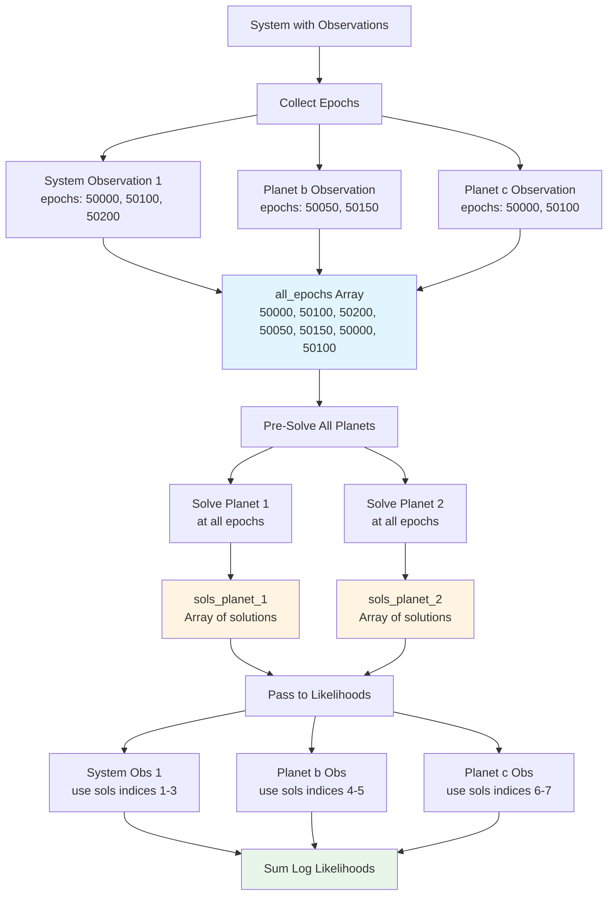

# Observation Epoch Tables and Kepler Pre-Solving

This document explains how Octofitter manages observation epochs and implements efficient Kepler equation solving through pre-computation and caching strategies.

## Overview

Octofitter makes the assumption that all observations will require solving Kepler's equation for all planets (N_planets x N_epochs). For code convenience and potential speedups (through better cache hits, multi-threading, and hopefully future GPU/SIMD), Octofitter pre-solves all orbits X all epochs upfront for every likelihood evaluation, and then passes the orbit solutions to each likelihood function.
## Observation Epoch Tables

### Table Structure

All observation likelihoods that involve computing an orbit store the observation data data as a `TypedTables.Table` with an `:epoch` column:

```julia
using TypedTables

# Relative astrometry example
astrom_table = Table(
    epoch = [50000.0, 50100.0, 50200.0],  # MJD
    ra    = [100.0, 98.0, 95.0],          # mas
    dec   = [50.0, 52.0, 54.0],           # mas
    σ_ra  = [1.0, 1.0, 1.0],              # mas
    σ_dec = [1.0, 1.0, 1.0]               # mas
)

astrom_like = PlanetRelAstromLikelihood(astrom_table)
```

### Why TypedTables?

`TypedTables.jl` provides a DataFrame-like object that is completely concretely typed to avoid any runtime dispatch. Everything is compiled out.

### Common Epoch Column Patterns

Typical structure:
```julia
# Most likelihoods: epoch column in main table
struct PlanetRelAstromLikelihood{TTable<:Table}
    table::TTable  # Must have :epoch column
end
```

Exception: we currently also overload the meaning of the table to refer to discrete "observation" rows for the sake of e.g. cross-validation. For a couple of absolute astrometry types, which involve solving many different orbit solutions per discrete "observation data point" (e.g. Hipparcos proper motion in RA), we create a dummy table with one row per observation and then just solve the orbits manually in the ln_like function.

## Epoch Collection Process

Octofitter uses run time metaprogramming. When compiling the user model, we loop through all likelihoods and collect the list of epochs. These epochs are inlined directly into the generated likelihood function.
**Location**: [`src/likelihoods/system.jl:6-40`](../../src/likelihoods/system.jl)

### Collection Algorithm

During `make_ln_like` code generation, Octofitter walks through all observations and collects epochs:

```julia
function make_ln_like(system::System, θ_system_sample)
    all_epochs = Float64[]
    epoch_start_index_mapping = Dict{Any,Int}()
    j = 1

    # Step 1: Collect from system-level observations
    for obs in system.observations
        if hasproperty(obs, :table) && hasproperty(obs.table, :epoch)
            # Record starting index for this observation
            epoch_start_index_mapping[obs] = j

            # Append epochs
            n_epochs = length(obs.table.epoch)
            j += n_epochs
            append!(all_epochs, obs.table.epoch)
        end
    end

    # Step 2: Collect from planet-level observations
    for i in 1:length(system.planets)
        planet = system.planets[i]
        for obs in planet.observations
            if hasproperty(obs, :table) && hasproperty(obs.table, :epoch)
                # Record starting index
                epoch_start_index_mapping[obs] = j

                # Append epochs
                n_epochs = length(obs.table.epoch)
                j += n_epochs
                append!(all_epochs, obs.table.epoch)
            end
        end
    end

    # all_epochs now contains concatenated epochs from all observations
    # epoch_start_index_mapping maps each observation → its offset
end
```

## Kepler Equation Pre-Solving

### The Kepler Problem

Given orbital elements and a time `t`, find the true anomaly `ν` (position in orbit):

```
M = n(t - tp)              # Mean anomaly (linear in time)
M = E - e sin(E)           # Kepler's equation (must solve for E)
ν = 2 atan(√((1+e)/(1-e)) * tan(E/2))  # True anomaly from E
```

Kepler's equation has no closed-form solution, requiring iterative methods (e.g. Newton-Raphson) or another approximation, like the Markley algorithm we use by default.

### Pre-Solving Strategy

**Location**: [`src/likelihoods/system.jl:111-131`](../../src/likelihoods/system.jl)

Octofitter pre-solves at the start of each likelihood call:

```julia
# Generated code pattern
function ln_like_generated(system::System, θ_system)
    ll_out = @no_escape begin
        # Construct orbit elements
        planet_1 = Visual{KepOrbit}(;merge(θ_system, θ_system.planets[1])...)
        planet_2 = ThieleInnesOrbit(;merge(θ_system, θ_system.planets[2])...)
        elems = tuple(planet_1, planet_2)

        # Pre-solve ALL orbits at ALL epochs
        epochs = @alloc(Float64, $(length(all_epochs)))
        $(initialize_epochs...)  # Unrolled: epochs[1] = 50000.0, epochs[2] = ...

        # Solve first epoch to determine solution type
        sol0_planet_1 = orbitsolve(planet_1, first(epochs))
        sols_planet_1 = @alloc(typeof(sol0_planet_1), length(epochs))
        sols_planet_1[begin] = sol0_planet_1
        _kepsolve_all!(view(sols_planet_1, 2:length(epochs)),
                       planet_1,
                       view(epochs, 2:length(epochs)))

        # Repeat for planet 2
        sol0_planet_2 = orbitsolve(planet_2, first(epochs))
        sols_planet_2 = @alloc(typeof(sol0_planet_2), length(epochs))
        sols_planet_2[begin] = sol0_planet_2
        _kepsolve_all!(view(sols_planet_2, 2:length(epochs)),
                       planet_2,
                       view(epochs, 2:length(epochs)))

        orbit_solutions = (sols_planet_1, sols_planet_2)

        # Now evaluate likelihoods (can access pre-computed solutions)
        ll = zero(Float64)
        ll += ln_like(system.observations[1], θ_system, θ_obs, elems, orbit_solutions, 0)
        ll += ln_like(planet_1.observations[1], θ_system, θ_planet_1, θ_obs, elems, orbit_solutions, 1, 4)
        # ... more likelihood evaluations

        ll
    end

    return ll_out
end
```

### Single-Threaded Solver

```julia
function _kepsolve_all_singlethread!(solutions, orbit, epochs)
    for epoch_i in eachindex(epochs)
        solutions[epoch_i] = orbitsolve(orbit, epochs[epoch_i])
    end
    return solutions
end
```

Used for either small numbers of observations, or when the outer sampler is multi-threaded.

### Multi-Threaded Solver

```julia
function _kepsolve_all_multithread!(solutions, orbit, epochs)
    Threads.@threads for epoch_i in 1:length(epochs)
        solutions[epoch_i] = orbitsolve(orbit, epochs[epoch_i])
    end
    return solutions
end
```

Parallelizes across available threads. Each orbit solve is independent.

### Dynamic Dispatch

```julia
const _kepsolve_use_threads = Ref(false)

function _kepsolve_all!(solutions, orbit, epochs)
    if _kepsolve_use_threads[]
        return _kepsolve_all_multithread!(solutions, orbit, epochs)
    else
        return _kepsolve_all_singlethread!(solutions, orbit, epochs)
    end
end
```

Threading decision is made once at the start of sampling, not per-call.

## Threading Decision

**Location**: [`src/sampling.jl:264-269`](../../src/sampling.jl)

### Heuristic

```julia
threads_avail = Threads.nthreads()
n_epochs = _count_epochs(model.system)

# Enable threading if:
# 1. Multiple threads available
# 2. Enough epochs to justify overhead
Octofitter._kepsolve_use_threads[] = threads_avail > 1 && n_epochs > 15
```

### Benchmark-Based Threshold

The threshold of **15 epochs** is based on micro-benchmarks:

```julia
# Typical performance on modern CPU:
thread_spawn_overhead ≈ 450 ns
orbitsolve_time ≈ 32 ns per call

# Threading beneficial when:
# N × orbitsolve_time > thread_spawn_overhead
# N × 32ns > 450ns
# N > 14

# Conservative threshold: 15 epochs
```

For fewer epochs, single-threaded is faster due to spawn overhead.

### Counting Epochs

```julia
function _count_epochs(system::System)
    n = 0
    # System-level observations
    for obs in system.observations
        if hasproperty(obs, :table) && hasproperty(obs.table, :epoch)
            n += length(obs.table.epoch)
        end
    end
    # Planet-level observations
    for planet in system.planets
        for obs in planet.observations
            if hasproperty(obs, :table) && hasproperty(obs.table, :epoch)
                n += length(obs.table.epoch)
            end
        end
    end
    return n
end
```

## Likelihood Interface

TODO: update this to match the new Observation Context system.
### Standard Signature

Likelihoods receive pre-solved orbits via this interface:

```julia
function ln_like(
    like::AbstractLikelihood,
    θ_system::NamedTuple,            # System parameters
    θ_planet::NamedTuple,            # Planet parameters (if planet-level)
    θ_obs::NamedTuple,               # Observation parameters
    orbits::Tuple,                   # All orbit element objects
    orbit_solutions::Tuple,          # Pre-computed solutions for all planets
    planet_index::Int,               # Which planet (0 for system-level)
    orbit_solutions_start_index::Int # Offset into solutions array
)
end
```

### Accessing Pre-Solved Orbits

Example from [`src/likelihoods/relative-astrometry.jl`](../../src/likelihoods/relative-astrometry.jl):

```julia
function ln_like(
    like::PlanetRelAstromLikelihood,
    θ_system,
    θ_planet,
    θ_obs,
    orbits,
    orbit_solutions,
    planet_index,
    orbit_solutions_start_index
)
    ll = zero(eltype(θ_planet.a))

    # Get this planet's solutions
    sols = orbit_solutions[planet_index]

    # Loop through observations
    for i_epoch in eachindex(like.table.epoch)
        # Access pre-computed solution
        sol_i = i_epoch + orbit_solutions_start_index
        sol = sols[sol_i]

        # Extract observables (no solving needed!)
        ra_model = raoff(sol) * θ_obs.platescale
        dec_model = decoff(sol) * θ_obs.platescale

        # Compute residuals
        Δra = like.table.ra[i_epoch] - ra_model
        Δdec = like.table.dec[i_epoch] - dec_model

        # Likelihood contribution
        ll += logpdf(Normal(0, like.table.σ_ra[i_epoch]), Δra)
        ll += logpdf(Normal(0, like.table.σ_dec[i_epoch]), Δdec)
    end

    return ll
end
```

### Key Points

1. **No `orbitsolve` calls**: Solutions already computed
2. **Indexing**: Use `orbit_solutions_start_index` to offset into global solution array
3. **Planet selection**: `planet_index` selects the correct planet's solutions
4. **Type stability**: `sols` has concrete type from pre-solving

## Memory Management

### Stack Allocation with Bumper.jl

All temporary arrays use stack allocation:

```julia
ll_out = @no_escape begin
    # Create bump allocator scope

    epochs = @alloc(Float64, n_epochs)
    sols_planet_1 = @alloc(OrbitSolution, n_epochs)
    sols_planet_2 = @alloc(OrbitSolution, n_epochs)

    # ... compute likelihood

    ll_final
end  # All allocations freed here (stack pointer reset)
```

**Benefits**:
- **Fast allocation**: Bump pointer increment (1-2 CPU cycles)
- **Fast deallocation**: Stack pointer reset (free!)
- **No GC pressure**: No heap allocations to collect
- **Thread safe**: Each thread has its own buffer

**Location**: `@no_escape` comes from Bumper.jl, enabled in the `@no_escape begin ... end` block.

### Allocation Sizes

For a typical system:

```julia
# Example: 2 planets, 100 epochs total
sizeof(epochs) = 100 × 8 bytes = 800 bytes
sizeof(sols_planet_1) = 100 × 64 bytes = 6.4 KB  # Typical solution size
sizeof(sols_planet_2) = 100 × 64 bytes = 6.4 KB

# Total temporary allocation: ~13.6 KB per likelihood call
# Stack allocated → no heap fragmentation
```

Even for large systems (10 planets, 1000 epochs), temporary allocations are < 1 MB.

### Type Determination

The solution type must be determined at runtime:

```julia
# Solve first epoch to get concrete type
sol0 = orbitsolve(planet_1, first(epochs))

# Allocate array with correct concrete type
sols = @alloc(typeof(sol0), length(epochs))
```

This ensures type stability for the entire solution array.


## Diagram: Epoch Collection and Pre-Solving



## Special Cases


### Observations Without Epochs

Some likelihoods don't depend on time:

```julia
# Priors on observable quantities
struct ObservablePriorLikelihood <: AbstractLikelihood
    dist::Distribution
    # No table, no epochs
end

# Doesn't participate in epoch collection
# Evaluated directly without orbit solving
```

### Multi-Epoch Observations

Some observations span multiple epochs in complex ways:

```julia
# Hipparcos-Gaia proper motion anomaly
struct HGCALikelihood{TTable}
    table::TTable
    # table.hip has Hipparcos epoch
    # table.gaia has Gaia epoch(s)
end
```

The likelihood implementation handles its own epoch indexing into the pre-solved arrays.

## Debugging

### Verifying Epoch Collection

Add diagnostic output during model construction:

```julia
model = LogDensityModel(system)

# Count epochs
n_epochs = Octofitter._count_epochs(system)
println("Total epochs: ", n_epochs)

# Check threading
println("Threading enabled: ", Octofitter._kepsolve_use_threads[])
```

### Checking Solution Types

During development of custom likelihoods:

```julia
function ln_like(like, θ_system, θ_planet, θ_obs, orbits, orbit_solutions, planet_idx, offset)
    # Debug: print solution type
    @show typeof(orbit_solutions)
    @show typeof(orbit_solutions[planet_idx])
    @show typeof(orbit_solutions[planet_idx][1])

    # ... rest of likelihood
end
```

### Profiling Kepler Solving

To measure Kepler solving cost:

```julia
using BenchmarkTools

# Create orbit
orbit = (M=1.0, plx=50.0, a=10.0, e=0.2, i=π/4, ω=0, Ω=0, tp=50000)

# Benchmark single solve
@btime orbitsolve($orbit, 50100.0)

# Benchmark batch solve
epochs = 50000.0:100.0:51000.0
sols = similar(epochs, Any)
@btime Octofitter._kepsolve_all!($sols, $orbit, $epochs)
```

## Future Optimizations

### Adaptive Threading

Could dynamically adjust threading threshold based on measured solve times:

```julia
# Calibration phase
solve_times = @elapsed _kepsolve_all!(...)
thread_overhead = @elapsed Threads.@threads for i in 1:10 end

# Adjust threshold
optimal_threshold = ceil(Int, thread_overhead / (solve_times / n_epochs))
```

**Benefit**: Adapt to different CPUs and orbit complexities automatically.

### SIMD

It would be great to develop (in PlanetOrbits.jl) a version of `orbitsolve` that works over an array of orbits
using SIMD. I think this could be a big improvement.

# Kernel: solve Kepler equation on GPU

Likewise, for systems with many epochs it would be great if the SIMD-capable algorithm could be used on a GPU.

## See Also

- **Developer Documentation**:
  - [Architecture Overview](architecture.md) - Overall code generation strategy
  - [Orbit Bases](orbit-bases.md) - Types of orbits and their interfaces

- **User Documentation**:
  - [Custom Likelihoods](../custom-likelihood.md) - Implementing new likelihood types
  - [Loading and Saving Data](../loading-saving.md) - Working with observation tables

- **External**:
  - [PlanetOrbits.jl Docs](https://sefffal.github.io/PlanetOrbits.jl/) - Orbit solving interface
  - [Bumper.jl](https://github.com/MasonProtter/Bumper.jl) - Stack allocation library
  - [TypedTables.jl](https://github.com/JuliaData/TypedTables.jl) - Type-stable tables
