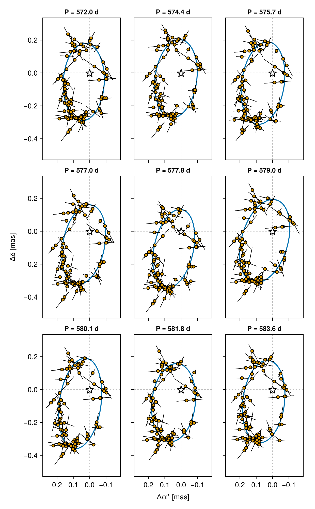

# Fitting Gaia DR4 Pre-Release Epoch Astrometry

In June 2026 ESA pre-released Gaia DR4 epoch astrometry for **12 sources**. Unlike the
[Gaia DR4 Simulation](@ref data-simulation-dr4) tutorial — which generates *synthetic*
epoch astrometry from a scan law — this tutorial fits **real Gaia epoch astrometry**.

We will fit **Gaia-4b**, a ~11.8 M<sub>jup</sub> companion on a ~571 day orbit
(Stefansson et al. 2025), from its along-scan measurements alone.

!!! note "Data provenance and credit"
    The data used here is derived from
    [`gaia-dr4-prerelease-epoch-astrometry_2026-06-26.zip`](https://www.cosmos.esa.int/web/gaia/dr4-prerelease).

    * Detailed information: <https://www.cosmos.esa.int/web/gaia/dr4-prerelease>
    * Data license: <https://www.cosmos.esa.int/web/gaia-users/license>
    * Acknowledgement and citation instructions:
      <https://gea.esac.esa.int/archive/documentation/GDR3/Miscellaneous/sec_credit_and_citation_instructions/>

    If you use this data in a publication, please follow ESA/DPAC's acknowledgement
    and citation instructions above.

## Setup

```julia
using Octofitter
using Distributions
using CairoMakie
using CSV, DataFrames
using Statistics
using Random
using Pigeons
```


## Loading the data

The pre-release ships as a VOTABLE, which needs a little massaging before it can be
used (see [Where these files came from](@ref dr4-prerelease-votable) at the bottom of
this page if you're curious). To keep this tutorial focused on the modelling, we ship
ready-to-use CSV extracts of three of the twelve pre-released sources with the
documentation — download them directly and read them with `CSV.read`:

| File | Source | `source_id` |
|---|---|---|
| [`gaia4_epoch_astrometry.csv`](https://github.com/sefffal/Octofitter.jl/blob/main/docs/src/gaia4_epoch_astrometry.csv) | Gaia-4 (G = 11.91) | `1457486023639239296` |
| [`gaia_bh3_epoch_astrometry.csv`](https://github.com/sefffal/Octofitter.jl/blob/main/docs/src/gaia_bh3_epoch_astrometry.csv) | Gaia BH3 (G = 11.23) | `4318465066420528000` |
| [`hd114762_epoch_astrometry.csv`](https://github.com/sefffal/Octofitter.jl/blob/main/docs/src/hd114762_epoch_astrometry.csv) | HD 114762 (G = 7.15) | `3937211745905473024` |

This tutorial fits the first; the other two are described under
[Other pre-released sources](@ref dr4-prerelease-others) below. The same code runs on
all three, and on any table you extract yourself from the VOTABLE.

```julia
const GAIA4_SOURCE_ID = 1457486023639239296
const REF_EPOCH_MJD   = 57936.375   # Gaia DR4 reference epoch, J2017.5

ccd = CSV.read(joinpath(@__DIR__, "gaia4_epoch_astrometry.csv"), DataFrame, comment="#")
println("$(nrow(ccd)) CCD-level observations, $(length(unique(ccd.transit_id))) transits")
```

This gives one row per **CCD observation**: 1077 rows spread over 109 transits.
The columns are:

| Column | Units | Meaning |
|---|---|---|
| `source_id` | — | Gaia DR3 source identifier (constant within one file) |
| `transit_id` | — | Groups the CCD observations belonging to one field-of-view transit |
| `epoch` | MJD | Observation time (converted from TCB nanoseconds — see below) |
| `scan_pos_angle` | **degrees** | Position angle of the scan, ψ |
| `centroid_pos_al` | mas | Along-scan centroid offset from the reference point |
| `centroid_pos_error_al` | mas | Formal along-scan centroid uncertainty |
| `ipd_error_al` | mas | Image parameter determination uncertainty |
| `parallax_factor_al` | — | Along-scan parallax factor (one value per transit) |
| `used_by_agis_al` | bool | Whether this CCD observation was used in the astrometric solution |
| `outlier_flag` | 0/1 | `0` where `used_by_agis_al` is true; `GaiaDR4AstromObs` skips rows with `outlier_flag > 0` |

!!! note "Angles are in degrees, exactly as the archive publishes them"
    `scan_pos_angle` is the only angle-like column, and these CSVs carry it in
    **degrees** — the unit declared in the VOTABLE (`unit="deg"`), unmodified.
    `GaiaDR4AstromObs` takes degrees and converts to radians internally, so a table read
    straight out of the Gaia archive needs no unit conversion at all. There is no
    `deg2rad` step anywhere in this tutorial.

    (This changed in Octofitter v9: v8's `GaiaDR4AstromObs` expected radians. If you are
    porting a v8 script, delete the `deg2rad.` you applied to `scan_pos_angle` — a scan
    angle silently read in the wrong unit is one of the easier ways to get a
    plausible-looking but wrong posterior.)

## [From CCD observations to transit-level data](@id dr4-prerelease-reduction)

Gaia records roughly 9 usable CCD observations per field-of-view transit (SM, then
AF1–AF9). These are taken seconds apart, so for orbit fitting they carry essentially the
same astrometric information but are *not* statistically independent — their errors share
attitude and calibration systematics.

We therefore collapse each transit down to a single measurement. The reduction we
recommend is the **bootstrap reduction** below: drop the CCD observations not used by
AGIS, take the per-transit median along-scan position, and estimate its uncertainty by
bootstrap-resampling the CCD observations within the transit, floored at the IPD
uncertainty divided by `sqrt(N_CCD)`.

This is deliberately *not* a built-in Octofitter function. The choice of reduction is a
modelling decision that belongs to you and should be visible in your script, so copy
these two functions in and adjust them if your data warrant it:

```julia
"CCD-level table filtered to AGIS-used rows, as a DataFrame."
load_dr4_ccd(path) =
    subset(CSV.read(path, DataFrame, comment="#"), :used_by_agis_al)

"""
    reduce_transits(ccd; n_boot=256) -> Dict{Int64,DataFrame}

Collapse the CCD-level table to one row per transit for each source. RNG is
seeded from the source_id and transits are processed in sorted order, so the
reduction is fully deterministic.
"""
function reduce_transits(ccd::DataFrame; n_boot::Int=256)
    out = Dict{Int64,DataFrame}()
    for src in groupby(ccd, :source_id)
        sid = src.source_id[1]
        rng = Xoshiro(sid)
        rows = NamedTuple[]
        for tr in groupby(sort(DataFrame(src), :transit_id), :transit_id)
            pos = collect(Float64, tr.centroid_pos_al)
            n = length(pos)
            med = median(pos)
            floor_err = median(tr.ipd_error_al) / sqrt(n)
            if n == 1
                err = tr.ipd_error_al[1]
            else
                meds = [median(rand(rng, pos, n)) for _ in 1:n_boot]
                err = max(std(meds), floor_err)
            end
            push!(rows, (;
                transit_id=tr.transit_id[1],
                epoch=mean(tr.epoch),
                scan_pos_angle=tr.scan_pos_angle[1],
                parallax_factor_al=tr.parallax_factor_al[1],
                centroid_pos_al=med,
                centroid_pos_error_al=err,
                n_ccd=n))
        end
        out[sid] = DataFrame(rows)
    end
    return out
end
```

What each piece does:

* **`load_dr4_ccd`** reads the CSV and keeps only the rows AGIS itself used
  (`used_by_agis_al`), which is Gaia's own outlier rejection at CCD level.
* **the median** of `centroid_pos_al` within a transit is the transit's along-scan
  position — robust to the one or two CCD windows that go bad in a transit.
* **the uncertainty** is the standard deviation of `n_boot` bootstrap-resampled medians:
  it measures the actual scatter of the CCD observations rather than trusting the formal
  per-CCD error, and so credits the averaging when the CCDs agree.
* **the floor** `median(ipd_error_al) / sqrt(n)` keeps a transit whose CCDs happen to
  agree very closely from being assigned an implausibly small error bar.
* **`scan_pos_angle` and `parallax_factor_al`** are taken from the first CCD row: both
  are per-transit quantities in the pre-release. `parallax_factor_al` is literally one
  value per transit; `scan_pos_angle` drifts by at most ~0.002° (a few arcseconds)
  across the ~45 s a transit takes to cross the focal plane, which moves the projected
  abscissa by ≲0.004 mas — an order of magnitude below the per-transit precision.
* **determinism**: the RNG is seeded from the `source_id` and transits are visited in
  sorted `transit_id` order, so re-running the script reproduces the same error bars
  exactly, and two different sources never share a random stream.

```julia
transit_level_data = reduce_transits(load_dr4_ccd(
    joinpath(@__DIR__, "gaia4_epoch_astrometry.csv")))[GAIA4_SOURCE_ID]

println("$(nrow(transit_level_data)) transits over ",
        round((maximum(transit_level_data.epoch) - minimum(transit_level_data.epoch))/365.25, digits=2),
        " yr")
```

For Gaia-4 this leaves **93 transits** spanning MJD 57038.6 – 58843.2 (4.94 yr, a bit
over three orbits at the published 571 day period).

!!! note "What this binning does and does not model"
    The bootstrap error bar measures the *observed* scatter of the CCD observations
    within a transit. What it still does not model is the correlated
    attitude/calibration component shared *within* a transit, which no within-transit
    statistic can see. As always with pre-release data, check that your conclusions are
    not sensitive to the choice of reduction before publishing them — for instance by
    re-running with `n_boot` doubled, or against the per-CCD formal errors, and
    confirming the posterior does not move.

## Building the likelihood

The astrometric nuisance parameters live in the likelihood's own `@variables` block. The
frame zero-point offsets (`ra_offset_mas`, `dec_offset_mas`) absorb the difference between
the DR3 catalogue position and the DR4 frame, and `pmra`/`pmdec` are the barycentre's
proper motion.

```julia
gaia_obs = GaiaDR4AstromObs(
    transit_level_data,
    target = Photocentre,   # what the catalogue source is: the blended, flux-weighted point
    ref    = Barycentre,    # ...measured against the system barycentre
    name="GaiaDR4",
    variables=@variables begin
        astrometric_jitter ~ LogUniform(0.00001, 10)   # mas
        ra_offset_mas  ~ Normal(0, 1000)               # frame zero-point (absorbs DR3<->DR4 offset)
        dec_offset_mas ~ Normal(0, 1000)
        pmra  ~ Uniform(-1000, 1000)                   # mas/yr
        pmdec ~ Uniform(-1000, 1000)
        ref_epoch = $REF_EPOCH_MJD
    end
)

# The observation carries data, references and variables only, so query the DR3
# solution explicitly when you need it:
sol = Octofitter._query_gaia_dr3(gaia_id=GAIA4_SOURCE_ID)
println("DR3 solution: plx=$(sol.parallax)  pmra=$(sol.pmra)  pmdec=$(sol.pmdec)")
```

The parallax the likelihood uses comes from the system's own `plx`; there is nothing to
forward into the observation's block.

!!! warning "`plx` is the barycentre's parallax, not the photocentre's"
    The frame's `plx` places the system's *barycentre*, while what the epoch astrometry
    actually constrains is the parallax of the **photocentre**. For a compact orbit the
    two are the same to well within the errors. For a wide one they are not, and a model
    that pins `plx` tightly to a catalog value — which was itself fitted as a single-star
    photocentre solution — can produce a posterior with a long curved ridge that samplers
    struggle to explore. The model below keeps `plx` wide, which is all a compact orbit
    needs. If yours is wide compared to the mission baseline, sample the *star's*
    quantities instead and let the model derive the barycentre's — see
    [Anchoring the frame to the star](@ref dr4-prerelease-anchored) — and check the
    `plx`–`a`–`mass` corner either way.

!!! note "`_query_gaia_dr3` is internal for now"
    The leading underscore is deliberate: the archive query layer will be replaced once
    the DR4 TAP endpoints are published, at which point the intent is that you pass a
    `gaia_id` and Octofitter fetches everything it needs. Until then, treat this call as
    a convenience whose signature may change.

## The model

```julia
orbit_ref_epoch = mean(gaia_obs.table.epoch)

A = Body(
    name="A",
    variables=@variables begin
        mass ~ truncated(Normal(0.644, 0.02), lower=0.1)   # host mass [Msol] (Stefansson et al. 2025)
        flux = 1.0                           # the host sets the photocentre's flux scale
    end
)

b = Body(
    name="b",
    about=A,
    variables=@variables begin
        mass ~ LogUniform(0.3mjup, 100mjup)  # companion mass [Msol]; `mjup` is a constant
        flux = 0.0                           # dark companion => the photocentre is the host
        a ~ Uniform(0, 10)                   # AU  (Gaia-4b is at ~1.17 AU)
        e ~ Uniform(0, 0.99)
        ω ~ UniformCircular()
        i ~ Sine()
        Ω ~ UniformCircular()
        θ ~ UniformCircular()                # position angle at `epoch`
        # `θ` + `epoch` is a phase parametrization the orbit constructor accepts
        # directly, and an orbit's total mass comes from the hierarchy.
        epoch = $orbit_ref_epoch
    end
)

sys = System(
    name="Gaia4",
    bodies=[A, b],
    observations=[gaia_obs],
    variables=@variables begin
        plx ~ Uniform(0, 100)
    end
)

model = Octofitter.LogDensityModel(sys; verbosity=4)
```

There is no system-level `M` any more: each body carries its own `mass`, and an orbit's
total mass comes from the hierarchy. A `Photocentre` target needs at least one body to
declare a flux, which is what `flux = 1.0` on `A` is for; `flux = 0.0` on `b` makes the
photocentre exactly the host, which is the right model for a dark companion.

### [Anchoring the frame to the star](@id dr4-prerelease-anchored)

The model above samples the *barycentre's* parallax, proper motion and position offset.
The data measure none of them: every transit is a position of the **photocentre** — here
the host star, since `b` is dark. For Gaia-4 the difference is small and the wide priors
absorb it. For a massive companion on a wide orbit (Gaia BH3, below), the star's motion
about the barycentre is large and the orbit unclosed, so the barycentric frame becomes
degenerate with the orbit and the sampler crawls along a ridge.

The fix is to sample what the data measure and *derive* the barycentre. A **deferred
system line** — one that names a body — can solve `system_interim`, a system built from
this model's own bodies, and ask where the star sits relative to the barycentre in the
current draw:

```julia
gaia_obs = GaiaDR4AstromObs(
    transit_level_data,
    target = Photocentre,
    ref    = Barycentre,
    name="GaiaDR4",
    variables=@variables begin
        astrometric_jitter ~ LogUniform(0.00001, 10)
        # The reference-point motion now comes from the system block:
        ra_offset_mas  = system.bary_ra_offset_mas
        dec_offset_mas = system.bary_dec_offset_mas
        pmra  = system.bary_pmra
        pmdec = system.bary_pmdec
        ref_epoch = $REF_EPOCH_MJD
    end
)

sys = System(
    name="Gaia4",
    bodies=[A, b],
    observations=[gaia_obs],
    variables=@variables begin
        # Sample the star's own solution — the quantities the data measure…
        plx_A   ~ Uniform(0, 100)
        pmra_A  ~ Uniform(-1000, 1000)
        pmdec_A ~ Uniform(-1000, 1000)
        ra_offset_A_mas  ~ Normal(0, 1000)
        dec_offset_A_mas ~ Normal(0, 1000)
        # …and derive the barycentre's by subtracting A's modelled motion about it.
        plx_interim = plx_A                                    # distance for the solve below
        Δ = anchor_offsets(system_interim, :A, $REF_EPOCH_MJD) # deferred: names a body
        plx = barycentre_parallax(plx_A, Δ.dz)
        bary_pmra  = pmra_A  - Δ.pmra
        bary_pmdec = pmdec_A - Δ.pmdec
        bary_ra_offset_mas  = ra_offset_A_mas  - Δ.ra_cosdec
        bary_dec_offset_mas = dec_offset_A_mas - Δ.dec
    end
)
```

Nothing downstream changes — the frame still means the barycentre, and the likelihood
reads the same variables. What changed is which direction the sampler moves: `pmra_A` is
pinned by the data whatever the mass ratio does. The parallax is covered too:
[`barycentre_parallax`](@ref) converts the star's parallax to the barycentre's exactly,
using the star's line-of-sight offset `Δ.dz` — about `dz·plx²/2×10⁸` mas, negligible
here but not for a nearby wide binary. Priors on the anchored variables transfer with
volume factor 1 (see [`AnchoredFrame`](@ref)'s docstring for the Jacobian).

Starting values follow the sampled names — `plx_A = sol.parallax, pmra_A = sol.pmra, …`
instead of `plx`, and the observation block now needs only `astrometric_jitter`. What
anchoring does *not* buy is a licence to pin: `sol.parallax` is still a single-star fit
that the very orbit you are fitting can bias, so it makes a starting point, not a tight
prior.

[Anchoring the frame to a source](@ref g23h-anchored) explains the mechanism —
`system_interim`, [`anchor_offsets`](@ref), the Jacobian — and [`AnchoredFrame`](@ref)
packages these lines for observation types that keep the frame in the system block.

## Initializing and sampling

```julia
init_chain = initialize!(model, (;
    plx = sol.parallax,
    bodies = (
        A = (; mass = 0.644),
        b = (; mass = 11.8mjup, a = 1.17, e = 0.1, i = 1.0),
    ),
    observations = (GaiaDR4 = (
        astrometric_jitter = 0.1,
        ra_offset_mas = 0.0,
        dec_offset_mas = 0.0,
        pmra = sol.pmra,
        pmdec = sol.pmdec,
    ),),
))
octoplot(model, init_chain)
```

Starting values nest under `bodies=` now, not `planets=`, and the host star is a body like
any other, so its mass is initialized in the same place.

### [Seeding from a published NSS solution](@id nss-starting-points)

If your source has a Gaia Non-Single Star two-body orbit, [`initialize_from_nss!`](@ref)
fetches it and seeds the named body from it in one call:

```julia
init_chain = initialize_from_nss!(model; gaia_id=GAIA4_SOURCE_ID, body=b)
```

It maps whichever parameterization your body uses — Thiele-Innes constants directly, or
Campbell elements (including the `Ωx`/`Ωy` pair of a `UniformCircular()`) converted from
them — plus `e`, and `P` or `a`. Everything stays free during sampling; the solution only
anchors the search. The pieces are also available separately:
[`query_nss`](@ref) returns the catalogue row, [`nss_to_starting_point`](@ref) turns it
into an `initialize!` guess, and [`nss_to_model_chain`](@ref) builds a throwaway
model and chain from the published values and their error bars, to plot the NSS orbit
beside your own posterior:

```julia
nss_model, nss_chain = nss_to_model_chain(query_nss(gaia_id=GAIA4_SOURCE_ID))
octoplot(nss_model, nss_chain)
pairplot("This fit" => chain, "NSS" => nss_chain)
```

!!! warning "Starting points, never priors"
    Fitting the same astrometry the NSS solution was fitted to, with that solution as a
    prior, uses the data twice — and NSS error bars can be optimistic on top of that. Use
    these values to start the search and to compare against, not to constrain it.

Astrometry-only orbit fits are strongly multi-modal, so parallel tempering is the safer
choice here:

```julia
chain, pt = octofit_pigeons(
    model,
    n_chains=16,
    n_rounds=8,
    n_chains_variational=0,
    variational=nothing,
)
```

!!! tip "An astrometry-only fit wants parallel tempering"
    This fit runs under [`octofit_pigeons`](@ref) with a non-variational reference
    (`n_chains_variational=0`, `variational=nothing`), which is what an astrometry-only
    posterior wants. Dropping to HMC here is a real downgrade: seed it well
    ([`initialize!`](@ref) / [`startingpoints!`](@ref)) and check carefully for missed
    modes if you do.

## Results

```julia
q(v) = round.(quantile(v, (0.16, 0.5, 0.84)), sigdigits=5)

a    = vec(chain["b_a"])
e    = vec(chain["b_e"])
inc  = vec(chain["b_i"])
mb   = vec(chain["b_mass"]) ./ mjup           # Msol -> Mjup, for comparison with the paper
Mtot = vec(chain["A_mass"]) .+ vec(chain["b_mass"])
Pday = sqrt.(a.^3 ./ Mtot) .* 365.25

println("period  [day] : ", q(Pday), "   (Stefansson et al. 2025: 571.3 ± 1.4)")
println("a       [AU]  : ", q(a))
println("e             : ", q(e))
println("i       [deg] : ", round.(rad2deg.(quantile(inc, (0.16, 0.5, 0.84))), digits=1))
println("mass_b  [Mjup]: ", q(mb),   "   (Stefansson et al. 2025: 11.8 ± 0.7)")
```

The chain columns follow the bodies: `b_mass` and `A_mass`, both in solar masses.

And the usual plots:

```julia
octoplot(model, chain)
```

```julia
# A single posterior draw, plotted against the Gaia along-scan data.
# As with RV, this only works for individual draws: the Gaia points are "detrended"
# using the parameters of that particular draw.
#
# `GaiaDR4AstromObs` declares an `:along_scan` plot channel, so the generic panel covers
# the abscissa-vs-time view — restrict the PosteriorSeries to the draw you want:
idx = rand(1:size(chain, 1))
octoplot(Octofitter.PosteriorSeries(model, chain; ii=[idx]))

# `gaiastarplot` is the sky-plane version of the same draw: the reflex track with each
# transit's residual re-projected along its own scan angle.
Octofitter.gaiastarplot(model, chain, idx)
```

```julia
using PairPlots
octocorner(model, chain, small=true)
```

## [Showing the degeneracy: one panel per period quantile](@id dr4-prerelease-degeneracy)

A single `gaiastarplot` shows one orbit passing through the transits, and it is very
easy to read that picture as *the* answer. It is not: it is one draw out of a posterior
that, for an astrometry-only fit, can be broad and is often multi-modal. The honest
version of the figure is a **grid** — the same data, several times, each panel a
different draw taken from across the period marginal.

[`gaiastarplot!`](@ref) draws into a cell of a figure you already have, so this is a
loop over grid positions. Its third argument is the row index of the draw, which is what
turns a set of quantiles into a set of panels:

```julia
# The period marginal. `a` is sampled and the total mass comes from the hierarchy,
# so the period is derived per draw rather than being a chain column.
Pday = sqrt.(vec(chain["b_a"]).^3 ./
             (vec(chain["A_mass"]) .+ vec(chain["b_mass"]))) .* 365.25

# Nine draws spread over the marginal: for each quantile, the draw whose period
# is nearest to it. (`argmin` on |P - quantile| — the quantile itself is not a
# draw, and we want a real posterior sample, orbit and nuisance parameters and
# all, not an interpolation between two of them.)
probs = range(0.05, 0.95, length=9)     # 5th to 95th percentile, nine panels
idxs  = [argmin(abs.(Pday .- quantile(Pday, p))) for p in probs]

fig = Figure(size=(620, 1000))   # each panel is DataAspect: size the figure to match
axes = Axis[]
for (k, idx) in enumerate(idxs)
    i, j = fldmod1(k, 3)
    ax = Octofitter.gaiastarplot!(fig[i, j], model, chain, idx;
        axis=(; title="P = $(round(Pday[idx], digits=1)) d", titlesize=13,
                xlabel="", ylabel=""))
    push!(axes, ax)
end

# Shared scale, and decorations only on the outside edges.
linkaxes!(axes...)
for (k, ax) in enumerate(axes)
    i, j = fldmod1(k, 3)
    hidexdecorations!(ax; ticks=false, grid=false)
    hideydecorations!(ax; ticks=false, grid=false)
    i == 3 && (ax.xticklabelsvisible = true)
    j == 1 && (ax.yticklabelsvisible = true)
end
Label(fig[4, 1:3], "Δα* [mas]")
Label(fig[1:3, 0], "Δδ [mas]", rotation=pi/2)
colgap!(fig.layout, 8)
rowgap!(fig.layout, 8)
fig
```



**Read it as a caption.** Every panel shows the same 93 transits; only the orbit differs.
Ellipses of visibly different shape, size and orientation all thread the same scan lines
about equally well, because each transit constrains the source's position along **one**
direction — the measurement is a line, not a point — and the frame zero-point, proper
motion and jitter parameters absorb a good deal of what is left over. The differences
between panels *are* the posterior width, drawn in the space where you can judge them,
and a single best-fit track cannot show you any of it.

Because the panels share a scale, they are directly comparable. Read both what changes
and what does not: for Gaia-4 the period is pinned to about ±1% across the whole 5th-to-95th
percentile range, so all nine titles are nearly the same number, while the eccentricity and
the orientation of the ellipse wander noticeably. That is the useful, publishable statement
— *this* is tight, *that* is not — and it is exactly what the grid makes visible. On a
system with only half an orbit of coverage — Gaia BH3, below — expect the tracks themselves
to disagree far more.

!!! tip "Please put this figure in your paper"
    We would encourage showing a grid like this alongside the usual single best-fit
    track. It costs one extra figure and it tells the reader what the posterior actually
    supports, which a MAP orbit drawn on its own quietly overstates. The same loop works
    for any parameter you are worried about — take the quantiles of `b_mass` or
    `b_e` instead of the period, or of `b_i` if the inclination is what your mass
    depends on.

    The grid is a *visual* check, not a replacement for the corner plot: it shows how
    different the orbits look, while `octocorner` shows how the parameters covary. They
    answer different questions and it is worth showing both.

## [Other pre-released sources](@id dr4-prerelease-others)

Two more of the twelve pre-released sources are shipped with the documentation as CSVs
in the same format, so the code above runs on them unchanged — only the file name and
`source_id` differ:

```julia
const BH3_SOURCE_ID = 4318465066420528000
bh3 = reduce_transits(load_dr4_ccd(
    joinpath(@__DIR__, "gaia_bh3_epoch_astrometry.csv")))[BH3_SOURCE_ID]

const HD114762_SOURCE_ID = 3937211745905473024
hd114762 = reduce_transits(load_dr4_ccd(
    joinpath(@__DIR__, "hd114762_epoch_astrometry.csv")))[HD114762_SOURCE_ID]
```

**Gaia BH3** (`4318465066420528000`, α = 294.82785°, δ = +14.93092°, G = 11.23) is the
nearby dormant black hole of Gaia Collaboration et al. (2024): a ~33 M⊙ companion to a
metal-poor giant on a ~11.6 yr orbit. The pre-release gives 631 usable CCD observations
over 64 transits; after `reduce_transits` that is **63 transits** spanning MJD 56957.6 –
58818.6 (5.10 yr), which is only about half an orbital period — a good example of a
system where the orbit is *not* closed by the DR4 baseline alone, where the priors on
`a` and `mass` matter, and where
[anchoring the frame to the star](@ref dr4-prerelease-anchored) pays off. Its DR3 RUWE
is 3.41.

**HD 114762** (`3937211745905473024`, G = 7.15, ϖ = 26.2 mas) is the historically
interesting one: the companion announced by Latham et al. (1989) as the first
extrasolar-planet candidate, whose minimum mass of ~11 M<sub>jup</sub> turned out to be
a low-mass *star* seen nearly face-on once Gaia astrometry constrained the inclination
(Kiefer 2019). Its DR3 RUWE is 3.16 and it carries a DR3 non-single-star solution, so
there is a real astrometric signal here to recover, and a published astrometric orbit to
check a fit against.

It is also the cautionary example of the three. Being bright, it loses a much larger
fraction of its CCD observations to AGIS: 879 rows over 89 transits, of which only 558
rows over **63 transits** survive `used_by_agis_al` (MJD 57042.4 – 58840.0, 4.92 yr).
Twenty-six transits vanish entirely. Whether that rejection pattern is uncorrelated with
the orbit is exactly the kind of thing to check before believing a result on
pre-release data.

Both are brighter and better characterised than most of the remaining pre-released
sources, which run down to G ≈ 20 and include at least one quasar — targets chosen to
exercise the pipeline rather than to have orbits fitted to them.

## [Where these files came from](@id dr4-prerelease-votable)

You do not need this section to follow the tutorial — it documents how the three CSVs
were derived from the official VOTABLE, so the reduction is reproducible. We expect the
eventual DR4 release to be reachable through a friendlier query interface, at which point
this step should disappear.

The pre-release VOTABLE stores **one row per transit**, with several columns holding
*arrays* of 10 values — the SM sample followed by AF1–AF9. `obs_time_tcb`,
`scan_pos_angle`, `centroid_pos_al`, `centroid_pos_error_al`, `ipd_error_al` and
`used_by_agis_al` are all array-valued, while `parallax_factor_al`, `ra0` and `dec0` are
per-transit scalars.

To get the flat, one-row-per-CCD-observation table Octofitter expects:

1. Select the rows for your `source_id`.
2. Flatten the array-valued columns, broadcasting the per-transit scalars across the
   10 CCD entries. Drop any CCD entry where a required quantity is masked.
3. Convert the time: `obs_time_tcb` is in **nanoseconds since JD 2455197.5 (TCB)**, so
   `jd = 2455197.5 + obs_time_tcb / 1e9 / 86400` and `mjd = jd - 2400000.5`.
   (Note this differs from the Gaia BH3 paper's published table, where the equivalent
   column is already in days.)
4. Set `outlier_flag = 0` where `used_by_agis_al` is true, else `1`.

That is the whole conversion. In particular there is **no angle unit conversion**:
`scan_pos_angle` is carried through in degrees exactly as the VOTABLE declares it
(`unit="deg"`), which is what `GaiaDR4AstromObs` ingests.

For Gaia-4 (`source_id` 1457486023639239296) this yields 1077 CCD observations over 109
transits, of which 824 are flagged as used by AGIS. The reference point for
`centroid_pos_al` is `ra0 = 209.506326888 deg`, `dec0 = 31.695499700 deg`; these values,
along with the per-file counts and the full conversion, are recorded in the comment
header of each CSV.

!!! note "The full list of pre-released sources"
    The 12 pre-released sources are `2237987199365376`, `2309425390592896`,
    `10973744521070720`, `20694084440761600`, `60730287810150016`, `435469040545191680`,
    `1457486023639239296` (Gaia-4), `1663617687609809280`, `3926186255616949504`,
    `3937211745905473024` (HD 114762), `4181040337841125632` and `4318465066420528000`
    (Gaia BH3).

    `docs/src/astrom.dat` is the separate table published alongside the Gaia BH3 paper,
    already in the flat one-row-per-CCD-observation form rather than the array-valued
    pre-release form. The two agree where they overlap: for a shared `transit_id`, the
    paper table's scan angles reproduce the pre-release `scan_pos_angle` to five
    significant figures — both in degrees.
    Re-basing that example onto the pre-release file has not been done.
