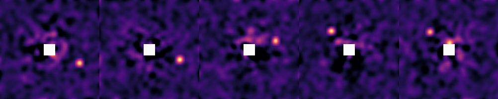
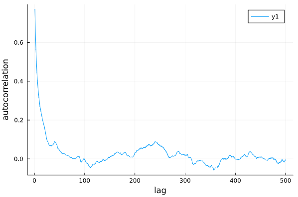
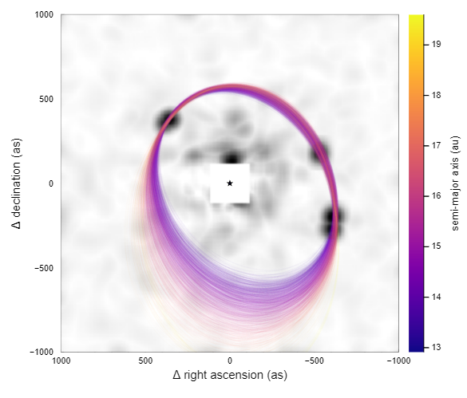
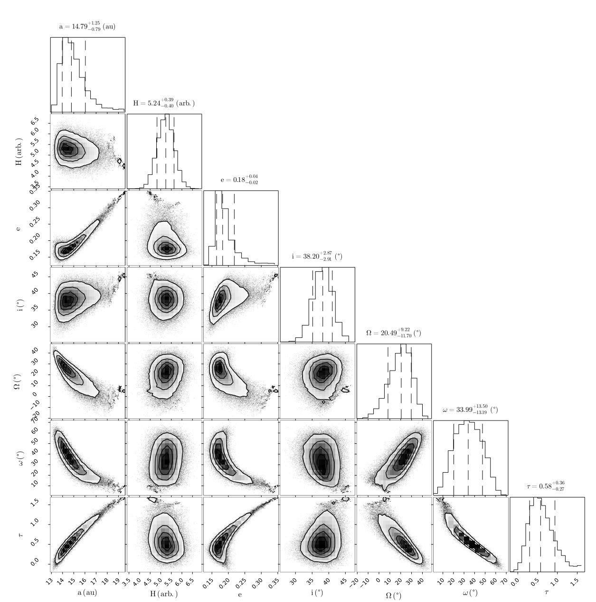
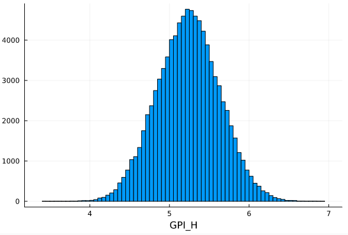

# [Fitting Images](@id fit-images)

One of the key features of DirectDetections.jl is the ability to search for planets directly from images of the system. Sampling from images is much more computationally demanding than sampling from astrometry, but it allows for a few very powerful results:

1. You can search for a planet that is not well detected in a single image
By this, we mean you can feed in images of a system with no clear detections, and see if a planet is hiding in the noise based off of its Kepelerian motion.

2. Not detecting a planet in a given image can be almost as useful as a detection for constraining its orbit. 
If you have a clear detection in one epoch, but no detection in another, DirectDetections can use the image from the second epoch to rule out large swathes of possible orbits.

Sampling from images can be freely combined with any known astrometry points, as well as astrometric acceleration. See advanced models for more details.

## Preparing images
The first step will be to load your images. For this, we will use our DirectImages.jl package; however, all that is really necessary is to load your image(s) into an array and adjust the axes so that the star is at index `[0,0]` (see OffsetArrays.jl if you want to do this yourself).

Start by loading your images:
```julia
using DirectImages

# Load individual iamges
# image1 = readfits("image1.fits")
# image2 = readfits("image2.fits")

# Or slices from a cube:
# cube = readfits("cube1.fits")
# image1 = cube[:,:,1] 

# Or multi-extension FITS (this example)
images = readfits("image-examples-1.fits",:)
```

You can preview the image using `imshow2` from DirectImages:
```julia
# imshow2(image1, cmap=:magma) # for a single image
imshow2([
    images[1]
    images[2]
    images[3]
    images[4]
    images[5]
], cmap=:magma, clims=(-1.0, 4.0))
```


Your images should either be convolved with a gaussian of diameter one λ/D, or be matched filtered. This is so that the values of the pixels in the image represent the photometry at that location. 

If you want to perform the convolution in Julia, see ImageFiltering.jl.

## Build the model
Then, create a system with one or more planets. In this case, we will not provide any astrometry measurements for the planet, but they are supported with the same syntax as shown in the [Fit Astrometry](@ref fit-astrometry) tutorial.

Start by specifying a planet:
```julia
@named X = DirectDetections.Planet(
    Priors(
        a = Normal(13, 3),
        e = TruncatedNormal(0.2, 0.2, 0, 1.0),
        τ = Normal(0.5, 1),
        ω = Normal(0.1, deg2rad(30.)),
        i = Normal(0.6, deg2rad(10.)),
        Ω = Normal(0.0, deg2rad(30.)),
        H = Normal(3.8, 0.5)
    ),
)
```
Note how we also provided a prior on the photometry called `H`. We can put any name we want here, as long as it's used consistently throughout the model specification.

See [Fit Astrometry](@ref fit-astrometry) for a description of the different orbital parameters, and conventions used.

Now, we create a table of images that will be passed to the `System`:

```julia
system_images = DirectDetections.Images(
    (band=:H, image=centered(images[1]), platescale=10.0, epoch=1238.6),
    (band=:H, image=centered(images[2]), platescale=10.0, epoch=1584.7),
    (band=:H, image=centered(images[3]), platescale=10.0, epoch=3220.0),
    (band=:H, image=centered(images[4]), platescale=10.0, epoch=7495.9),
    (band=:H, image=centered(images[5]), platescale=10.0, epoch=7610.4),
)
```
Provide one entry for each image you want to sample from. Ensure that each image has been re-centered so that index `[0,0]` is the position of the star. Areas of the image where there is no data should be filled with `NaN` and will not contribute to the likelihood of your model. `platescale` should be the pixel scale of your images, in milliarseconds / pixel. `epoch` should be the Modified Julian Day (MJD) that your image was taken. You can use the `mjd("2021-09-09")` function to calculate this for you.
`band` should be a symbol that matches the name you supplied when you created the `Planet`.

By default, the contrast of the images is calculated automatically, but you can supply your own contrast curve as well by also passing `contrast=contrast_interp(centered(my_image))`.

You can freely mix and match images from different instruments as long as you specify the correct platescale. 
You can also provide images from multiple bands and they will be sampled independently. If you wish to tie them together, see [Connecting Mass with Photometry](@ref mass-photometry).


Finally, create the system and pass in your table of images.
```julia
@named HD82134 = System(
    Priors(
        μ = Normal(2.0, 0.1),
        plx =Normal(45., 0.02),
    ),
    system_images,
    X,
)
```

## Sampling
Sampling from images is much more challenging than relative astrometry or proper motion anomaly, so the fitting process tends to take longer.

This is because the posterior is much "bumpier" with images.
One way this manifests is very high tree depths. You might see a sampling report that says `max_tree_depth_frac = 0.9` or even `1.0`.
To encourage the sampler to take larger steps and explore the images,
it's recommended to lower the target acceptance ratio to around 0.5±0.2 and also increase the number of adapataion steps.

```julia
chain = DirectDetections.hmc(
    HD82134, 0.25,
    adaptation =   8_000,
    iterations =  10_000,
    tree_depth =      10,
);
```
Sampling directly from images is somewhat slower than from astrometry. This example takes roughly 7 minutes on my laptop.


## Diagnostics
The first thing you should do with your results is check a few diagnostics to make sure the sampler converged as intended.

The acceptance rate should be somewhat lower than when fitting just astrometry, e.g. around the 0.6 target.

You can make a trace plot:
```julia
plot(
    chain["X[a]"],
    xlabel="iteration",
    ylabel="semi-major axis (aU)"
)
```

And an auto-correlation plot:
```julia
using StatsBase
plot(
    autocor(chain["X[e]"], 1:500),
    xlabel="lag",
    ylabel="autocorrelation",
)
```
For this model, there is somewhat higher correlation between samples. Some thinning to remove this correlation is recommended.



## Analysis
You can plot the model as usual:
```julia
using Plots
plotmodel(chain)
```
[](assets/images-model-plot.svg)


In this case, the model is shown overtop a stack of the input images to help you visualize which peaks contributed to the fit.
The images are stacked using the `maximum` function, so that bright spots from all images appear at once. The colour scale is inverted, so that the brightest peaks are shown in black.

You can also specify a `lims=1000` parameter to set limits of the images to +/- 1000 mas, as in this example.

## Pair Plot
We can show the relationships between variables on a pair plot (aka corner plot) using PairPlots.jl

```julia
using PairPlots
table = (;
    a=         chain["X[a]"],
    H=         chain["X[H]"],
    e=         chain["X[e]"],
    i=rad2deg.(chain["X[i]"]),
    Ω=rad2deg.(chain["X[Ω]"]),
    ω=rad2deg.(chain["X[ω]"]),
    τ=         chain["X[τ]"],
)
labels=[
    "a",
    "H",
    "e",
    "i",
    "\\Omega",
    "\\omega",
    "\\tau",
]
units = [
    "(au)",
    "(arb.)",
    "",
    "(\\degree)",
    "(\\degree)",
    "(\\degree)",
    "",
]
corner(table, labels, units)
```

Note that this time, we also show the recovered photometry in the corner plot.

[](assets/images-corner-plot.svg)


## Assessing Detections
To assess a detection, we can treat all the orbital variables as nuisance parameters. 
We start by plotting the marginal distribution of the flux parameter, `H`:


```julia
histogram(chain["X[H]"], xlabel="H", label="")
```



We can calculate an analog of the traditional signal to noise ratio (SNR) using that same histogram:
```julia
flux = chain["X[H]"]
snr = mean(flux)/std(flux) # 13.35 in this example
```
It might be better to consider a related measure, like the median flux over the interquartile distance. This will depend on your application.
