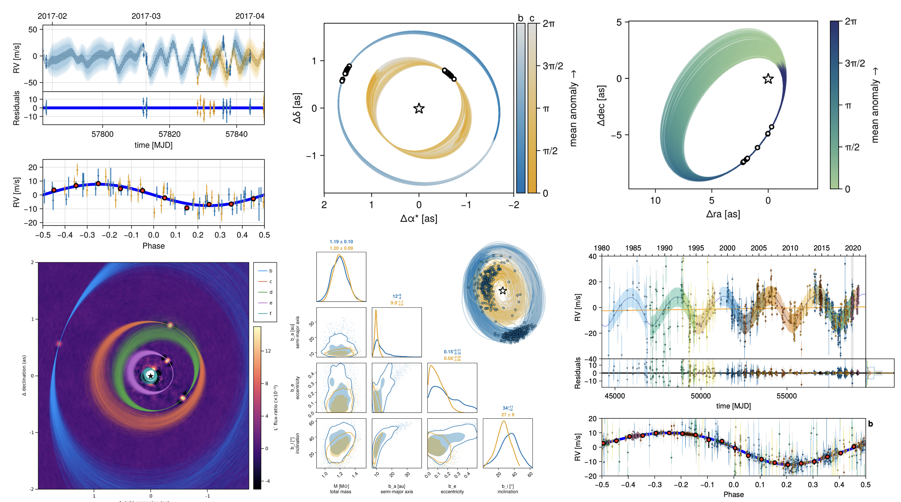

# *Octofitter*

[](https://github.com/sefffal/Octofitter.jl)

[](https://github.com/sefffal/Octofitter.jl/blob/master/LICENSE)


Octofitter is a Julia package for performing Bayesian inference 
against a wide variety of exoplanet / binary star data.
You can also use Octofitter from Python using the [Python guide](@ref python).

!!! warning "Upgrading from v6 or v7?"
    **If you're upgrading from Octofitter v7 or below, please see our [Migration Guide](@ref migration)**





**Supported data:**
Fit exoplanet orbits to
* relative astrometry
* absolute astrometry (Gaia or Hipparcos)
* absolute radial velocity data (of a star)
* relative radial velocity data (of a planet relative to a star)
* sample directly from images (also known as "deorbiting")
* sample directly from interferometric visibilities (NIRISS-AMI, or GRAVITY)

You can freely combine any of the above data types.  Any and all combinations work together.

**Modelling features:**
* multiple planets (zero or more)
* gaussian processes (AbstractGPs or Celerite)
* hyperbolic orbits
* co-planar, and non-coplanar systems
* arbitrary priors and parameterizations
* optional O'Neil "observable based priors"
* link mass to photometry via atmosphere models
* hierarchical models (with a bit of work from the user)
* Model stellar activity with Gaussian processes

**Speed:**

Fit astrometry on your laptop in seconds!

* Highly optimized code and derivatives are generated from your model
* Higher order sampler (No U-Turn sampler) which explores the parameter space very efficiently 
* The sampler is automatically warmed up using a variational approximation from the Pathfinder algorithm (Pathfinder.jl) 


See also: the python libraries [Orbitize!](https://orbitize.readthedocs.io/en/latest/), [orvara](https://github.com/t-brandt/orvara), and [exoplanet](https://docs.exoplanet.codes/en/latest/).

### Read the paper
In addition to these documentation and tutorial pages, you can read the paper published in the [Astronomical Journal](https://dx.doi.org/10.3847/1538-3881/acf5cc) (open-access).

## Attribution
* If you use Octofitter in your work, please cite [Thompson et al](https://dx.doi.org/10.3847/1538-3881/acf5cc):
```bibtex
@article{Thompson_2023,
doi = {10.3847/1538-3881/acf5cc},
url = {https://dx.doi.org/10.3847/1538-3881/acf5cc},
year = {2023},
month = {sep},
publisher = {The American Astronomical Society},
volume = {166},
number = {4},
pages = {164},
author = {William Thompson and Jensen Lawrence and Dori Blakely and Christian Marois and Jason Wang and Mosé Giordano and Timothy Brandt and Doug Johnstone and Jean-Baptiste Ruffio and S. Mark Ammons and Katie A. Crotts and Clarissa R. Do Ó and Eileen C. Gonzales and Malena Rice},
title = {Octofitter: Fast, Flexible, and Accurate Orbit Modeling to Detect Exoplanets},
journal = {The Astronomical Journal},
}
```
* If you use Gaia parallaxes in your work, please cite Gaia DR3 [Gaia Collaboration et al. 2023](https://ui.adsabs.harvard.edu/abs/2023A&A...674A...1G)
* Please cite the HMC sampler backend if you use `octofit`: [Xu et al 2020](http://proceedings.mlr.press/v118/xu20a.html)
* Please cite the [Pigeons paper](https://arxiv.org/abs/2308.09769) if you use `octofit_pigeons`.
* If you use Hipparcos-GAIA proper motion anomaly, please cite [Brandt 2021](https://ui.adsabs.harvard.edu/abs/2021ApJS..254...42B)
* If you use example data in one of the tutorials, please cite the sources listed
* If you use one of the included functions for automatically retreiving data from a public dataset, eg HARPS RVBank, please cite the source as appropriate (it will be displayed in the terminal)
* If you adopt the O'Neil et al. 2019 observable based priors, please cite [O'Neil et al. 2019](https://ui.adsabs.harvard.edu/abs/2019AJ....158....4O).
* If you use RV phase folded plot, please consider citing Makie.jl [Danisch & Krumbiegel, (2021).](https://doi.org/10.21105/joss.03349)
* If you use the pairplot/cornerplot functionality, please cite:
```bibtex
@misc{Thompson2023,
  author = {William Thompson},
  title = {{PairPlots.jl} Beautiful and flexible visualizations of high dimensional data},
  year = {2023},
  howpublished = {\url{https://sefffal.github.io/PairPlots.jl/dev}},
}
```


## Ready?
Ready to get started? Follow our [installation guide](@ref install) and then follow our [first tutorial](@ref fit-astrometry).
