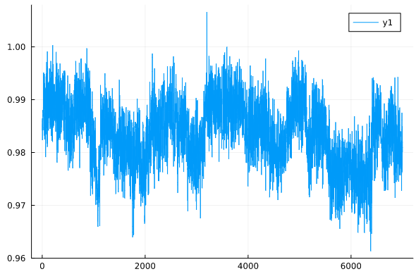
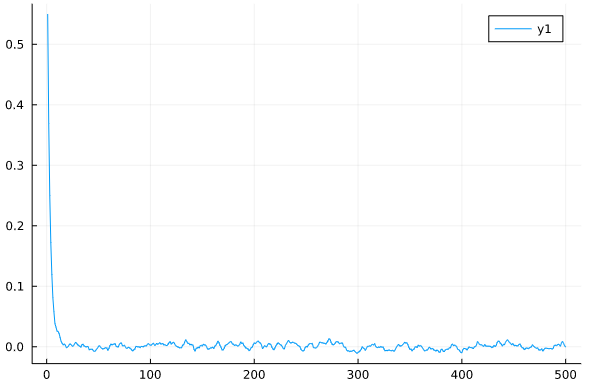
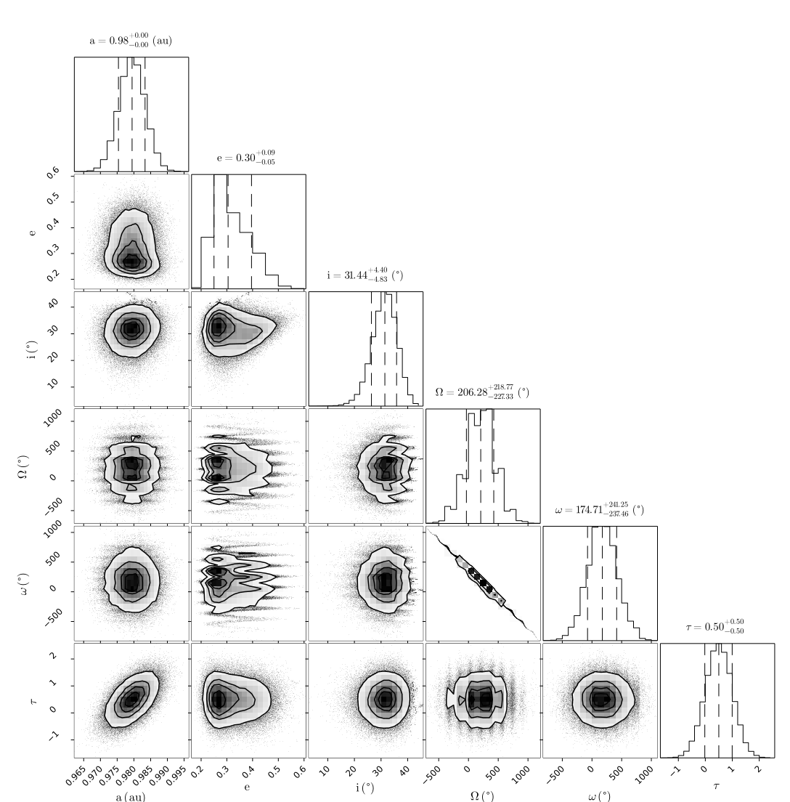

# [Fit Relative AstrometryLikelihood](@id fit-astrometry)

Here is a worked example of a basic model. It contains a star with a single planet, and several astrometry points.

The full code is available on [GitHub](https://github.com/sefffal/Octofitter.jl/examples/basic-example.jl)

Start by loading the Octofitter and Distributions packages:
```julia
using Octofitter, Distributions
```

## Creating a planet

Create our first planet. Let's name it planet B. 
```julia

astrom = AstrometryLikelihood(
    (epoch = 5000, ra = -505.7637580573554, dec = -66.92982418533026, σ_ra = 10, σ_dec = 10, cor=0),
    (epoch = 5120, ra = -502.570356287689, dec = -37.47217527025044, σ_ra = 10, σ_dec = 10, cor=0),
    (epoch = 5240, ra = -498.2089148883798, dec = -7.927548139010479, σ_ra = 10, σ_dec = 10, cor=0),
    (epoch = 5360, ra = -492.67768482682357, dec = 21.63557115669823, σ_ra = 10, σ_dec = 10, cor=0),
    (epoch = 5480, ra = -485.9770335870402, dec = 51.147204404903704, σ_ra = 10, σ_dec = 10, cor=0),
    (epoch = 5600, ra = -478.1095526888573, dec = 80.53589069730698, σ_ra = 10, σ_dec = 10, cor=0),
    (epoch = 5720, ra = -469.0801731788123, dec = 109.72870493064629, σ_ra = 10, σ_dec = 10, cor=0),
    (epoch = 5840, ra = -458.89628893460525, dec = 138.65128697876773, σ_ra = 10, σ_dec = 10, cor=0),
)
# Or from a file:
# astrom = CSV.read("mydata.csv", AstrometryLikelihood)

@named B = Planet{Visual{KepOrbit}}(
    Variables(
        a = truncated(Normal(10, 4), lower=0, upper=100),
        e = Uniform(0.0, 0.5),
        i = Sine(),
        ω = UniformCircular(),
        Ω = UniformCircular(),
        τ = UniformCircular(1.0),
        
    ),
    astrom
)
```

There's a lot going on here, so let's break it down.

First, `Visual{KepOrbit}` is the kind of orbit parameterization from PlanetOrbits.jl that we'd like to use for this model. A `Visual{KepOrbit}` uses the traditional Keplerian parameters like semi-major axis and inclination, along with the parallax distance to map positions into projected coordinates in the sky.
Other options include the similar `ThieleInnesOrbit` which uses a different parameterization, as well as `RadVelOrbit` and `KepOrbit` which are useful for modelling radial velocity data.

The `Variables` block accepts the priors that you would like for the orbital parameters of this planet. Priors can be any univariate distribution from the Distributions.jl package.
You will want to always specify the following parameters:
* `a`: Semi-major axis, astronomical units (AU)
* `i`: Inclination, radius
* `e`: Eccentricity in the range [0, 1)
* `τ`: Epoch of periastron passage, in fraction of orbit \[0,1] (periodic outside these bounds)
* `ω`: Argument of periastron, radius
* `Ω`: Longitude of the ascending node, radians.

The parameter τ represents the epoch of periastron passage as a fraction of the planet's orbit between 0 and 1. This follows the same convention as Orbitize! and you can read more about their choice in ther FAQ.
Many different distributions are supported as priors, including `Uniform`, `LogNormal`, `LogUniform`, `Sine`, and `Beta`. See the section on [Priors](@ref priors) for more information.
The parameters can be specified in any order.

After the `Variables` block are zero or more `Likelihood` blocks. These are observations specific to a given planet that you would like to include in the model. If you would like to sample from the priors only, don't pass in any observations.

For this example, we specify `AstrometryLikelihood` block. This is where you can list the position of a planet at different epochs if it known. `epoch` is a modified Julian date that the observation was taken. the `ra`, `dec`, `σ_ra`, and `σ_dec` parameters are the position of the planet at that epoch, relative to the star. All values in milliarcseconds (mas).
Alternatively, you can pass in `pa`, `sep`, `σ_pa`, and `σ_sep` if your data is specified in position angle (degrees) and separation (mas).

If you have many observations you may prefer to load them from a file or database. You can pass in any Tables.jl compatible data source via, for example, the CSV.jl library, the Arrow.jl library, a DataFrame, etc. Just ensure the right columns are present.


## Creating a system

A system represents a host star with one or more planets. Properties of the whole system are specified here, like parallax distance and mass of the star. This is also where you will supply data like images and astrometric acceleration in later tutorials, since those don't belong to any planet in particular.

```julia
@named HD82134 = System(
    Variables(
        M = truncated(Normal(1.2, 0.1), lower=0),
        plx = truncated(Normal(50.0, 0.02), lower=0),
    ),  
    B,
)
```

The `Variables` block works just like it does for planets. Here, the two parameters you must provide are:
* `M`: Gravitational parameter of the central body, expressed in units of Solar mass.
* `plx`: Distance to the system expressed in milliarcseconds of parallax.

After that, just list any planets that you want orbiting the star. Here, we pass planet B.
You can name the system and planets whatever you like.

Note: the `@named` convenience macro just passes in the name as a keyword argument, e.g. `name=:HD82134`. This makes sure that the variable name matches what gets displayed in the package output, and saved a few keystrokes. (taken from ModellingToolkit.jl)

## Prepare model
We now convert our declarative model into efficient, compiled code.

```julia
model = Octofitter.LogDensityModel(HD82134; autodiff=:ForwardDiff, verbosity=4) # defaults are ForwardDiff, and verbosity=0
```

```

[ Info: Preparing model
┌ Info: Timing autodiff
│   chunk_size = 1
└   t = 8.84e-5
┌ Info: Timing autodiff
│   chunk_size = 2
└   t = 3.58e-5
┌ Info: Timing autodiff
│   chunk_size = 4
└   t = 3.49e-5
┌ Info: Timing autodiff
│   chunk_size = 6
└   t = 2.3e-5
┌ Info: Timing autodiff
│   chunk_size = 8
└   t = 2.77e-5
┌ Info: Timing autodiff
│   chunk_size = 10
└   t = 1.43e-5
┌ Info: Selected auto-diff chunk size
└   ideal_chunk_size = 10
ℓπ(initial_θ_0_t): 0.003915 seconds (1 allocation: 16 bytes)
∇ℓπ(initial_θ_0_t): 0.013444 seconds (1 allocation: 32 bytes)
```
You can hide this output by adjusting `verbosity`.

This type implements the LogDensityProblems interface and can be passed to a wide variety of samplers.

## Sampling
Great! Now we are ready to draw samples from the posterior.

Start sampling:
```julia
# Provide a seeded random number generator for reproducibility of this example.
# Not needed in general: simply omit the RNG parameter.
using Random
rng = Random.Xoshiro(0)

chain = Octofitter.advancedhmc(
    rng, model, 0.85;
    adaptation =   500,
    iterations =  1000,
    verbosity = 4,
    tree_depth = 15
)
```

You will get an output that looks something like this with a progress bar that updates every second or so. You can reduce or completely silence the output by reducing the `verbosity` value down to 0.
```
┌ Info: Guessing a starting location by sampling from prior
└   initial_samples = 50000
┌ Info: Found starting location
│   ℓπ(θ) = -89.28815445133954
└   θ = (M = 1.1111483814942722, plx = 1000.2227630045661, planets = (X = (e = 0.1418001656198612, i = 0.525788926622379, ωy = -1.1725508160731015, ωx = -0.43641579618975873, Ωy = -0.7979161232983363, Ωx = 0.2820224081714881, τy = -0.043514240045819885, τx = 0.2096938720105077, a = 1.15, ω = -2.78528474083047, Ω = 2.801848814768598, τ = 0.28256456774501354),))
[ Info: Determining initial positions and metric using pathfinder
┌ Info: Pathfinder results
│   ℓπ(θ) = -81.40541918631729
│   mode = (M = 1.1127302837775135, plx = 1000.2000677799822, planets = (X = (e = 0.16579107514335195, i = 0.677833985142943, ωy = -0.9614880217396555, ωx = -0.45166294756082653, Ωy = -0.7346570090965128, Ωx = -0.08731420672478027, τy = -0.020385223319104005, τx = 0.1748163097467169, a = 1.15, ω = -2.7024331879915238, Ω = -3.0232972595211622, τ = 0.26847552057327845),))
│   inv_metric =
│    10×10 Matrix{Float64}:
│     1.06997e-6  3.08986e-10  -7.81759e-5  0.000140487  0.000171713  -0.000210901  7.95167e-5  -7.16133e-5  9.73303e-6  -1.86979e-5
└     ⋮                                                                ⋮
[ Info: Creating metric
[ Info: Creating model
[ Info: Creating hamiltonian
[ Info: Finding good stepsize
┌ Info: Found initial stepsize
└   ϵ = 0.05
[ Info: Creating kernel
[ Info: Creating adaptor
[ Info: Creating sampler
[ Info: Adapting sampler...
[ Info: Adaptation complete.
Adapated stepsize ϵ=0.002872101892940701
[ Info: Sampling...
Progress legend: divergence iter(thread) td=tree-depth ℓπ=log-posterior-density
      1( 1) td= 9 ℓπ=   -85. θ=(M = 1.1424834223934601, plx = 1000.1966145007555, planets = (X = (e = 0.01862240489198337, i = 0.6488908016928603, ωy = 0.6923810518865087, ωx = 0.19568512...
      
      ...

   5000( 1) td= 9 ℓπ=   -91. θ=(M = 1.1359851964247802, plx = 1000.2011655406451, planets = (X = (e = 0.028169989687460695, i = 0.6426282606572278, ωy = -1.0140236479079945, ωx = -0.17573...
Sampling100%|███████████████████████████████| Time: 0:03:43
[ Info: Sampling compete. Building chains.
Sampling report for chain 1:
mean_accept         = 0.9064319281136375
num_err_frac        = 0.0082
mean_tree_depth     = 9.5084
max_tree_depth_frac = 0.0
Chains MCMC chain (5000×14×1 Array{Float64, 3}):

Iterations        = 1:1:5000
Number of chains  = 1
Samples per chain = 5000
Wall duration     = 537.41 seconds
Compute duration  = 537.41 seconds
parameters        = M, plx, B_e, B_i, B_ωy, B_ωx, B_Ωy, B_Ωx, B_τy, B_τx, B_a, B_ω, B_Ω, B_τ

Summary Statistics
  parameters        mean       std   naive_se      mcse         ess      rhat   ess_per_sec 
      Symbol     Float64   Float64    Float64   Float64     Float64   Float64       Float64

           M      1.1770    0.0643     0.0009    0.0074     13.6286    1.3228        0.0254
         plx   1000.1999    0.0200     0.0003    0.0003   5106.1567    0.9998        9.5014
         B_e      0.0896    0.0720     0.0010    0.0027    452.4981    1.0177        0.8420
         B_i      0.6654    0.0865     0.0012    0.0037    118.3149    1.0328        0.2202
        B_ωy      0.0438    1.0324     0.0146    0.0387    729.2747    1.0037        1.3570
        B_ωx      0.1143    0.9379     0.0133    0.0566    123.0589    1.0065        0.2290
        B_Ωy      0.2000    1.1830     0.0167    0.1106     40.3880    1.0443        0.0752
        B_Ωx      0.1078    0.7360     0.0104    0.0572     63.0293    1.0176        0.1173
        B_τy      0.0033    1.0146     0.0143    0.0225   2225.1564    1.0000        4.1405
        B_τx      0.0351    1.0049     0.0142    0.0203   2625.0771    1.0004        4.8847
         B_a      1.1500    0.0000     0.0000    0.0000     10.5465    0.9998        0.0196
         B_ω      0.0442    1.8056     0.0255    0.0995    156.0941    1.0061        0.2905
         B_Ω     -0.5663    1.6501     0.0233    0.1377     51.8761    1.0282        0.0965
         B_τ      0.0062    0.2906     0.0041    0.0052   2653.3396    1.0000        4.9373

Quantiles
  parameters        2.5%       25.0%       50.0%       75.0%       97.5% 
      Symbol     Float64     Float64     Float64     Float64     Float64

           M      1.0751      1.1343      1.1663      1.2071      1.3184
         plx   1000.1613   1000.1863   1000.1999   1000.2135   1000.2388
         B_e      0.0033      0.0337      0.0720      0.1271      0.2709
         B_i      0.4805      0.6157      0.6695      0.7227      0.8190
        B_ωy     -1.9748     -0.6966      0.0558      0.7736      2.0343
        B_ωx     -1.7283     -0.5112      0.1333      0.7312      1.9565
        B_Ωy     -2.0398     -0.8199      0.4805      1.0963      2.1772
        B_Ωx     -1.4038     -0.3779      0.1416      0.5949      1.5423
        B_τy     -1.9671     -0.6951      0.0032      0.6845      2.0126
        B_τx     -1.9379     -0.6503      0.0492      0.6978      2.0343
         B_a      1.1500      1.1500      1.1500      1.1500      1.1500
         B_ω     -2.9700     -1.5517      0.3106      1.4407      2.9686
         B_Ω     -2.9958     -2.5080      0.2512      0.5978      2.8679
         B_τ     -0.4774     -0.2444      0.0168      0.2535      0.4746
```

The sampler will begin by drawing orbits randomly from the priors (50,000 by default). It will then pick the orbit with the highest posterior density as a starting point. These are then passed to AdvancedHMC to adapt following the Stan windowed adaption scheme.

Once complete, the `chain` object will hold the sampler results. Displaying it prints out a summary table like the one shown above.

For a basic model like this, sampling should take less than a minute on a typical laptop.

## Diagnostics
The first thing you should do with your results is check a few diagnostics to make sure the sampler converged as intended.

A few things to watch out for: check that you aren't getting many (any, really) numerical errors (`num_err_frac`). 
This likely indicates a problem with your model: either invalid values of one or more parameters are encountered (e.g. the prior on semi-major axis includes negative values) or that there is a region of very high curvature that is failing to sample properly. This latter issue can lead to a bias in your results.

One common mistake is to use a distribution like `Normal(10,3)` for semi-major axis. This left hand side of this distribution includes negative values which are not physically possible. A better choice is a `truncated(Normal(10,3), lower=0)` distribution.

You may see some warnings during initial step-size adaptation. These are probably nothing to worry about if sampling proceeds normally afterwards.

You should also check the acceptance rate (`mean_accept`) is reasonably high and the mean tree depth (`mean_tree_depth`) is reasonable (~4-8). 
Lower than this and the sampler is taking steps that are too large and encountering a U-turn very quicky. Much larger than this and it might be being too conservative. The default maximum tree depth is 10. These don't affect the accuracy of your results, but do affect the efficiency of the sampling.

Next, you can make a trace plot of different variabes to visually inspect the chain:
```julia
plot(
    chain["B_a"],
    xlabel="iteration",
    ylabel="semi-major axis (AU)"
)
```


And an auto-correlation plot:
```julia
using StatsBase
plot(
    autocor(chain["B_e"], 1:500),
    xlabel="lag",
    ylabel="autocorrelation",
)
```
This plot shows that these samples are not correlated after only above 5 steps. No thinning is necessary.


To confirm convergence, you may also examine the `rhat` column from chains. This diagnostic approaches 1 as the chains converge and should at the very least equal `1.0` to one significant digit (3 recommended).

Finnaly, if you ran multiple chains (see later tutorials to learn how), you can run 
```julia
using MCMCChains
gelmandiag(chain)
```
As an additional convergence test.

## Analysis
As a first pass, let's plot a sample of orbits drawn from the posterior.

```julia 
using Plots
plotchains(chain, :B, kind=:astrometry, color="B_a")
```
This function draws orbits from the posterior and displays them in a plot. Any astrometry points are overplotted. 


We can overplot the astrometry data like so:
```julia
plot!(astrom, label="astrometry")
```


## Pair Plot
A very useful visualization of our results is a pair-plot, or corner plot. We can use our PairPlots.jl package for this purpose:
```julia
using CairoMakie: Makie
using PairPlots
table = (;
    a=         vec(chain["B_a"]),
    e=         vec(chain["B_e"]),
    i=rad2deg.(vec(chain["B_i"])),
    Ω=rad2deg.(vec(chain["B_Ω"])),
    ω=rad2deg.(vec(chain["B_ω"])),
    τ=         vec(chain["B_τ"]),
)
pairplot(table)
```
You can read more about the syntax for creating pair plots in the PairPlots.jl documentation page.
[](assets/astrometry-corner-plot.svg)
In this case, the sampler was able to resolve the complicated degeneracies between eccentricity, the longitude of the ascending node, and argument of periapsis.

## Notes on Hamiltonian Monte Carlo
Unlike most other astrometry modelling code, Octofitter uses Hamiltonian Monte Carlo instead of Affine Invariant MCMC (e.g. emcee in Python) This sampling method makes use of derivative information, and is much more efficient. This package by default uses the No U-Turn sampler, as implemented in AdvancedHMC.jl.

Derviatives for a complex model are usualy tedious to code, but Octofitter uses ForwardDiff.jl to generate them automatically.

When using HMC, only a few chains are necessary. This is in contrast to Affine Invariant MCMC based packages where hundreds or thousands of walkers are required.
One chain should be enough to cover the whole posterior, but you can run a few different chains to make sure each has converged to the same distribution.

Similarily, many fewer samples are required. This is because unlike Affine Invariant MCMC, HMC produces samples that are much less correlated after each step (i.e. the autocorrelation time is much shorter).
