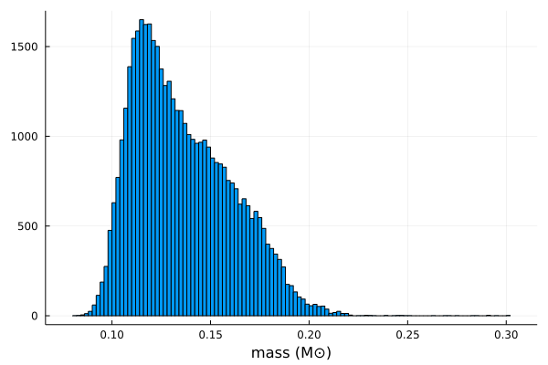
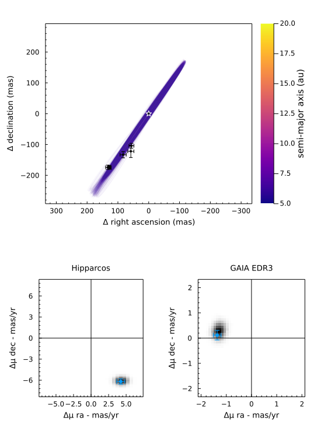

# [Fit Astrometric Acceleration](@id fit-pma)

One of the features of DirectDetections.jl is support for proper motion anomaly / astrometric acceleration.
These data points are typically calculated by finding the difference between a long term proper motion of a star between the Hipparcos and GAIA catalogs, and their proper motion calculated within the windows of each catalog.

For Hipparcos/GAIA this gives four data points that can constrain the dynamical mass & orbits of planetary companions (assuming we subtract out the net trend).

You can specify these quantities manually, but the easiest way is to use the Hipparcos-GAIA Catalog of Accelerations (HGCA, [https://arxiv.org/abs/2105.11662](https://arxiv.org/abs/2105.11662)). Support for loading this catalog is built into DirectDetections.jl.

Let's look at the star and companion [HD 91312 A & B](https://arxiv.org/abs/2109.12124), discovered by SCExAO. We will use their published astrometry and proper motion anomaly extracted from the HGCA.

The first step is to find the GAIA source ID for your object. For HD 91312, SIMBAD tells us the GAIA DR2 ID is `756291174721509376` (which we will assume is the same in eDR3).

## Planet Model & Reparameterization
For this model, we will have to add the variable `mass` as a prior. A reasonable uninformative prior for `mass` is `Uniform(0,1)`.


```julia
@named B = DirectDetections.Planet(
    Priors(
        a = Uniform(0, 35),
        e = TruncatedNormal(0.0, 0.2, 0, 1.0),
        τ = Uniform(0, 1),
        ω = Uniform(0, 2pi),
        i = Uniform(0, 2pi),
        Ω = Uniform(0, 2pi),
        mass = Uniform(0,1)
    ),
    Astrometry(
        (epoch=mjd("2016-12-15"), ra=0.133*1e3, dec=-0.174*1e3, σ_ra=0.007*1e3, σ_dec=0.007*1e3),
        (epoch=mjd("2017-03-12"), ra=0.126*1e3, dec=-0.176*1e3, σ_ra=0.004*1e3, σ_dec=0.004*1e3),
        (epoch=mjd("2017-03-13"), ra=0.127*1e3, dec=-0.172*1e3, σ_ra=0.004*1e3, σ_dec=0.004*1e3),
        (epoch=mjd("2018-02-08"), ra=0.083*1e3, dec=-0.133*1e3, σ_ra=0.010*1e3, σ_dec=0.010*1e3),
        (epoch=mjd("2018-11-28"), ra=0.058*1e3, dec=-0.122*1e3, σ_ra=0.010*1e3, σ_dec=0.020*1e3),
        (epoch=mjd("2018-12-15"), ra=0.056*1e3, dec=-0.104*1e3, σ_ra=0.008*1e3, σ_dec=0.008*1e3),
    )
)
```

If you try this you may find that the sampler hits a lot of numerical errors. This is because it will often try to push `mass` to zero or below, which falls outside the bounds of our prior. This is okay if it happens occaisionally, but on some models this can really lower our efficienty.

Let's use `Deterministic` to reparameterize both `mass` and `a` using logarithmic variables:
```julia

@named B = DirectDetections.Planet(
    Deterministic(
        e = (sys, pl) -> 10^pl.loge,
        a = (sys, pl) -> 10^pl.loga,
        mass = (sys, pl) -> 10^pl.logm,
    ),
    Priors(
        # Note: priors with sharp edges (e.g. Uniform priors) are challenging for HMC samplers.
        # Using wide Gaussians can be better than uniform priors, for example.
        τ = Normal(0.5, 1),
        ω = Normal(pi, 2pi),
        i = Normal(pi, 2pi),
        Ω = Normal(pi, 2pi),

        # Reparameterize a few properties for better sampling
        loge = TruncatedNormal(-2, 1.5, -Inf, 0),
        loga = Uniform(-1, 1.5),
        logm = Uniform(-2, 0),
    ),
    Astrometry(
        (epoch=mjd("2016-12-15"), ra=0.133*1e3, dec=-0.174*1e3, σ_ra=0.007*1e3, σ_dec=0.007*1e3),
        (epoch=mjd("2017-03-12"), ra=0.126*1e3, dec=-0.176*1e3, σ_ra=0.004*1e3, σ_dec=0.004*1e3),
        (epoch=mjd("2017-03-13"), ra=0.127*1e3, dec=-0.172*1e3, σ_ra=0.004*1e3, σ_dec=0.004*1e3),
        (epoch=mjd("2018-02-08"), ra=0.083*1e3, dec=-0.133*1e3, σ_ra=0.010*1e3, σ_dec=0.010*1e3),
        (epoch=mjd("2018-11-28"), ra=0.058*1e3, dec=-0.122*1e3, σ_ra=0.010*1e3, σ_dec=0.020*1e3),
        (epoch=mjd("2018-12-15"), ra=0.056*1e3, dec=-0.104*1e3, σ_ra=0.008*1e3, σ_dec=0.008*1e3),
    )
)
```

We specified `loga` and `logm` under priors, but our model still needs the variables `a` and `mass`. For these, we specify functions in the Deterministic block.
Each deterministic variable for a planet should be a function accepting the system parameters, and planet parameters. In this case, we will access the `loga` and `logm` parameters and use them to calculate `a` and `mass`.

## System Model & Specifying Proper Motion Anomaly
Now that we have our planet model, we create a system model to contain it.

```julia
@named HD91312 = System(
    Priors(
        μ = Normal(1.61, 0.05),
        plx = gaia_plx(gaia_id=756291174721509376),
    ),  
    ProperMotionAnomHGCA(gaia_id=756291174721509376),
    B,
)
```

We specify priors on `μ` and `plx` as usual, but here we use the `gaia_plx` helper function to read the parallax and uncertainty directly from the HGCA using its source ID.

After the priors, we add the proper motion anomaly measurements from the HGCA. If this is your first time running this code, you will be prompted to automatically download and cache the catalog which may take around 30 seconds.


## Sampling from the posterior
Ssample from our model as usual:

```julia
chain, stats = DirectDetections.hmc(
    HD91312,
    adaptation =   6_000,
    iterations =  50_000,
    tree_depth =     12,
);
```

## Analysis

### Mass
Let's start by plotting a histogram of the companion mass.

`chain["B[mass]"]` may be a matrix if multiple indepdendent chains were run, so we call `vec` to reshape it into a column vector.

```julia
mass_B = chain["B[mass]"]
histogram(vec(mass_B), xlabel="mass (M⊙)", ylabel="", legend=false)
```
[](assets/pma-astrometry-mass-hist.svg)

### Orbits

Now plot a sample of orbits from the posterior to see how well they 
fit the astrometry and proper motion anomaly.
```julia
plotmodel(chain, HD91312, clims=(7.2, 7.4))
```
[](assets/pma-astrometry-mass-model.svg)


### Pair Plot
Visualize all the parameters as a pair-plot:

```julia
##Create a corner plot / pair plot.
# We can access any property from the chain specified in Priors or in Deterministic.
using PairPlots
table = (;
    a=         chain["B[a]"],
    μ=         chain["μ"],
    m=         chain["B[mass]"],
    e=         chain["B[e]"],
    i=rad2deg.(chain["B[i]"]),
    Ω=rad2deg.(chain["B[Ω]"]),
    ω=rad2deg.(chain["B[ω]"]),
    τ=         chain["B[τ]"],
)
labels=[
    "a",
    "\\mu",
    "m",
    "e",
    "i",
    "\\Omega",
    "\\omega",
    "\\tau",
]
units = [
    "(au)",
    "(_\\odot)",
    "(_\\odot)",
    "",
    "(\\degree)",
    "(\\degree)",
    "(\\degree)",
    "",
]
corner(table, labels, units)
```
[](assets/pma-astrometry-mass-corner.svg)
