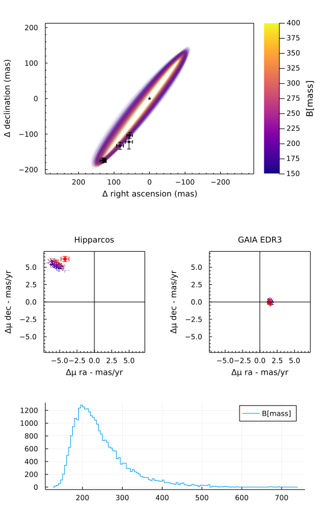
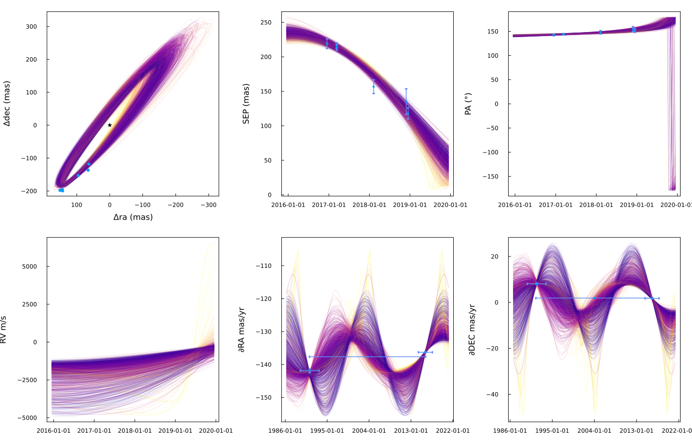
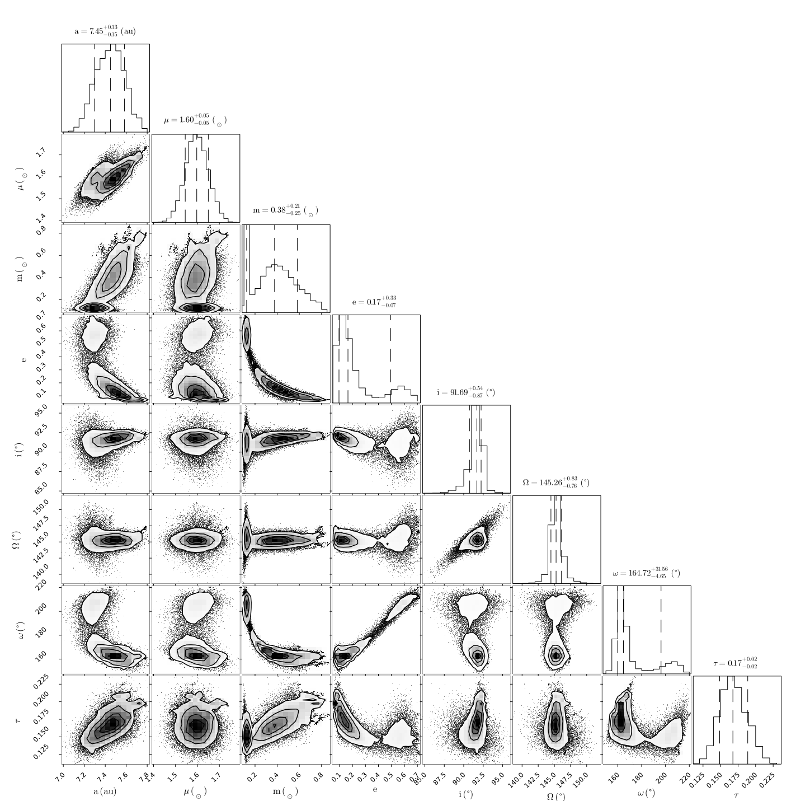
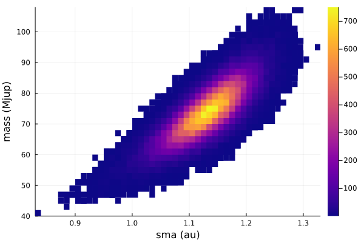
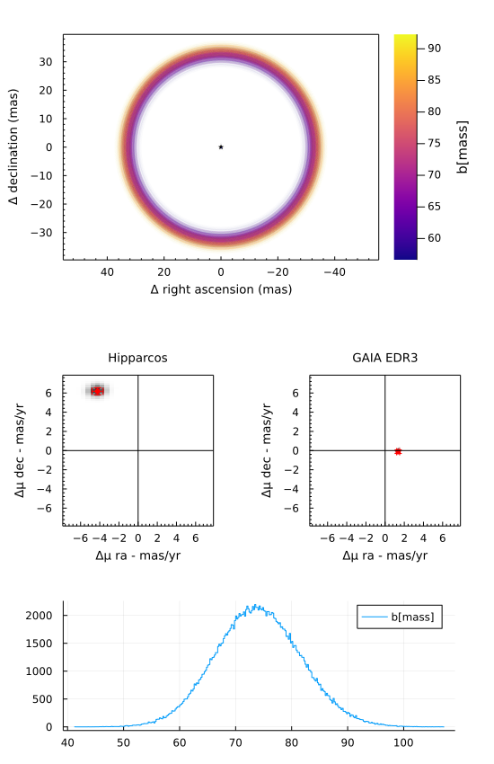

# [Fit Proper Motion Anomaly](@id fit-pma)

One of the features of Octofitter.jl is support for absolute astrometry aka. proper motion anomaly aka. astrometric acceleration.
These data points are typically calculated by finding the difference between a long term proper motion of a star between the Hipparcos and GAIA catalogs, and their proper motion calculated within the windows of each catalog.

For Hipparcos/GAIA this gives four data points that can constrain the dynamical mass & orbits of planetary companions (assuming we subtract out the net trend).

You can specify these quantities manually, but the easiest way is to use the Hipparcos-GAIA Catalog of Accelerations (HGCA, [https://arxiv.org/abs/2105.11662](https://arxiv.org/abs/2105.11662)). Support for loading this catalog is built into Octofitter.jl.

Let's look at the star and companion [HD 91312 A & B](https://arxiv.org/abs/2109.12124), discovered by SCExAO. We will use their published astrometry and proper motion anomaly extracted from the HGCA.

The first step is to find the GAIA source ID for your object. For HD 91312, SIMBAD tells us the GAIA DR2 ID is `756291174721509376` (which we will assume is the same in eDR3).

## Planet Model
For this model, we will have to add the variable `mass` as a prior.
The units used on this variable are Jupiter masses, in contrast to `M`, the primary's mass, in solar masses.  A reasonable uninformative prior for `mass` is `Uniform(0,1000)` or `LogUniform(1,1000)` depending on the situation.

Initial setup:
```julia
using Octofitter, Distributions, Plots
```


```julia
astrom = PlanetRelAstromLikelihood(
    (epoch=mjd("2016-12-15"), ra=133., dec=-174., σ_ra=07.0, σ_dec=07.,),# cor=0.2),
    (epoch=mjd("2017-03-12"), ra=126., dec=-176., σ_ra=04.0, σ_dec=04.,),# cor=0.3),
    (epoch=mjd("2017-03-13"), ra=127., dec=-172., σ_ra=04.0, σ_dec=04.,),# cor=0.1),
    (epoch=mjd("2018-02-08"), ra=083., dec=-133., σ_ra=10.0, σ_dec=10.,),# cor=0.4),
    (epoch=mjd("2018-11-28"), ra=058., dec=-122., σ_ra=10.0, σ_dec=20.,),# cor=0.3),
    (epoch=mjd("2018-12-15"), ra=056., dec=-104., σ_ra=08.0, σ_dec=08.,),# cor=0.2),
)
@planet B Visual{KepOrbit} begin
    a ~ truncated(LogNormal(9,3),lower=0)
    e ~ Uniform(0,1)
    ω ~ UniformCircular()
    i ~ Sine() # The Sine() distribution is defined by Octofitter
    Ω ~ UniformCircular()
    # mass ~ LogNormal(300, 18)
    # Anoter option would be:
    mass ~ Uniform(0.5, 1000)


    τ ~ UniformCircular(1.0)
    P = √(b.a^3/system.M)
    tp =  b.τ*b.P + 58849 # reference epoch for τ. Choose an MJD date near your data.
end astrom
```


## System Model & Specifying Proper Motion Anomaly
Now that we have our planet model, we create a system model to contain it.

```julia
@system HD91312 begin
    M ~ LogNormal(1.61, 1)
    plx ~ gaia_plx(gaia_id=756291174721509376)
            
    # Priors on the centre of mass proper motion
    pmra ~ Normal(0, 500)
    pmdec ~ Normal(0,  500)
end HGCALikelihood(gaia_id=756291174721509376) B
```

We specify priors on `M` and `plx` as usual, but here we use the `gaia_plx` helper function to read the parallax and uncertainty directly from the HGCA using its source ID.

We also add parameters for the long term system's proper motion. This is usually
close to the long term trend between the Hipparcos and GAIA measurements.

After the priors, we add the proper motion anomaly measurements from the HGCA. If this is your first time running this code, you will be prompted to automatically download and cache the catalog which may take around 30 seconds.


## Sampling from the posterior
Sample from our model as usual:

```julia
model = Octofitter.LogDensityModel(HD91312)
chain = octofit(
    # Note: start the target acceptance at around 0.8 and increase if you see numerical errors. That indicates a tricky posterior and that therefore smaller steps are required.
    model, 0.92, 
    adaptation =  1_000,
    iterations =  4_000,
    initial_samples = 500_000
)
```

Output:
```        
┌ Info: Guessing a good starting location by sampling from priors
└   N = 50000
┌ Info: Found initial stepsize
└   initial_ϵ = 0.0125
[ Info: Will adapt step size and mass matrix
[ Info: progress logging is enabled globally
Sampling100%|███████████████████████████████| Time: 0:00:24
  iterations:                    30000
  n_steps:                       7
  is_accept:                     true
  acceptance_rate:               0.863239872503996
  log_density:                   -51.71436291701389
  hamiltonian_energy:            54.325211045874674
  hamiltonian_energy_error:      0.19872154840668088
  max_hamiltonian_energy_error:  0.3162241419617615
  tree_depth:                    3
  numerical_error:               false
  step_size:                     0.5200876630871248
  nom_step_size:                 0.5200876630871248
  is_adapt:                      false
  mass_matrix:                   DenseEuclideanMetric(diag=[0.002497517511145372, 0.02 ...])
[ Info: Resolving derived variables
[ Info: Constructing chains
Sampling report:
mean_accept = 0.7834391801902499
num_err_frac = 0.017433333333333332
mean_tree_depth = 2.8884666666666665
max_tree_depth_frac = 0.0
Chains MCMC chain (30000×9×1 Array{Float64, 3}):

Iterations        = 1:1:30000
Number of chains  = 1
Samples per chain = 30000
Wall duration     = 24.15 seconds
Compute duration  = 24.15 seconds
parameters        = M, plx, B_a, B_e, B_τ, B_ω, B_i, B_Ω, B_mass

Summary Statistics
  parameters       mean       std   naive_se      mcse          ess      rhat   ess_per_sec 
      Symbol    Float64   Float64    Float64   Float64      Float64   Float64       Float64

           M     1.6107    0.0499     0.0003    0.0003   21449.1180    1.0000      888.1255
         plx    29.1444    0.1396     0.0008    0.0010   23713.4280    1.0000      981.8818
        B_a     6.7402    0.0890     0.0005    0.0010    7643.8317    1.0000      316.5017
        B_e     0.2043    0.0449     0.0003    0.0005    5958.7172    1.0000      246.7276
        B_τ     1.1459    0.0254     0.0001    0.0003    9732.8386    1.0000      402.9994
        B_ω    -0.3675    0.0984     0.0006    0.0011    8379.4363    1.0000      346.9602
        B_i     1.4706    0.0280     0.0002    0.0003   10928.8907    1.0000      452.5233
        B_Ω    -0.6672    0.0147     0.0001    0.0001   19642.2568    1.0001      813.3103
     B_mass   245.0888   69.1839     0.3994    1.2972    2404.3514    1.0000       99.5549

Quantiles
  parameters       2.5%      25.0%      50.0%      75.0%      97.5% 
      Symbol    Float64    Float64    Float64    Float64    Float64

           M     1.5131     1.5777     1.6109     1.6441     1.7083
         plx    28.8718    29.0491    29.1440    29.2396    29.4166
        B_a     6.5706     6.6794     6.7398     6.7994     6.9165
        B_e     0.1229     0.1730     0.2023     0.2332     0.2989
        B_τ     1.1036     1.1281     1.1433     1.1608     1.2032
        B_ω    -0.5503    -0.4335    -0.3705    -0.3075    -0.1589
        B_i     1.4133     1.4525     1.4715     1.4902     1.5217
        B_Ω    -0.6967    -0.6769    -0.6670    -0.6573    -0.6390
     B_mass   159.7716   196.9441   228.3291   274.9650   431.3844
```

This takes about a minute on the first run due to JIT startup latency; subsequent runs are very quick even on e.g. an older laptop.

## Analysis

The first step is to look at the table output above generated by MCMCChains.jl.
The `rhat` column gives a convergence measure. Each parameter should have an `rhat` very close to 1.000.
If not, you may need to run the model for more iterations or tweak the parameterization of the model to improve sampling.
The `ess` column gives an estimate of the effective sample size.
The `mean` and `std` columns give the mean and standard deviation of each parameter.

The second table summarizes the 2.5, 25, 50, 75, and 97.5 percentiles of each parameter in the model.

Since this chain is well converged, we can begin examining the results.
Use the `plotchains` function to display orbits from the posterior against the input data:


```julia
plotchains(chain, :B, kind=:astrometry, color="B_mass")
scatter!(astrom, label="astrometry", markersize=0, linecolor=1)
```
[](assets/pma-astrometry-posterior.svg)

Another useful plotting function is `octoplot` which takes similar arguments and produces a 9 panel plot:
```julia
octoplot(model, chain)
```
[](assets/pma-astrometry-posterior-grid.svg)


### Pair Plot
If we wish to examine the covariance between parameters in more detail, we can construct a pair-plot (aka. corner plot).

For a quick look, you can just run `corner(chain)`, but for more professional output you may wish to customize the labels, units, unit labels, etc:


```julia
##Create a corner plot / pair plot.
# We can access any property from the chain specified in Variables
using CairoMakie: Makie
using PairPlots
table = (;
    M=         vec(chain["M"]),
    m=         vec(chain["B_mass"]),
    a=         vec(chain["B_a"]),
    e=         vec(chain["B_e"]),
    i=rad2deg.(vec(chain["B_i"])),
    Ω=rad2deg.(vec(chain["B_Ω"])),
    ω=rad2deg.(vec(chain["B_ω"])),
    τ=         vec(chain["B_τ"]),
)
fig = pairplot(table)
```
[](assets/pma-astrometry-mass-corner.svg)


## Fitting Astrometric Acceleration Only
If you wish to look at the possible locations/masses of a planet around a star using onnly GAIA/HIPPARCOS,
you can follow a simplified approach.

As a start, you can restrict the orbital parameters to just semi-major axis, epoch of periastron passage, and mass.

```julia
@planet b Visual{KepOrbit} begin
    a ~ LogUniform(0.1, 100)
    τ ~ UniformCircular(1.0)
    mass ~ LogUniform(1, 2000)
    i = 0
    e = 0
    Ω = 0
    ω = 0
end
@named HD91312 begin
    M ~ truncated(Normal(1.61, 0.2), lower=0)
    plx ~ gaia_plx(gaia_id=756291174721509376)
    
    # Priors on the centre of mass proper motion
    pmra ~ Normal(0, 500)
    pmdec ~ Normal(0,  500)
end HGCALikelihood(gaia_id=756291174721509376) b
```

This models assumes a circular, face-on orbit.

```julia
model = Octofitter.LogDensityModel(HD91312; autodiff=:ForwardDiff, verbosity=4) # defaults are ForwardDiff, and verbosity=0

chains = octofit(
    model, 0.75,
    # Octofitter.MCMCThreads(),
    # num_chains=4,
    adaptation =  2_000,
    iterations =  2_000,
)
```
```

[ Info: Preparing model
┌ Info: Tuning autodiff
│   chunk_size = 1
└   t = 0.000184293
┌ Info: Tuning autodiff
│   chunk_size = 2
└   t = 0.000102274
┌ Info: Tuning autodiff
│   chunk_size = 4
└   t = 5.4869e-5
┌ Info: Tuning autodiff
│   chunk_size = 6
└   t = 6.416e-5
┌ Info: Tuning autodiff
│   chunk_size = 8
└   t = 3.512e-5
┌ Info: Selected auto-diff chunk size
└   ideal_chunk_size = 8
ℓπcallback(initial_θ_0_t): 0.000026 seconds (76 allocations: 2.375 KiB)
∇ℓπcallback(initial_θ_0_t): 0.000066 seconds (76 allocations: 2.391 KiB)
┌ Info: Guessing a starting location by sampling from prior
└   initial_samples = 50000
[ Info: Sampling, beginning with adaptation phase...
┌ Warning: The current proposal will be rejected due to numerical error(s).
│   isfinite.((θ, r, ℓπ, ℓκ)) = (true, false, false, false)
└ @ AdvancedHMC ~/.julia/packages/AdvancedHMC/4fByY/src/hamiltonian.jl:49
┌ Warning: The current proposal will be rejected due to numerical error(s).
│   isfinite.((θ, r, ℓπ, ℓκ)) = (true, false, false, false)
└ @ AdvancedHMC ~/.julia/packages/AdvancedHMC/4fByY/src/hamiltonian.jl:49
[ Info: Adaptation complete.
[ Info: Sampling...
Progress legend: divergence iter(thread) td=tree-depth ℓπ=log-posterior-density 
       1( 1) td= 5 ℓπ=   -41. 
     838( 1) td= 5 ℓπ=   -37. 
    1650( 1) td= 5 ℓπ=   -40. 
[ Info: Sampling compete. Building chains.
Sampling report for chain 1:
mean_accept         = 0.8628791796894713
num_err_frac        = 0.067
mean_tree_depth     = 4.119
max_tree_depth_frac = 0.0
Chains MCMC chain (2000×13×1 Array{Float64, 3}):

Iterations        = 1:1:2000
Number of chains  = 1
Samples per chain = 2000
Wall duration     = 20.56 seconds
Compute duration  = 20.56 seconds
parameters        = M, plx, pmra, pmdec, b_a, b_τy, b_τx, b_mass, b_τ, b_i, b_e, b_Ω, b_ω

Summary Statistics
  parameters        mean       std   naive_se      mcse         ess      rhat   ess_per_sec 
      Symbol     Float64   Float64    Float64   Float64     Float64   Float64       Float64 

           M      1.6075    0.1954     0.0044    0.0050   1486.7663    0.9995       72.3171
         plx     29.1524    0.1368     0.0031    0.0038   1610.2294    1.0003       78.3224
        pmra   -137.6625    0.0196     0.0004    0.0006   1293.2684    0.9998       62.9052
       pmdec      1.8893    0.0127     0.0003    0.0004   1373.6978    1.0046       66.8173
         b_a      1.2721    0.0520     0.0012    0.0013   1444.7449    0.9995       70.2731
        b_τy     -0.1191    0.0736     0.0016    0.0027    680.9847    1.0013       33.1234
        b_τx      1.2082    0.6403     0.0143    0.0249    590.1177    1.0018       28.7036
      b_mass    614.6158   63.3446     1.4164    1.2606   1588.0401    0.9996       77.2431
         b_τ      0.2657    0.0048     0.0001    0.0001   1314.3761    0.9995       63.9319
         b_i      0.0000    0.0000     0.0000    0.0000         NaN       NaN           NaN
         b_e      0.0000    0.0000     0.0000    0.0000         NaN       NaN           NaN
         b_Ω      0.0000    0.0000     0.0000    0.0000         NaN       NaN           NaN
         b_ω      0.0000    0.0000     0.0000    0.0000         NaN       NaN           NaN

Quantiles
  parameters        2.5%       25.0%       50.0%       75.0%       97.5% 
      Symbol     Float64     Float64     Float64     Float64     Float64 

           M      1.2321      1.4744      1.6046      1.7340      2.0030
         plx     28.8919     29.0589     29.1508     29.2470     29.4229
        pmra   -137.7004   -137.6755   -137.6625   -137.6504   -137.6223
       pmdec      1.8635      1.8811      1.8892      1.8975      1.9150
         b_a      1.1663      1.2383      1.2736      1.3069      1.3709
        b_τy     -0.2881     -0.1609     -0.1081     -0.0642     -0.0126
        b_τx      0.1992      0.7274      1.1270      1.6199      2.6172
      b_mass    495.0310    571.2174    613.4512    656.2661    742.1851
         b_τ      0.2560      0.2623      0.2658      0.2690      0.2744
         b_i      0.0000      0.0000      0.0000      0.0000      0.0000
         b_e      0.0000      0.0000      0.0000      0.0000      0.0000
         b_Ω      0.0000      0.0000      0.0000      0.0000      0.0000
         b_ω      0.0000      0.0000      0.0000      0.0000      0.0000


```

With such simple models, the mean tree depth is often very low and sampling proceeds very quickly.

A good place to start is a histogram of planet mass vs. semi-major axis:
```julia
histogram2d(chains["b_a"], chains["b_mass"], color=:plasma, xguide="sma (au)", yguide="mass (Mjup)")
```
[](assets/pma-a-vs-mass.svg)


You can also visualize the orbits and proper motion:
```julia
octoplot(model, chain)
```
[](assets/pma-model.svg)
